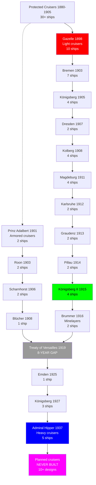
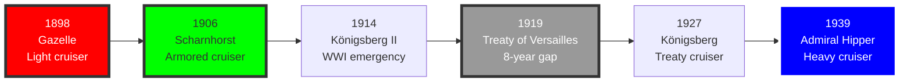

# German Navy Cruiser Research Tree (1880-1945)

## Era Overview

| Era | Years | Key Innovation | Classes | Ships |
|-----|-------|----------------|---------|-------|
| **Protected Cruisers (Kaiserliche Marine)** | 1880-1905 | Early steel cruisers | 8+ classes | 30+ ships |
| **Light Cruisers (Kaiserliche Marine)** | 1898-1918 | Scout/fleet cruisers | 15+ classes | 45+ ships |
| **Armored Cruisers (Kaiserliche Marine)** | 1900-1910 | Heavy protection | 5 classes | 13 ships |
| **Small Cruisers (Kaiserliche Marine)** | 1914-1918 | WWI emergency builds | 8 classes | 25+ ships |
| **Interwar Gap (Treaty of Versailles)** | 1919-1927 | No cruisers allowed | 0 classes | 0 ships |
| **Light Cruisers (Kriegsmarine)** | 1927-1935 | Treaty-compliant | 2 classes | 3 ships |
| **Heavy Cruisers (Kriegsmarine)** | 1935-1939 | 8-inch gun cruisers | 1 class | 5 ships |
| **Planned (Never Built)** | 1939-1945 | Various designs | 10+ designs | 0 ships |

**Total:** ~40+ major classes, ~121+ cruisers built (140+ planned)

## Production Summary

| Type | Classes | Total Ships | Peak Era |
|------|---------|-------------|----------|
| Protected Cruisers (Kaiserliche Marine) | 8+ | 30+ ships | 1880-1905 |
| Light Cruisers (Kaiserliche Marine) | 15+ | 45+ ships | 1898-1918 |
| Armored Cruisers (Kaiserliche Marine) | 5 | 13 ships | 1900-1910 |
| Small Cruisers (Kaiserliche Marine) | 8+ | 25+ ships | 1914-1918 |
| Light Cruisers (Kriegsmarine) | 2 | 3 ships | 1927-1935 |
| Heavy Cruisers (Kriegsmarine) | 1 | 5 ships | 1935-1939 |
| Planned (Never Built) | 10+ | 0 ships | 1939-1945 |
| **Grand Total (Built)** | **~40+** | **~121+** | **65 years** |
| **Grand Total (Planned)** | **~50+** | **~140+** | **65 years** |

## Research Tree Diagram

## Major Milestones

### Technological Firsts

| Achievement | Class/Ship | Year |
|-------------|------------|------|
| **First protected cruiser** | SMS Irene | 1887 |
| **First modern light cruiser** | Gazelle | 1898 |
| **First armored cruiser** | Fürst Bismarck | 1897 |
| **First turbine cruiser** | Lübeck | 1904 |
| **First oil-fired cruiser** | Pillau | 1914 |
| **First treaty cruiser** | Emden | 1925 |
| **First heavy cruiser** | Admiral Hipper | 1939 |

## Timeline

## Class Listing by Era

### Kaiserliche Marine Protected Cruisers (1880-1905)

1. [[Irene-Class]] (1887-1888) - 2 ships
   - Irene, Prinzess Wilhelm
   - 14× 5.9-inch guns, 18 knots, 4,960 tons

2. [[Kaiserin-Augusta-Class]] (1890-1892) - 1 ship
   - Kaiserin Augusta
   - 12× 5.9-inch guns, 18.5 knots, 6,300 tons

3. [[Victoria-Louise-Class]] (1897-1899) - 5 ships
   - Victoria Louise, Hertha, Freya, Vineta, Hansa
   - 2× 8.3-inch, 8× 5.9-inch guns, 19 knots, 6,700 tons

4. [[Hela-Class]] (1895) - 1 ship
   - Hela
   - 4× 3.5-inch guns, 19.5 knots, 2,100 tons (scout cruiser)

### Kaiserliche Marine Light Cruisers (1898-1918)

5. [[Gazelle-Class]] (1898-1901) - **10 ships, first modern light cruisers**
   - Gazelle, Niobe, Nymph, Thetis, Ariadne, Amazone, Medusa, Frauenlob, Arcona, Undine
   - 10× 4.1-inch guns, 21 knots, 3,200 tons
   - Established German light cruiser design philosophy

6. [[Bremen-Class]] (1903-1904) - 7 ships
   - Bremen, Hamburg, Berlin, Lübeck, München, Leipzig, Danzig
   - 10× 4.1-inch guns, 22 knots, 3,800 tons
   - Improved Gazelle design

7. [[Königsberg-Class-1905]] (1905-1907) - 4 ships
   - Königsberg, Nürnberg, Stuttgart, Stettin
   - 10× 4.1-inch guns, 24 knots, 3,800 tons
   - Increased speed for scouting

8. [[Dresden-Class]] (1907-1908) - 2 ships
   - Dresden, Emden
   - 10× 4.1-inch guns, 24 knots, 3,650 tons
   - SMS Emden famous WWI raider (Indian Ocean)

9. [[Kolberg-Class]] (1908-1910) - 4 ships
   - Kolberg, Mainz, Cöln, Augsburg
   - 12× 4.1-inch guns, 25 knots, 4,400 tons
   - Enhanced armament

10. [[Magdeburg-Class]] (1911-1912) - 4 ships
    - Magdeburg, Breslau, Strassburg, Stralsund
    - 12× 4.1-inch guns, 27 knots, 4,600 tons
    - SMS Breslau escaped to Turkey with Goeben 1914

11. [[Karlsruhe-Class]] (1912-1913) - 2 ships
    - Karlsruhe, Rostock
    - 12× 5.9-inch guns, 27.5 knots, 6,200 tons
    - Increased caliber to 5.9-inch

12. [[Graudenz-Class]] (1913-1914) - 2 ships
    - Graudenz, Regensburg
    - 12× 5.9-inch guns, 28 knots, 6,400 tons

13. [[Pillau-Class]] (1914) - **2 ships, first oil-fired**
    - Pillau, Elbing
    - 8× 5.9-inch guns, 27.5 knots, 5,600 tons
    - First German cruisers with oil firing

14. [[Wiesbaden-Class]] (1915-1916) - 2 ships
    - Wiesbaden, Frankfurt
    - 8× 5.9-inch guns, 27.5 knots, 6,600 tons

15. [[Königsberg-Class-1915]] (1915-1918) - **4 ships, WWI standard**
    - Königsberg, Karlsruhe, Emden, Nürnberg
    - 8× 5.9-inch guns, 27.5 knots, 7,125 tons
    - Most numerous WWI light cruiser class

16. [[Cöln-Class]] (1916-1918) - 2 ships
    - Cöln, Dresden
    - 8× 5.9-inch guns, 27.5 knots, 7,500 tons

17. [[Brummer-Class]] (1916) - **2 ships, minelaying cruisers**
    - Brummer, Bremse
    - 4× 5.9-inch guns, 300 mines, 34 knots, 4,400 tons
    - Fastest WWI cruisers

### Kaiserliche Marine Small Cruisers (1914-1918)

18. [[Gazelle-Class-Small-Cruiser]] (1914-1915) - 10 ships
    - Emergency WWI builds, simplified design
    - 8× 4.1-inch guns, 27 knots, 5,600 tons

### Kaiserliche Marine Armored Cruisers (1900-1910)

19. [[Fürst-Bismarck-Class]] (1897) - **1 ship, first armored cruiser**
    - Fürst Bismarck
    - 4× 9.4-inch guns, 18.5 knots, 11,500 tons

20. [[Prinz-Adalbert-Class]] (1901-1904) - 2 ships
    - Prinz Adalbert, Prinz Heinrich
    - 2× 9.4-inch, 10× 5.9-inch guns, 20 knots, 9,700 tons

21. [[Roon-Class]] (1903-1905) - 2 ships
    - Roon, Yorck
    - 4× 8.3-inch, 10× 5.9-inch guns, 21 knots, 10,300 tons

22. [[Scharnhorst-Class-Armored-Cruiser]] (1906-1907) - **2 ships**
    - Scharnhorst, Gneisenau
    - 8× 8.3-inch guns, 23.5 knots, 12,800 tons
    - Sunk at Battle of Falkland Islands (1914)

23. [[SMS-Blücher]] (1908) - **1 ship, hybrid battlecruiser/armored cruiser**
    - 12× 8.3-inch guns, 25 knots, 17,500 tons
    - Sunk at Dogger Bank (1915)

### Interwar Period (1919-1927)

**Treaty of Versailles Restrictions:**
- Germany limited to 6 light cruisers (<6,000 tons)
- Existing cruisers to be scrapped
- 8-year gap before new construction

**Retained Ships (1920s):**
- Few WWI light cruisers kept as training ships
- Most scrapped or transferred to Allied navies

### Kriegsmarine Light Cruisers (1925-1935)

24. [[SMS-Emden-1925]] (1925) - **1 ship, first post-WWI cruiser**
    - 8× 5.9-inch guns, 29 knots, 7,100 tons
    - Training cruiser, survived WWII

25. [[Königsberg-Class-1927]] (1927-1930) - **3 ships, K-class**
    - Königsberg, Karlsruhe, Köln
    - 9× 5.9-inch guns, 32 knots, 7,700 tons
    - First modern Kriegsmarine cruisers

26. [[Leipzig-Class]] (1929-1934) - 2 ships
    - Leipzig, Nürnberg
    - 9× 5.9-inch guns, 32 knots, 9,100 tons
    - Improved K-class design

### Kriegsmarine Heavy Cruisers (1935-1939)

27. [[Admiral-Hipper-Class]] (1937-1940) - **5 ships, 8-inch gun cruisers**
    - Admiral Hipper, Blücher, Prinz Eugen, Seydlitz (incomplete), Lützow (incomplete)
    - 8× 8-inch guns, 32 knots, 18,200 tons
    - Blücher sunk Norway 1940, Prinz Eugen survived war

### Planned But Never Built (1939-1945)

28. [[M-Class-Cruiser]] - **6 ships planned, NONE LAID DOWN**
    - 8× 5.9-inch guns, 36 knots, 8,000 tons (planned)
    - Scout cruiser design, cancelled 1939

29. [[P-Class-Cruiser]] - **12 ships planned, NONE LAID DOWN**
    - 6× 5.9-inch guns, 33 knots, 6,000 tons (planned)
    - Panzerschiff escort cruiser, cancelled 1939

30. [[Improved-Hipper-Class]] - **3 ships planned, NONE BEGUN**
    - 8× 8-inch guns, 33 knots, 20,000 tons
    - Design study only

31. [[Super-Cruiser-Designs]] - **Various, FANTASY PROJECTS**
    - 9-15× 8-inch guns, up to 30,000 tons
    - Never serious proposals

## Key Technologies

### Main Battery Evolution
- **1880-1898:** 4-14× 5.9-inch guns (protected cruisers)
- **1898-1914:** 10-12× 4.1-inch guns (early light cruisers)
- **1912-1918:** 8-12× 5.9-inch guns (standard WWI light cruisers)
- **1925-1935:** 8-9× 5.9-inch guns (Weimar/early Kriegsmarine)
- **1935-1940:** 8× 8-inch guns (Admiral Hipper class heavy cruisers)
- **1900-1910:** 4-8× 8.3-9.4-inch guns (armored cruisers)

### Armor Evolution
- **1880-1905:** Deck armor only (protected cruisers)
- **1900-1910:** Belt and deck armor (armored cruisers)
- **1898-1918:** Light deck armor (light cruisers)
- **1925-1935:** Improved deck armor (K-class, Leipzig)
- **1935-1940:** Belt and deck armor (Admiral Hipper)

### Propulsion Evolution
- **1880-1904:** Coal-fired boilers, reciprocating engines
- **1904-1914:** Coal-fired boilers, steam turbines
- **1914-1918:** Oil-fired boilers, steam turbines (Pillau onward)
- **1925-1945:** High-pressure oil-fired boilers, steam turbines

### Speed Evolution
- **1880-1898:** 18-20 knots (protected cruisers)
- **1898-1910:** 21-24 knots (early light cruisers)
- **1910-1918:** 25-28 knots (WWI light cruisers)
- **1916:** 34 knots (Brummer minelayers - fastest)
- **1925-1940:** 29-32 knots (Kriegsmarine cruisers)

## Notable Service

### Pre-WWI
- **Colonial Service:** Protected cruisers in overseas stations
- **Scouting Force:** Light cruisers with High Seas Fleet
- **East Asia Squadron:** Scharnhorst and Gneisenau

### World War I (1914-1918)
- **Battle of Coronel (1914):** Scharnhorst and Gneisenau sank British squadron
- **Battle of Falkland Islands (1914):** Scharnhorst, Gneisenau sunk by battlecruisers
- **SMS Emden Raiding (1914):** Destroyed 30+ Allied merchantmen, sunk November 1914
- **Goeben and Breslau to Turkey (1914):** Escaped through Mediterranean
- **Battle of Jutland (1916):** 11 light cruisers engaged, 4 sunk (Wiesbaden, Frauenlob, Elbing, Rostock)
- **Dogger Bank (1915):** SMS Blücher sunk
- **Baltic Operations:** Light cruisers vs Russian Navy

### Interwar Period (1919-1933)
- **Treaty Restrictions:** Most cruisers scrapped
- **Training Ships:** Emden (1925) circumnavigated globe 1926-1928
- **Rearmament:** K-class cruisers (Königsberg, Karlsruhe, Köln)

### World War II (1939-1945)
- **Invasion of Norway (1940):** Blücher sunk, Königsberg sunk, Karlsruhe sunk
- **Atlantic Operations:** Admiral Hipper raids, limited success
- **Channel Dash (1942):** Prinz Eugen escaped with Scharnhorst/Gneisenau
- **Arctic Convoys:** Admiral Hipper operations
- **Battle of Barents Sea (1942):** Admiral Hipper repulsed by destroyers
- **Operation Rheinübung (1941):** Prinz Eugen with Bismarck (survived)

### Famous Ships

- **SMS Emden (1908):** Most successful WWI commerce raider, 30+ ships sunk
- **SMS Scharnhorst & Gneisenau (AC):** Coronel victory, Falklands defeat
- **SMS Breslau:** Escaped to Turkey, became Midilli, sank 1918
- **SMS Blücher:** Sunk Dogger Bank 1915, 792 killed
- **Königsberg (1927):** Sunk Norway 1940 (first warship sunk by dive bombers)
- **Blücher (1937):** Sunk Norway 1940, 1,000+ killed
- **Prinz Eugen:** Survived war, US atomic bomb tests Bikini 1946

## Cancelled Cruiser Programs

### M-Class Scout Cruisers (1939) - CANCELLED
- **Ordered:** 6 ships planned
- **Specifications:** 8,000 tons, 8× 5.9-inch guns, 36 knots
- **Purpose:** High-speed scouting for fleet
- **Cancellation:** September 1939 (WWII outbreak, resources to U-boats)

### P-Class Cruisers (1939) - CANCELLED
- **Ordered:** 12 ships planned
- **Specifications:** 6,000 tons, 6× 5.9-inch guns, 33 knots
- **Purpose:** Escort cruisers for pocket battleships
- **Cancellation:** September 1939 (WWII outbreak)

### SP-Class Cruisers (1940) - CANCELLED
- **Ordered:** 5 ships planned
- **Specifications:** 7,800 tons, 8× 5.9-inch guns, 35 knots
- **Purpose:** Anti-aircraft cruisers
- **Cancellation:** 1940 (low priority, resources diverted)

### Seydlitz and Lützow Conversion (1942) - INCOMPLETE
- **Ships:** Admiral Hipper-class hulls Seydlitz and Lützow
- **Plan:** Convert to aircraft carriers
- **Progress:** Seydlitz 95% complete as cruiser, conversion begun 1942
- **Fate:** Both abandoned incomplete, scrapped post-war

## Comparison to Royal Navy

| Feature | Germany | Britain | Advantage |
|---------|---------|---------|-----------|
| **WWI Light Cruisers** | 45+ ships | 60+ ships | Britain (quantity) |
| **Armored Cruisers** | 13 ships | 35+ ships | Britain (quantity) |
| **Cruiser Speed** | 25-34 knots | 25-33 knots | Germany (Brummer 34 knots) |
| **WWII Heavy Cruisers** | 3 operational | 18 operational | Britain (quantity) |
| **Cruiser Survivability** | Good armor for size | Variable | Germany (quality) |
| **Global Deployment** | Limited (coastal/Baltic) | Worldwide | Britain (strategic) |

**Strategic Assessment:**
- Germany: Quality designs, limited numbers, regional focus
- Britain: Quantity over quality, global coverage
- Result: British numerical superiority decisive in both World Wars

---

**Tree:** Master Research Tree | **Classes:** ~40+ | **Ships Built:** ~121+ | **Ships Planned:** ~140+

#cruiser #kaiserliche-marine #kriegsmarine #light-cruiser #heavy-cruiser #sms-emden #admiral-hipper #prinz-eugen #jutland #armored-cruiser #german-navy
