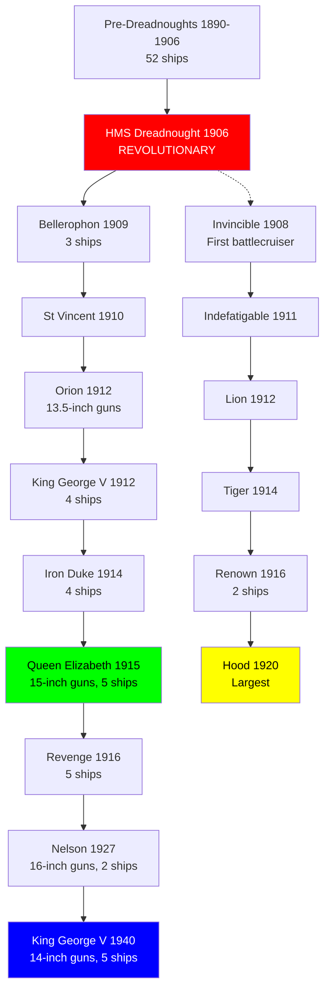

# Royal Navy Battleship Research Tree (1890-1945)

## Era Overview

| Era | Years | Key Innovation | Classes | Ships |
|-----|-------|----------------|---------|-------|
| **Pre-Dreadnoughts** | 1890-1906 | First modern battleships | 14+ classes | 52 ships |
| **Revolutionary** | 1906 | HMS Dreadnought, all-big-gun | 1 class | 1 ship |
| **Dreadnoughts** | 1907-1912 | 12-inch gun dreadnoughts | 8 classes | 22 ships |
| **Super-Dreadnoughts** | 1911-1916 | 13.5-inch and 15-inch guns | 4 classes | 18 ships |
| **Battlecruisers** | 1908-1920 | Speed and firepower | 7 classes | 13 ships |
| **Treaty Battleships** | 1927-1940 | Washington Treaty limits | 2 classes | 7 ships |

**Total:** ~36+ major classes, ~113+ battleships and battlecruisers built

## Production Summary

| Type | Classes | Total Ships | Peak Era |
|------|---------|-------------|----------|
| Pre-Dreadnoughts | 14+ | 52 ships | 1890-1906 |
| HMS Dreadnought | 1 | 1 ship | 1906 (revolutionary) |
| Dreadnoughts | 8 | 22 ships | 1907-1912 |
| Super-Dreadnoughts | 4 | 18 ships | 1911-1916 (Queen Elizabeth, Revenge) |
| Battlecruisers | 7 | 13 ships | 1908-1920 (Invincible to Hood) |
| Treaty Battleships | 2 | 7 ships | 1927-1940 (Nelson, King George V) |
| **Grand Total** | **36+** | **~113+** | **55 years** |

## Research Tree Diagram

## Major Milestones

### Technological Firsts

| Achievement | Class/Ship | Year |
|-------------|------------|------|
| **First steel battleships** | Royal Sovereign | 1892 |
| **First all-big-gun battleship** | HMS Dreadnought | 1906 |
| **First battlecruiser** | Invincible | 1908 |
| **First 13.5-inch guns** | Orion | 1912 |
| **First 15-inch guns** | Queen Elizabeth | 1915 |
| **First oil-only propulsion** | Queen Elizabeth | 1915 |
| **Largest battlecruiser** | Hood | 1920 |
| **First 16-inch guns** | Nelson | 1927 |
| **Last battleships built** | King George V | 1940 |

## Timeline

## Class Listing by Era

### Pre-Dreadnought Battleships (1890-1906)
1. [[Royal Sovereign-Class]] (1892) - 8 ships, first steel battleships
2. [[Majestic-Class]] (1895) - 9 ships, largest pre-dreadnought class
3. [[Canopus-Class]] (1899) - 6 ships
4. [[Formidable-Class]] (1901) - 3 ships
5. [[Duncan-Class]] (1903) - 6 ships
6. [[King Edward VII-Class]] (1905) - 8 ships
7. [[Lord Nelson-Class]] (1908) - 2 ships, last pre-dreadnoughts
(Plus 7 smaller/earlier classes)

### Revolutionary Dreadnought (1906)
8. [[HMS-Dreadnought]] (1906) - **1 ship, revolutionized battleship design**

### Dreadnought Battleships (1907-1912)
9. [[Bellerophon-Class]] (1909) - 3 ships
10. [[St Vincent-Class]] (1910) - 3 ships
11. [[HMS-Neptune]] (1911) - 1 ship
12. [[Colossus-Class]] (1911) - 2 ships
13. [[Orion-Class]] (1912) - **4 ships, first 13.5" guns**
14. [[King George V-Class-1912]] (1912) - 4 ships
15. [[Iron Duke-Class]] (1914) - 4 ships, Jellicoe's flagship
16. [[Erin-Class]] (1914) - 1 ship, built for Turkey

### Super-Dreadnought Battleships (1913-1916)
17. [[Queen Elizabeth-Class]] (1915) - **5 ships, 15" guns, oil-fired, fast battleships**
18. [[Revenge-Class]] (1916) - 5 ships, R-class

### Battlecruisers (1908-1920)
19. [[Invincible-Class-BC]] (1908) - **3 ships, first battlecruisers**
20. [[Indefatigable-Class]] (1911) - 3 ships
21. [[Lion-Class-BC]] (1912) - 2 ships
22. [[Tiger-Class-BC]] (1914) - 1 ship
23. [[Renown-Class]] (1916) - 2 ships
24. [[Courageous-Class]] (1917) - 3 ships, large light cruisers/battlecruisers
25. [[HMS-Hood]] (1920) - **1 ship, largest battlecruiser ever, 42,000 tons**

### Treaty Battleships (1927-1940)
26. [[Nelson-Class]] (1927) - **2 ships, 16" guns, unique design**
27. [[King George V-Class-1940]] (1940) - **5 ships, last RN battleships**

### Cancelled Post-WWI (1920s)
28. [[G3-Battlecruiser]] - **CANCELLED, 16" guns, 32 knots, 4 ordered**
29. [[N3-Battleship]] - **CANCELLED, 18" guns, 4 ordered**

### Cancelled WWII (1938-1945)
30. [[Lion-Class-1940]] (1940) - **CANCELLED, 9× 16" guns, 2 laid down**
31. [[Vanguard-Class]] (1946) - 1 ship, last British battleship (post-war)

## Key Technologies

### Main Battery Evolution
- **1890-1906:** 4× 12-13.5-inch guns (pre-dreadnoughts)
- **1906:** 10× 12-inch guns (HMS Dreadnought)
- **1907-1911:** 10× 12-inch guns (dreadnoughts)
- **1912-1914:** 10× 13.5-inch guns (super-dreadnoughts)
- **1915-1922:** 8× 15-inch guns (Queen Elizabeth, Hood)
- **1927:** 9× 16-inch guns (Nelson) - only RN 16" ships
- **1940:** 10× 14-inch guns (King George V) - treaty limits

### Armor Evolution
- **1890-1906:** Harvey/Krupp armor, 6-14 inches
- **1906-1916:** Krupp cemented armor, improved protection
- **1915:** Oil-fired boilers enabled better armor layout
- **1927:** All-or-nothing armor (Nelson)
- **1940:** Advanced armor schemes (King George V)

### Propulsion Evolution
- **1890-1915:** Coal-fired boilers, reciprocating engines/turbines
- **1915:** Oil-fired boilers (Queen Elizabeth) - first all-oil battleships
- **1906-1945:** Steam turbines standard

### Speed Evolution
- **1890-1906:** 16-19 knots (pre-dreadnoughts)
- **1906:** 21 knots (HMS Dreadnought)
- **1908-1920:** 25-31 knots (battlecruisers)
- **1915:** 25 knots (Queen Elizabeth) - fast battleships
- **1916:** 21 knots (Revenge) - slower, more armor
- **1927:** 23 knots (Nelson) - slow due to treaty limits
- **1940:** 28-30 knots (King George V)

## Size Growth

| Class | Year | Displacement | Length | Main Guns | Speed |
|-------|------|--------------|--------|-----------|-------|
| Royal Sovereign | 1892 | 14,150 tons | 380 ft | 4× 13.5" | 17 kn |
| Dreadnought | 1906 | 18,120 tons | 527 ft | 10× 12" | 21 kn |
| Orion | 1912 | 22,200 tons | 545 ft | 10× 13.5" | 21 kn |
| Queen Elizabeth | 1915 | 27,500 tons | 600 ft | 8× 15" | 25 kn |
| Hood | 1920 | 42,000 tons | 860 ft | 8× 15" | 31 kn |
| Nelson | 1927 | 33,950 tons | 710 ft | 9× 16" | 23 kn |
| King George V | 1940 | 36,700 tons | 745 ft | 10× 14" | 28 kn |

## Notable Service

### Pre-WWI
- **Russo-Japanese War:** Some pre-dreadnoughts lent to Japan
- **Naval Race:** Dreadnought sparked global naval arms race
- **Fisher Reforms:** HMS Dreadnought part of Admiral Fisher's reforms

### World War I (1914-1918)
- **Battle of Jutland (1916):** Largest battleship engagement
  - 28 British dreadnoughts vs 16 German dreadnoughts
  - Invincible, Indefatigable, Queen Mary lost (battlecruisers)
  - British losses heavier but strategic victory
- **Grand Fleet:** Iron Duke (flagship), Queen Elizabeth, Revenge classes
- **Battlecruiser losses:** Poor armor led to catastrophic explosions

### Interwar Period (1918-1939)
- **Washington Treaty (1922):** Limited battleship construction
- **Hood:** "Mighty Hood" - pride of Royal Navy
- **Nelson class:** Unique design within treaty limits
- **Modernizations:** Queen Elizabeth and other WWI ships rebuilt

### World War II (1939-1945)
- **Bismarck chase (1941):** Hood sunk, Prince of Wales damaged, Bismarck sunk
- **Mediterranean:** Queen Elizabeth class at Alexandria, Malta convoys
- **Force H:** Renown, Ark Royal operated from Gibraltar
- **Arctic convoys:** King George V class escorted convoys
- **Pacific:** King George V class joined British Pacific Fleet 1945

### Famous Ships

- **HMS Dreadnought:** Revolutionized naval warfare
- **HMS Hood:** Sunk by Bismarck May 1941, 1,415 killed
- **HMS Warspite:** Most decorated RN ship, 15 battle honors
- **HMS Prince of Wales:** Sunk by Japanese aircraft December 1941
- **HMS Duke of York:** Sank German battleship Scharnhorst 1943

## Cancelled Battleship Programs

### G3 Battlecruiser (1921) - CANCELLED
- **Ordered:** 4 ships under 1921 program
- **Specifications:** 48,400 tons, 9× 16-inch guns, 32 knots
- **Innovation:** Most advanced battlecruiser design, speed + firepower
- **Cancellation:** Washington Treaty (1922)
- **Impact:** Would have been most powerful capital ships afloat

### N3 Battleship (1921) - CANCELLED
- **Ordered:** 4 ships under 1921 program
- **Specifications:** 48,500 tons, 9× 18-inch guns, 23 knots
- **Innovation:** Only British design with 18-inch guns
- **Cancellation:** Washington Treaty (1922)
- **Impact:** Largest guns ever planned for RN battleship

### Lion-Class (1938) - CANCELLED
- **Ordered:** 6 ships planned, 2 laid down (Lion, Temeraire)
- **Specifications:** 40,550 tons, 9× 16-inch guns, 30 knots
- **Progress:** Construction stopped September 1939 (WWII outbreak)
- **Reason:** Resources prioritized for escorts, carriers
- **Impact:** Would have been first RN 16" battleships since Nelson

### HMS Vanguard (1946) - BUILT POST-WAR
- **Last British battleship:** Commissioned 1946 (too late for WWII)
- **Specifications:** 44,500 tons, 8× 15-inch guns, 30 knots
- **Unique:** Used spare 15" guns from WWI-era battlecruisers
- **Service:** Training, royal tours, never fired guns in anger
- **Scrapped:** 1960

---

**Tree:** Master Research Tree | **Classes:** 36+ | **Ships:** ~113+

#battleship #royal-navy #research-tree #dreadnought #hms-hood #queen-elizabeth #king-george-v #battlecruiser #royal-navy-history

## Cancelled Battleship Programs & Design Studies
Four major cancelled programs documented separately:
- [[G3-Battlecruiser]] - 9× 16" guns, 32 knots, cancelled under Washington Treaty (1921-1922)
- [[N3-Battleship]] - 9× 18" guns, 23 knots, cancelled under Washington Treaty (1921-1922)
- [[Lion-Class-1940]] - 9× 16" guns, 30 knots, construction stopped WWII (1938-1945)
- [[HMS-Vanguard]] - 8× 15" guns, last British battleship, commissioned post-war (1946)
