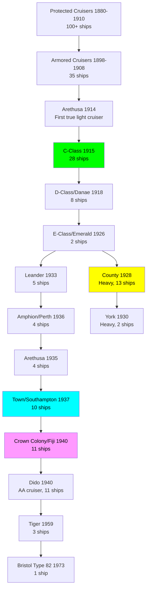

# Royal Navy Cruiser Research Tree (1880-1985)

## Era Overview

| Era | Years | Key Innovation | Classes | Ships |
|-----|-------|----------------|---------|-------|
| **Protected Cruisers** | 1880-1910 | Early steel cruisers | 20+ classes | 100+ ships |
| **Armored Cruisers** | 1898-1908 | Belt armor, heavy guns | 8 classes | 35 ships |
| **Light Cruisers (WWI)** | 1913-1922 | C-D-E series, standardization | 8 classes | 60+ ships |
| **Heavy Cruisers** | 1924-1930 | Treaty cruisers, 8" guns | 3 classes | 15 ships |
| **Light Cruisers (Interwar)** | 1931-1939 | Leander to Town classes | 6 classes | 27 ships |
| **WWII Cruisers** | 1939-1945 | Crown Colony, Dido AA cruisers | 3 classes | 27 ships |
| **Post-War Cruisers** | 1950-1964 | Tigers, guided missiles | 3 classes | 8 ships |
| **Modern Cruisers** | 1980-Present | Type 82, Type 12 (destroyers reclassified) | 1-2 classes | 1-8 ships |

**Total:** ~52+ major classes, ~280+ cruisers built

## Production Summary

| Type | Classes | Total Ships | Peak Era |
|------|---------|-------------|----------|
| Protected Cruisers | 20+ | 100+ ships | 1880-1910 |
| Armored Cruisers | 8 | 35 ships | 1898-1908 |
| Light Cruisers WWI | 8 | 60+ ships | 1913-1922 (C, D, E classes) |
| Heavy Cruisers | 3 | 15 ships | 1924-1930 (County, York) |
| Light Cruisers Interwar | 6 | 27 ships | 1931-1939 (Leander to Town) |
| WWII Cruisers | 3 | 27 ships | 1939-1945 (Crown Colony, Dido) |
| Post-War Cruisers | 3 | 8 ships | 1950-1964 (Tiger, Neptune conversions) |
| **Grand Total** | **~52+** | **~280+** | **105 years** |

## Research Tree Diagram

## Major Milestones

### Technological Firsts

| Achievement | Class | Year |
|-------------|-------|------|
| **First protected cruisers** | Iris/Mercury | 1878 |
| **First armored cruisers** | Cressy | 1901 |
| **First true light cruiser** | Arethusa | 1914 |
| **First oil-only propulsion** | Arethusa | 1914 |
| **Most numerous WWI class** | C-class | 1915 (28 ships) |
| **First treaty heavy cruisers** | County | 1928 |
| **First 6" triple turrets** | Town/Southampton | 1937 |
| **First dual-purpose AA cruisers** | Dido | 1940 |
| **Last gun cruisers** | Tiger | 1959 |
| **First guided missile cruiser** | HMS Bristol | 1973 |

## Timeline

```mermaid
graph LR
    A[1878<br/>Iris<br/>Protected cruiser] --> B[1914<br/>Arethusa<br/>Light cruiser]
    B --> C[1915<br/>C-Class<br/>28 ships]
    C --> D[1928<br/>County<br/>Heavy cruiser]
    D --> E[1933<br/>Leander<br/>5 ships]
    E --> F[1937<br/>Town<br/>10 ships]
    F --> G[1940<br/>Crown Colony<br/>11 ships]
    G --> H[1940<br/>Dido<br/>AA cruiser]
    H --> I[1959<br/>Tiger<br/>Last gun cruiser]
    I --> J[1973<br/>Bristol<br/>Guided missile]

    style B fill:#0ff,stroke:#333,stroke-width:4px
    style C fill:#0f0,stroke:#333,stroke-width:4px
    style D fill:#ff0,stroke:#333,stroke-width:4px
    style F fill:#f9f,stroke:#333,stroke-width:4px
```

## Class Listing by Era

### Protected Cruisers (1880-1910)
1. [[Iris-Class]] (1878) - 2 ships, first protected cruisers
2. [[Comus-Class]] (1878) - 8 ships
3. [[Leander-Class-1882]] (1882) - 4 ships
4. [[Mersey-Class]] (1885) - 4 ships
5. [[Orlando-Class]] (1888) - 7 ships
6. [[Blake-Class]] (1892) - 2 ships
7. [[Edgar-Class]] (1893) - 9 ships
8. [[Powerful-Class]] (1897) - 2 ships, largest protected cruisers
9. [[Diadem-Class]] (1898) - 8 ships
10. [[Eclipse-Class]] (1897) - 9 ships
11. [[Pelorus-Class]] (1897) - 11 ships
12. [[Highflyer-Class]] (1898) - 3 ships
13. [[Challenger-Class]] (1902) - 2 ships
14. [[Adventure-Class]] (1905) - 2 ships
(Plus 6+ smaller/earlier classes)

### Armored Cruisers (1898-1908)
15. [[Cressy-Class]] (1901) - 6 ships
16. [[Drake-Class]] (1902) - 4 ships
17. [[Monmouth-Class]] (1903) - 10 ships
18. [[Devonshire-Class]] (1905) - 6 ships
19. [[Duke of Edinburgh-Class]] (1906) - 2 ships
20. [[Warrior-Class]] (1906) - 4 ships
21. [[Minotaur-Class-AC]] (1908) - 3 ships

### WWI Light Cruisers (1913-1922)
22. [[Arethusa-Class-1914]] (1914) - **8 ships, first true light cruisers**
23. [[Caroline-Class]] (1915) - C-class subgroup, 6 ships
24. [[Calliope-Class]] (1915) - C-class subgroup, 2 ships
25. [[Cambrian-Class]] (1916) - C-class subgroup, 4 ships
26. [[Centaur-Class-1916]] (1916) - C-class subgroup, 2 ships
27. [[Caledon-Class]] (1917) - C-class subgroup, 4 ships
28. [[Ceres-Class]] (1917) - C-class subgroup, 5 ships
29. [[Carlisle-Class]] (1918) - C-class subgroup, 5 ships
30. [[Danae-Class]] (1918) - **D-class, 8 ships**
31. [[Emerald-Class]] (1926) - E-class, 2 ships

### Heavy Cruisers (1924-1930)
32. [[Hawkins-Class]] (1919) - 5 ships, proto-heavy cruisers
33. [[County-Class]] (1928) - **13 ships total** (Kent 5, London 4, Norfolk 2, plus York 2 separate)
34. [[York-Class]] (1930) - 2 ships, smaller heavy cruisers

### Interwar Light Cruisers (1931-1939)
35. [[Leander-Class]] (1933) - 5 ships
36. [[Amphion-Class/Perth]] (1936) - 4 ships (modified Leander)
37. [[Arethusa-Class-1935]] (1935) - 4 ships
38. [[Town-Class/Southampton]] (1937) - **10 ships** (Southampton 5, Gloucester 3, Edinburgh 2)
39. [[Dido-Class]] (1940) - **11 ships, AA cruisers** (Dido 6, Bellona 5)

### WWII Cruisers (1939-1945)
40. [[Crown Colony-Class/Fiji]] (1940) - **11 ships** (Fiji 8, Ceylon 3)
41. [[Minotaur-Class/Swiftsure]] (1944) - 3 ships (completed post-war)

### Post-War Cruisers (1950-1964)
42. [[Tiger-Class]] (1959) - **3 ships, last gun cruisers**
43. [[Neptune-Class]] (1950s) - Conversions to guided missile cruisers
44. [[Tiger-Class-Conversions]] (1972-1978) - Tiger and Blake converted to helicopter cruisers

### Modern Era (1973-Present)
45. [[Bristol-Type-82]] (1973) - **1 ship, guided missile cruiser**

### Cancelled Post-WWII
46. [[Lion-Class-Cruiser]] - **CANCELLED 1945, 3 ordered, large cruisers**
47. [[Minotaur-Conversions]] - **Several ships cancelled or not converted**

## Key Technologies

### Armament Evolution
- **1880-1910:** Mixed caliber guns (6", 9.2", 4")
- **1914-1939:** Standardized 6" guns (BL 6"/50)
- **1924-1930:** 8" guns (heavy cruisers, treaty limits)
- **1937:** 6" triple turrets (Town class)
- **1940:** Dual-purpose 5.25" (Dido AA cruisers)
- **1959:** 6" and 3" automatic guns (Tiger)
- **1973:** Guided missiles (Sea Dart on Bristol)

### Armor Evolution
- **1880-1910:** Deck armor only (protected cruisers)
- **1898-1908:** Belt armor (armored cruisers)
- **1914-1945:** Light side armor, deck armor
- **1924-1930:** Heavy cruiser armor (County)
- **1937-1945:** Improved protection (Town, Crown Colony)

### Propulsion Evolution
- **1880-1914:** Coal-fired, reciprocating engines
- **1914:** Oil-fired, steam turbines (Arethusa)
- **1920s-1960s:** Oil-fired, geared turbines
- **1973:** Gas turbines (Bristol Type 82)

### Speed Evolution
- **1880-1910:** 18-23 knots (protected/armored cruisers)
- **1914-1945:** 29-33 knots (light cruisers)
- **1924-1930:** 31-32 knots (heavy cruisers)
- **1937-1945:** 32-33 knots (modern light cruisers)
- **1959:** 31.5 knots (Tiger)
- **1973:** 30+ knots (Bristol)

## Size Growth

| Class | Year | Displacement | Length | Main Guns | Speed |
|-------|------|--------------|--------|-----------|-------|
| Iris | 1878 | 3,730 tons | 300 ft | 10× 64-pdr | 18 kn |
| Cressy | 1901 | 12,000 tons | 472 ft | 2× 9.2", 12× 6" | 21 kn |
| C-class | 1915 | 4,200 tons | 451 ft | 5× 6" | 29 kn |
| County | 1928 | 9,750 tons | 633 ft | 8× 8" | 31.5 kn |
| Town | 1937 | 9,100 tons | 592 ft | 12× 6" | 32 kn |
| Crown Colony | 1940 | 8,000 tons | 555 ft | 9-12× 6" | 31.5 kn |
| Tiger | 1959 | 9,500 tons | 555 ft | 4× 6", 6× 3" | 31.5 kn |

## Notable Service

### Pre-WWI
- **Boxer Rebellion (1900):** Multiple cruisers participated
- **Russo-Japanese War:** Some cruisers lent to Japan
- **Naval arms race:** Protected and armored cruisers proliferated

### World War I (1914-1918)
- **Battle of Coronel (1914):** Good Hope, Monmouth sunk
- **Battle of Falklands (1914):** Invincible, Inflexible sank German cruisers
- **Battle of Jutland (1916):** Multiple light cruisers engaged
- **North Sea patrols:** C-class and D-class heavily used
- **Gallipoli (1915):** Cruisers provided fire support
- **Zeebrugge Raid (1918):** Multiple cruisers participated

### Interwar Period (1918-1939)
- **Washington Treaty (1922):** Limited cruiser construction (8" or 6")
- **County class:** First British treaty heavy cruisers
- **Modernization:** WWI cruisers upgraded

### World War II (1939-1945)
- **Battle of River Plate (1939):** Exeter, Ajax, Achilles vs Graf Spee
- **Norway campaign (1940):** Multiple cruisers lost
- **Mediterranean:** Town class at Malta, Alexandria
- **Arctic convoys:** Cruisers escorted convoys to Russia
- **Battle of North Cape (1943):** Belfast, Sheffield helped sink Scharnhorst
- **D-Day (1944):** Cruisers provided fire support
- **Pacific:** Crown Colony class with British Pacific Fleet

### Cold War (1945-1991)
- **Korean War (1950-1953):** Several cruisers provided fire support
- **Suez Crisis (1956):** Multiple cruisers participated
- **Falklands War (1982):** HMS Bristol in task force

### Famous Ships

- **HMS Belfast:** Museum ship on Thames, Battle of North Cape
- **HMS Exeter:** River Plate, Java Sea, sunk 1942
- **HMS Edinburgh:** Arctic convoy, sunk 1942 carrying Soviet gold
- **HMS Sheffield:** Arctic convoys, Battle of North Cape
- **HMS Tiger:** Last traditional gun cruiser, converted to helicopter cruiser

## Cancelled Cruiser Programs

### Lion-Class Cruiser (1944) - CANCELLED 1945
- **Ordered:** 3 ships (Lion, Temeraire, Defence)
- **Specifications:** 14,650 tons, 9× 6" guns in triple turrets, 31.5 knots
- **Innovation:** Large, powerful light cruisers
- **Progress:** All three laid down, construction stopped 1945
- **Cancellation:** End of WWII, budget cuts
- **Scrapped:** Broken up on slips 1945-1946

### Neptune-Class Guided Missile Conversions - PARTIALLY CANCELLED
- **Planned:** Convert multiple cruisers to guided missile ships
- **Completed:** Only a few conversions completed
- **Cancelled:** Most conversions cancelled due to cost

---

**Tree:** Master Research Tree | **Classes:** ~52+ | **Ships:** ~280+

#cruiser #royal-navy #research-tree #light-cruiser #heavy-cruiser #hms-belfast #c-class #county-class #town-class #crown-colony

## Cancelled Cruiser Programs
One major cancelled program documented separately:
- [[Lion-Class-Cruiser]] - Large light cruisers, 3 laid down, cancelled 1945 (end of WWII)
