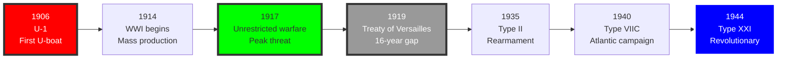

# German Navy Submarine Research Tree (1850-1945)

## Era Overview

| Era | Years | Key Innovation | Classes | Ships |
|-----|-------|----------------|---------|-------|
| **Early Experimental (Pre-Kaiserliche Marine)** | 1850-1906 | Pioneer submarines | 10+ designs | 15+ boats |
| **Petrol-Engine U-boats (Kaiserliche Marine)** | 1906-1912 | First operational U-boats | 4 types | 19 boats |
| **Early Diesel U-boats (Kaiserliche Marine)** | 1912-1914 | Diesel propulsion | 5 types | 30 boats |
| **WWI Mass Production (Kaiserliche Marine)** | 1914-1918 | Unrestricted warfare | 30+ types | 344 boats |
| **Interwar Gap (Treaty of Versailles)** | 1919-1935 | No U-boats allowed | 0 types | 0 boats |
| **Type II/VII (Kriegsmarine)** | 1935-1945 | Atlantic U-boats | 10+ types | 760+ boats |
| **Type IX (Kriegsmarine)** | 1938-1945 | Long-range U-boats | 6 types | 200+ boats |
| **Type XXI/XXIII (Kriegsmarine)** | 1943-1945 | Revolutionary submarines | 2 types | 118+ boats |
| **Experimental/Midget (Kriegsmarine)** | 1943-1945 | Special operations | 10+ types | 400+ boats |

**Total:** ~70+ major types, ~1,886+ U-boats/submarines built (2,000+ planned)

## Production Summary

| Type | Classes | Total Ships | Peak Era |
|------|---------|-------------|----------|
| Early Experimental | 10+ | 15+ boats | 1850-1906 |
| Petrol-Engine U-boats (WWI) | 4 | 19 boats | 1906-1912 |
| Early Diesel U-boats (WWI) | 5 | 30 boats | 1912-1914 |
| WWI Mass Production | 30+ | 344 boats | 1914-1918 |
| Type II (WWII Coastal) | 4 | 50 boats | 1935-1941 |
| Type VII (WWII Atlantic) | 6 | 709 boats | 1936-1945 |
| Type IX (WWII Long-Range) | 6 | 200 boats | 1938-1945 |
| Type XXI/XXIII (Revolutionary) | 2 | 118 boats | 1943-1945 |
| Experimental/Midget (WWII) | 10+ | 400+ boats | 1943-1945 |
| **Grand Total (Built)** | **~70+** | **~1,885+** | **95 years** |
| **Grand Total (Planned)** | **~80+** | **~2,000+** | **95 years** |

## Research Tree Diagram

```mermaid
graph TD
    EXP[Experimental 1850-1906<br/>15+ boats] --> U1[U-1 1906<br/>Petrol engine<br/>First operational]

    U1 --> U5[U-5 1910<br/>Diesel engines<br/>4 boats]
    U5 --> U19[U-19 1912<br/>Diesel standard<br/>26 boats]
    U19 --> U81[U-81 1915<br/>Ocean-going<br/>Mobilization Type<br/>96 boats]
    U81 --> U117[U-117 1918<br/>Minelayers<br/>U-cruisers]
    U117 --> UB[UB-class 1915<br/>Coastal<br/>137 boats]
    UB --> UC[UC-class 1915<br/>Minelayers<br/>105 boats]

    UC --> TREATY[Treaty of Versailles 1919<br/>16-YEAR GAP]

    TREATY --> T2[Type II 1935<br/>Coastal<br/>50 boats]
    T2 --> T7[Type VII 1936<br/>ATLANTIC WORKHORSE<br/>709 boats]
    T7 --> T7C[Type VIIC 1940<br/>Most produced<br/>568 boats]
    T7C --> T9[Type IX 1938<br/>Long-range<br/>200 boats]
    T9 --> T21[Type XXI 1944<br/>REVOLUTIONARY<br/>118 boats]
    T21 --> T23[Type XXIII 1944<br/>Coastal advanced<br/>61 boats]
    T23 --> MIDG[Midget submarines<br/>400+ boats]

    style U1 fill:#f00,color:#fff
    style U81 fill:#0f0,color:#000
    style TREATY fill:#999,color:#fff
    style T7C fill:#00f,color:#fff
    style T21 fill:#f0f,color:#fff
```

## Major Milestones

### Technological Firsts

| Achievement | Class/Ship | Year |
|-------------|------------|------|
| **First military submarine** | Brandtaucher | 1851 |
| **First operational U-boat** | U-1 | 1906 |
| **First diesel U-boat** | U-5 | 1910 |
| **First unrestricted warfare** | U-boats | 1915/1917 |
| **First U-boat ace (>100,000 tons)** | Lothar von Arnauld de la Perière | 1916 |
| **First snorkel U-boat** | Type VIIC (1944 retrofit) | 1944 |
| **First true submarine (underwater performance > surface)** | Type XXI | 1944 |
| **First hydrogen peroxide submarine** | Type XVII (experimental) | 1944 |

## Timeline

## Class Listing by Era

### Early Experimental Submarines (1850-1906)

1. [[Brandtaucher]] (1851) - **First German military submarine**
   - Hand-powered, 27 tons submerged
   - Sank on first dive, crew escaped
   - Recovered 1887, museum ship

2. [[Forelle]] (1903) - 1 boat
   - 16 tons, 1× torpedo tube
   - Sold to Russia 1904

3. [[Karp-Class]] (1904-1906) - 3 boats (built for Russia)
   - Karp, Karas, Kambala
   - 207 tons, petrol engine, 4× torpedo tubes
   - Experience led to U-1 design

### Kaiserliche Marine Petrol-Engine U-boats (1906-1912)

4. [[U-1-Class]] (1906-1907) - **4 boats, first German U-boats**
   - U-1, U-2, U-3, U-4
   - 238 tons, petrol engine, 1× torpedo tube
   - Dangerous (petrol fumes), training only

5. [[U-5-Class]] (1910) - **4 boats, first diesel U-boats**
   - U-5, U-6, U-7, U-8
   - 505 tons, diesel engines, 4× torpedo tubes
   - Safe, reliable, operational standard

6. [[U-9-Class]] (1910-1911) - 4 boats
   - U-9, U-10, U-11, U-12
   - 611 tons, diesel, 4× torpedo tubes
   - U-9 sank 3 British cruisers one day (Sept 1914)

7. [[U-13-Class]] (1911-1912) - 3 boats
   - U-13, U-14, U-15
   - 675 tons, diesel, 4× torpedo tubes

8. [[U-16-Class]] (1911-1912) - 4 boats
   - U-16, U-17, U-18
   - 685 tons, diesel, 4× torpedo tubes

### Kaiserliche Marine Early Diesel U-boats (1912-1914)

9. [[U-19-Class]] (1912-1913) - **4 boats**
   - U-19, U-20, U-21, U-22
   - 837 tons, 15.4 knots surface, 4× torpedo tubes
   - U-20 sank RMS Lusitania (May 1915, 1,198 killed)

10. [[U-23-Class]] (1913) - 4 boats
    - U-23, U-24, U-25, U-26
    - 832 tons, 16.7 knots, 4× torpedo tubes

11. [[U-27-Class]] (1913-1914) - 4 boats
    - U-27, U-28, U-29, U-30
    - 675 tons, 16.4 knots, 4× torpedo tubes

12. [[U-31-Class]] (1914) - 11 boats
    - U-31 through U-41
    - 685 tons, 16.7 knots, 4× torpedo tubes
    - Last pre-WWI class

### Kaiserliche Marine WWI Mass Production (1914-1918)

**Mobilization Types (Ocean-Going):**

13. [[U-43-Mobilization-Type]] (1915) - 6 boats
    - U-43 through U-50 (U-49, U-50 not completed)
    - 725 tons, 16.4 knots, 4× torpedo tubes

14. [[U-51-Mobilization-Type]] (1915-1916) - 11 boats
    - U-51 through U-56, U-65 through U-70 (various completed)
    - 715-755 tons, 16.8 knots, 4× torpedo tubes

15. [[U-57-Mobilization-Type]] (1916) - 3 boats
    - U-57, U-58, U-59
    - 785 tons, 15.6 knots, 4× torpedo tubes

16. [[U-63-Mobilization-Type]] (1916) - 2 boats
    - U-63, U-64
    - 810 tons, 16.8 knots, 5× torpedo tubes

17. [[U-71-Mobilization-Type]] (1916) - 11 boats
    - U-71 through U-80, various skipped numbers
    - 830-960 tons, 16.5 knots, 4× torpedo tubes

18. [[U-81-Mobilization-Type]] (1916-1918) - **96 boats, most numerous WWI type**
    - U-81 through U-167 (many cancelled)
    - 830-970 tons, 16.4 knots, 4-6× torpedo tubes
    - Standard WWI ocean-going U-boat

**Minelaying Types:**

19. [[U-71-Minelayer]] (1916) - 5 boats
    - U-71 through U-74, U-80
    - 830-960 tons, 34-36 mines, 4× torpedo tubes

20. [[U-117-Minelayer]] (1918) - 9 boats (7 completed)
    - U-117 through U-126 (U-125, U-126 incomplete)
    - 1,160 tons, 42 mines, 2× 5.9-inch guns, 4× torpedo tubes
    - Large ocean-going minelayers

21. [[U-127-Cruiser-Minelayer]] (1918) - 3 boats (incomplete)
    - U-127, U-128, U-129
    - 1,160 tons (planned), cancelled incomplete

**UB-Class (Coastal Submarines):**

22. [[UB-I-Class]] (1915) - **17 boats**
    - UB-1 through UB-17
    - 127-142 tons, 6.5 knots submerged, 2× torpedo tubes
    - Coastal defense, shipped by rail to theater

23. [[UB-II-Class]] (1915-1916) - **30 boats**
    - UB-18 through UB-47
    - 263-292 tons, 9 knots submerged, 2× torpedo tubes
    - Improved coastal type

24. [[UB-III-Class]] (1917-1918) - **95 boats**
    - UB-48 through UB-154 (many cancelled)
    - 508-516 tons, 9.7 knots submerged, 5× torpedo tubes, 1× 3.5-inch gun
    - Excellent coastal design

**UC-Class (Coastal Minelayers):**

25. [[UC-I-Class]] (1915) - **15 boats**
    - UC-1 through UC-15
    - 168 tons, 6.2 knots submerged, 12 mines
    - Shipped by rail to operations

26. [[UC-II-Class]] (1916-1917) - **64 boats**
    - UC-16 through UC-79
    - 400-417 tons, 7.3 knots submerged, 18 mines, 3× torpedo tubes
    - Standard coastal minelayer

27. [[UC-III-Class]] (1918) - **26 boats** (16 completed, 10 cancelled)
    - UC-80 through UC-105
    - 474-491 tons, 7.6 knots submerged, 14 mines, 3× torpedo tubes
    - Final coastal minelayer design

**U-Cruisers (Large Ocean-Going):**

28. [[U-139-Class]] (1917-1918) - 3 boats
    - U-139, U-140, U-141
    - 1,930-2,000 tons, 15.8 knots, 2× 5.9-inch guns, 6× torpedo tubes
    - Large commerce raiders

29. [[U-142-Class]] (1918) - 3 boats (incomplete)
    - U-142, U-143, U-144
    - 1,930 tons (planned), cancelled incomplete

30. [[U-151-Deutschland-Class]] (1916) - **7 boats**
    - U-151 (ex-Deutschland), U-152 through U-157
    - 1,875 tons, originally cargo submarines, converted to U-cruisers
    - 2× 5.9-inch guns, 18 torpedoes

### Interwar Period (1919-1935)

**Treaty of Versailles:**
- All U-boats surrendered or scrapped
- Germany forbidden submarines
- Existing U-boats distributed to Allies
- Secret submarine design work continued abroad (Netherlands, Spain)
- 16-year gap in German U-boat construction

### Kriegsmarine Type II (1935-1941) - Coastal

31. [[Type-IIA]] (1935) - **6 boats, first WWII U-boats**
    - U-1 through U-6
    - 254 tons, 13 knots surface, 3× torpedo tubes
    - Training and coastal operations

32. [[Type-IIB]] (1935-1936) - 20 boats
    - U-7 through U-24, U-120, U-121
    - 279 tons, 13 knots, 3× torpedo tubes
    - Improved Type IIA

33. [[Type-IIC]] (1938-1940) - 8 boats
    - U-56 through U-63
    - 291 tons, 12 knots, 3× torpedo tubes

34. [[Type-IID]] (1940-1941) - 16 boats
    - U-137 through U-152
    - 314 tons, 12.7 knots, 3× torpedo tubes
    - Final Type II variant

### Kriegsmarine Type VII (1936-1945) - Atlantic Workhorse

35. [[Type-VIIA]] (1936-1937) - **10 boats**
    - U-27 through U-36
    - 626 tons, 17 knots surface, 5× torpedo tubes, 1× 3.5-inch gun
    - First Atlantic U-boat type

36. [[Type-VIIB]] (1938-1940) - 24 boats
    - U-45 through U-55, U-73 through U-76, U-83 through U-87, U-99 through U-102
    - 753 tons, 17.9 knots, 5× torpedo tubes, 1× 3.5-inch gun
    - Improved Type VIIA

37. [[Type-VIIC]] (1940-1945) - **568 boats, MOST PRODUCED TYPE**
    - U-69 through U-72, U-77 through U-82, U-88 through U-98, U-132 through U-458, U-465 through U-1308 (many numbers skipped/cancelled)
    - 769 tons, 17.7 knots, 5× torpedo tubes, 1× 3.5-inch gun
    - Standard WWII Atlantic U-boat, backbone of U-boat force

38. [[Type-VIIC-41]] (1943-1945) - 91 boats
    - U-292 through U-300, U-317 through U-328, U-821 through U-822, U-825 through U-828, U-901 through U-908, U-921 through U-930, U-951 through U-1058, U-1063 through U-1065, U-1101 through U-1110, U-1131, U-1132, U-1161 through U-1172, U-1191 through U-1210, U-1271 through U-1279, U-1301 through U-1308
    - 759 tons, 17.6 knots, 5× torpedo tubes, stronger hull for deep diving
    - Final Type VII production variant

39. [[Type-VIID]] (1942) - 6 boats (minelayers)
    - U-213 through U-218
    - 965 tons, 16.7 knots, 5× torpedo tubes, 15 mines
    - Minelaying version

40. [[Type-VIIF]] (1943) - 4 boats (torpedo transports)
    - U-1059, U-1060, U-1061, U-1062
    - 1,084 tons, 16.9 knots, 5× torpedo tubes, carried spare torpedoes for other U-boats
    - Supply submarines

### Kriegsmarine Type IX (1938-1945) - Long-Range

41. [[Type-IXA]] (1938-1939) - **8 boats**
    - U-37 through U-44
    - 1,032 tons, 18.2 knots, 6× torpedo tubes, 1× 4.1-inch gun
    - First long-range type

42. [[Type-IXB]] (1939-1940) - 14 boats
    - U-64, U-65, U-103 through U-111, U-122, U-123, U-124
    - 1,051 tons, 18.2 knots, 6× torpedo tubes
    - Improved Type IXA

43. [[Type-IXC]] (1940-1943) - **54 boats**
    - U-66 through U-68, U-125 through U-131, U-153 through U-166, U-171 through U-176, U-183, U-185 through U-194, U-501 through U-524, U-525 through U-550, U-801 through U-806, U-841 through U-846, U-853 through U-858, U-865, U-867, U-889
    - 1,120 tons, 18.3 knots, 6× torpedo tubes
    - Standard long-range type

44. [[Type-IXC-40]] (1942-1944) - 87 boats
    - U-167 through U-170, U-177 through U-182, U-184, U-189, U-190, U-191, U-525 through U-550, U-801 through U-806, U-841 through U-846, U-853 through U-858, U-865, U-867, U-889, U-1221 through U-1235
    - 1,144 tons, 18.3 knots, 6× torpedo tubes, increased range
    - Final Type IXC variant

45. [[Type-IXD-1]] (1941-1942) - 2 boats (U-cruisers)
    - U-180, U-195
    - 1,610 tons, 19.2 knots, 6× torpedo tubes
    - Extra-long-range cruiser submarines

46. [[Type-IXD-2]] (1942-1943) - 30 boats (U-cruisers)
    - U-177 through U-182, U-196 through U-200, U-847 through U-852, U-859 through U-864, U-871 through U-876
    - 1,616 tons, 19.2 knots, 6× torpedo tubes, 24,000 nm range
    - Indian Ocean and Pacific operations

### Kriegsmarine Type XXI/XXIII (1943-1945) - Revolutionary

47. [[Type-XXI-Elektroboot]] (1944-1945) - **118 boats, REVOLUTIONARY**
    - U-2501 through U-2546, U-3001 through U-3035, U-3037 through U-3041, U-3044, U-3501 through U-3530
    - 1,621 tons, 15.6 knots surface, **17.2 knots submerged** (faster submerged!)
    - 6× torpedo tubes (hydraulic reloading, 18 torpedoes)
    - First true submarine (better performance submerged than surface)
    - Snorkel, streamlined hull, massive battery capacity
    - Only 2 operational patrols before war's end (none sank ships)

48. [[Type-XXIII-Elektroboot]] (1944-1945) - **61 boats**
    - U-2321 through U-2371, U-4701 through U-4712
    - 234 tons, 9.7 knots surface, **12.5 knots submerged**
    - 2× torpedo tubes
    - Coastal version of Type XXI
    - 6 operational patrols, 5 ships sunk

### Kriegsmarine Experimental/Special Types (1943-1945)

49. [[Type-XVII-Walter]] (1943-1945) - **3 boats, hydrogen peroxide**
    - V-80 (prototype), U-792, U-793, U-794, U-795
    - 312 tons, **25 knots submerged** (experimental hydrogen peroxide turbine)
    - Revolutionary but unreliable propulsion
    - Never operational

50. [[Type-XXVI-Walter]] (1945) - **PLANNED, NONE BUILT**
    - Hydrogen peroxide propulsion, 28 knots submerged
    - Too late for war

**Midget Submarines (1943-1945):**

51. [[Molch]] (1944) - 390 boats
    - 11 tons, 5 knots, 2× torpedoes
    - One-man midget submarine

52. [[Biber]] (1944-1945) - 324 boats
    - 6.3 tons, 6.5 knots, 2× torpedoes
    - One-man coastal defense

53. [[Seehund]] (1944-1945) - **285 boats**
    - 14.9 tons, 6 knots, 2× torpedoes
    - Two-man, most successful midget
    - Sank 9 ships, damaged 3

54. [[Neger/Marder]] (1944) - 200+ boats
    - Human torpedo (Neger), improved human torpedo (Marder)
    - Extremely dangerous to operator

## Key Statistics

### WWI U-Boat Campaign (1914-1918)

**Production:**
- 360+ U-boats commissioned
- Peak: 140 operational simultaneously (1917)

**Losses:**
- 178 U-boats lost (49%)
- 515 officers killed, 4,849 men killed

**Successes:**
- 6,394 Allied ships sunk (11.9 million GRT)
- 58 warships sunk including 10 battleships
- Most successful: Lothar von Arnauld de la Perière (453,716 GRT, 224 ships)
- Unrestricted submarine warfare 1917 nearly won war

### WWII U-Boat Campaign (1939-1945)

**Production:**
- 1,162 U-boats commissioned
- Peak: 240 operational simultaneously (1943)

**Losses:**
- 783 U-boats lost (67%)
- 28,000 crew killed (75% casualty rate)

**Successes:**
- 3,000+ Allied ships sunk (14.5 million GRT)
- 175 warships sunk
- Most successful: Otto Kretschmer (273,043 GRT, 47 ships)
- Nearly defeated Britain 1940-1943 (Battle of Atlantic)

## Notable Aces & Ships

### WWI Top Aces

1. **Lothar von Arnauld de la Perière (U-35, U-139):** 453,716 GRT, 224 ships - greatest submarine ace ever
2. **Walter Forstmann (U-12, U-39):** 384,304 GRT, 146 ships
3. **Max Valentiner (U-38, U-157):** 299,482 GRT, 144 ships
4. **Otto Steinbrinck (UB-18, UC-65):** 232,617 GRT, 223 ships
5. **Hans Rose (U-53):** 213,987 GRT, 79 ships

### WWII Top Aces

1. **Otto Kretschmer (U-23, U-99):** 273,043 GRT, 47 ships
2. **Wolfgang Lüth (U-9, U-138, U-43, U-181):** 225,712 GRT, 46 ships
3. **Joachim Schepke (U-3, U-19, U-100):** 159,130 GRT, 37 ships
4. **Erich Topp (U-57, U-552, U-2513):** 193,684 GRT, 35 ships
5. **Viktor Schütze (U-25, U-103):** 180,073 GRT, 35 ships

### Famous U-boats

- **U-9 (WWI):** Sank 3 British cruisers in 1 hour (22 Sept 1914)
- **U-20 (WWI):** Sank RMS Lusitania (7 May 1915, 1,198 killed)
- **U-35 (WWI):** Most successful submarine ever (453,716 GRT)
- **U-47 (WWII):** Sank HMS Royal Oak at Scapa Flow (14 Oct 1939)
- **U-99 (WWII):** Otto Kretschmer's boat, most successful WWII U-boat
- **U-110 (WWII):** Captured with Enigma machine (9 May 1941)
- **U-505 (WWII):** Captured intact by US Navy (4 June 1944, museum ship Chicago)
- **U-2511 (Type XXI):** Only Type XXI combat patrol, war ended

## Battle of the Atlantic (1939-1945)

### Phases

**Phase 1: Happy Time (1940-1941):**
- U-boats devastated British shipping
- 282 Allied ships sunk monthly (peak)
- British near defeat

**Phase 2: US Entry & Technology (1942-1943):**
- US shipping losses heavy
- Convoys, radar, sonar improvements
- Code-breaking (Ultra) critical
- May 1943: Black May (43 U-boats lost)

**Phase 3: Allied Dominance (1943-1945):**
- U-boats hunted by aircraft, escorts
- Type XXI too late to change outcome
- 783 of 1,162 U-boats lost (67%)

## Type XXI Revolution

**Why Revolutionary:**
- **17.2 knots submerged** (vs 7-9 knots previous types)
- **Faster submerged than surfaced** (first true submarine)
- **Snorkel:** Could charge batteries without surfacing
- **Streamlined hull:** Underwater performance priority
- **Hydraulic torpedo loading:** 12-14 torpedoes in 20 minutes vs hours
- **Massive batteries:** Could stay submerged for days
- **Sonar and radar detection:** Advanced sensors

**Impact:**
- Only 2 operational patrols (U-2511, U-3008)
- War ended before mass deployment
- Influenced all post-war submarine design worldwide
- USS Nautilus (first nuclear sub) based on Type XXI hull

## Comparison to Royal Navy/US Navy

| Feature | Germany WWI | Britain WWI | Advantage |
|---------|-------------|-------------|-----------|
| **U-boats Commissioned** | 360+ boats | 147 boats | Germany (quantity) |
| **Ships Sunk** | 11.9M GRT | 0.3M GRT | Germany (effectiveness) |
| **U-boat Losses** | 178 (49%) | 54 (37%) | Britain (survival rate) |

| Feature | Germany WWII | Britain/US WWII | Advantage |
|---------|--------------|-----------------|-----------|
| **Submarines Commissioned** | 1,162 boats | 350+ boats combined | Germany (quantity) |
| **Ships Sunk** | 14.5M GRT | 5.3M GRT | Germany (effectiveness) |
| **Submarine Losses** | 783 (67%) | 178 (51%) | Allies (survival rate) |
| **Type XXI Technology** | Revolutionary | None equivalent | Germany (innovation) |

**Strategic Assessment:**
- Germany: Most effective submarine force in history
- WWI: Unrestricted warfare nearly won war, ultimately failed
- WWII: 67% loss rate unsustainable, Type XXI too late
- Result: Technological brilliance insufficient vs Allied numbers and code-breaking

---

**Tree:** Master Research Tree | **Classes:** ~70+ | **Ships Built:** ~1,885+ | **Ships Planned:** ~2,000+

#submarine #u-boat #kaiserliche-marine #kriegsmarine #type-vii #type-xxi #unrestricted-warfare #battle-of-atlantic #wolf-pack #elektroboot #german-navy #lothar-von-arnauld #otto-kretschmer
