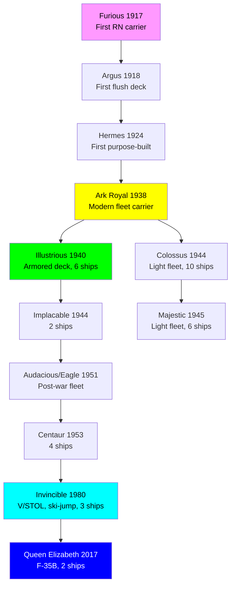

# Royal Navy Aircraft Carrier Research Tree (1917-Present)

## Era Overview

| Era | Years | Key Innovation | Classes | Ships |
|-----|-------|----------------|---------|-------|
| **Early Conversions** | 1917-1924 | First carriers, conversions | 4 classes | 6 ships |
| **Purpose-Built** | 1923-1938 | First purpose-built carriers | 2 classes | 3 ships |
| **Armored Fleet Carriers** | 1940-1945 | Armored flight decks | 2 classes | 6 ships |
| **Light Fleet Carriers** | 1943-1945 | Mass production, light carriers | 2 classes | 16 ships |
| **Escort Carriers** | 1941-1945 | Convoy protection, conversions | 2 categories | 40+ ships |
| **Post-War Fleet Carriers** | 1951-1955 | Angled decks, steam catapults | 2 classes | 4 ships |
| **Light Carriers** | 1953-1959 | Smaller fleet carriers | 1 class | 4 ships |
| **V/STOL Carriers** | 1980-2005 | Harrier carriers, ski-jump | 1 class | 3 ships |
| **Modern Supercarriers** | 2017-Present | F-35B, large fleet carriers | 1 class | 2 ships |

**Total:** ~20 major classes, ~84+ aircraft carriers built/operated

## Production Summary

| Type | Classes | Total Ships | Peak Era |
|------|---------|-------------|----------|
| Early Conversions | 4 | 6 ships | 1917-1924 (Furious, Argus, Eagle, Hermes) |
| Purpose-Built | 2 | 3 ships | 1923-1938 (Ark Royal) |
| Armored Fleet Carriers | 2 | 6 ships | 1940-1945 (Illustrious, Implacable) |
| Light Fleet Carriers | 2 | 16 ships | 1943-1945 (Colossus, Majestic) |
| Escort Carriers | 2 | 40+ ships | 1941-1945 (Lend-Lease + conversions) |
| Post-War Fleet | 2 | 4 ships | 1951-1955 (Audacious, Centaur incomplete) |
| Light Carriers | 1 | 4 ships | 1953-1959 (Centaur) |
| V/STOL Carriers | 1 | 3 ships | 1980-2005 (Invincible) |
| Modern Supercarriers | 1 | 2 ships | 2017-Present (Queen Elizabeth) |
| **Grand Total** | **~20** | **~84+** | **107 years** |

## Research Tree Diagram

## Major Milestones

### Technological Firsts

| Achievement | Class/Ship | Year |
|-------------|------------|------|
| **First RN aircraft carrier** | HMS Furious | 1917 |
| **First flush deck carrier** | HMS Argus | 1918 |
| **First purpose-built carrier** | HMS Hermes | 1924 |
| **First modern fleet carrier** | HMS Ark Royal | 1938 |
| **First armored flight deck** | Illustrious | 1940 |
| **Most numerous class** | Colossus | 1944 (10 ships) |
| **First angled deck** | HMS Centaur | 1954 |
| **First ski-jump ramp** | HMS Invincible | 1980 |
| **Largest RN carriers** | Queen Elizabeth | 2017 (65,000 tons) |

## Timeline

```mermaid
graph LR
    A[1917<br/>Furious<br/>First carrier] --> B[1918<br/>Argus<br/>Flush deck]
    B --> C[1924<br/>Hermes<br/>Purpose-built]
    C --> D[1938<br/>Ark Royal<br/>Modern fleet]
    D --> E[1940<br/>Illustrious<br/>Armored deck]
    E --> F[1944<br/>Colossus<br/>10 light carriers]
    F --> G[1951<br/>Eagle<br/>Post-war fleet]
    G --> H[1953<br/>Centaur<br/>4 ships]
    H --> I[1980<br/>Invincible<br/>V/STOL]
    I --> J[2017<br/>Queen Elizabeth<br/>F-35B]

    style A fill:#f9f,stroke:#333,stroke-width:4px
    style E fill:#0f0,stroke:#333,stroke-width:4px
    style I fill:#0ff,stroke:#333,stroke-width:4px
    style J fill:#00f,stroke:#fff,stroke-width:4px,color:#fff
```

## Class Listing by Era

### Early Conversions (1917-1924)
1. [[HMS-Furious]] (1917) - Converted battlecruiser, first RN carrier
2. [[Argus-Class]] (1918) - Converted liner, first flush deck
3. [[Eagle-Class-CV]] (1924) - Converted battleship, 22,600 tons
4. [[Hermes-Class-1924]] (1924) - **First purpose-built carrier**

### Converted Battlecruisers (1924-1928)
5. [[Courageous-Class-CV]] (1928) - 2 ships, converted from battlecruisers

### Modern Fleet Carriers (1938)
6. [[Ark Royal-Class-1938]] (1938) - **First modern RN fleet carrier**

### Armored Fleet Carriers (1940-1945)
7. [[Illustrious-Class]] (1940) - **6 ships, first armored flight decks**
8. [[Implacable-Class]] (1944) - 2 ships, improved Illustrious

### Light Fleet Carriers (1943-1945)
9. [[Colossus-Class]] (1944) - **10 ships, mass production light carriers**
10. [[Majestic-Class]] (1945) - 6 ships, improved Colossus (many sold to Commonwealth)

### Escort Carriers (1941-1945)
11. [[Attacker-Class]] (1942-1943) - 8 US-built escort carriers (Lend-Lease)
12. [[Ruler-Class]] (1943-1944) - 31 US-built escort carriers (Lend-Lease)
13. [[Activity-Class]] (1942) - 1 ship, British-built escort carrier
(Plus additional Lend-Lease classes)

### Post-War Fleet Carriers (1951-1955)
14. [[Audacious-Class]] (1951) - 2 ships (Eagle, Ark Royal), large fleet carriers
15. [[Centaur-Class]] (1953-1959) - 4 ships, medium fleet carriers

### V/STOL Carriers (1980-2005)
16. [[Invincible-Class]] (1980) - **3 ships, Harrier carriers, ski-jump**

### Modern Supercarriers (2017-Present)
17. [[Queen Elizabeth-Class]] (2017) - **2 ships, largest RN carriers ever, F-35B**

### Cancelled Post-WWII
18. [[Malta-Class]] - **CANCELLED 1945, 4 ordered, large fleet carriers**
19. [[CVA-01]] - **CANCELLED 1966, large fleet carrier replacement**

## Key Technologies

### Flight Deck Evolution
- **1917:** Partial flight deck (HMS Furious)
- **1918:** Full flush deck (HMS Argus)
- **1924:** Island superstructure (HMS Hermes)
- **1940:** Armored flight deck (Illustrious) - **RN innovation**
- **1954:** Angled flight deck (HMS Centaur)
- **1980:** Ski-jump ramp (HMS Invincible) - **RN innovation**
- **2017:** STOVL operations, F-35B (Queen Elizabeth)

### Propulsion Evolution
- **1917-1938:** Oil-fired boilers, steam turbines
- **1951-2005:** Steam turbines (post-war carriers)
- **1980s:** Gas turbines (Invincible class)
- **2017:** Gas turbines + diesel (Queen Elizabeth)

### Aircraft Systems
- **1917-1940:** No catapults, short takeoff runs
- **1940:** Accelerators for takeoff
- **1951:** Steam catapults
- **1954:** Angled deck + mirror landing sight
- **1980:** V/STOL (Harrier), no catapults needed
- **2017:** F-35B STOVL operations

### Size Growth
- **Furious (1917):** 22,450 tons, 786 ft
- **Ark Royal (1938):** 22,000 tons, 800 ft
- **Illustrious (1940):** 23,000 tons, 740 ft
- **Eagle (1951):** 36,800 tons, 804 ft
- **Invincible (1980):** 20,600 tons, 677 ft
- **Queen Elizabeth (2017):** 65,000 tons, 920 ft

## Notable Service

### World War I (1917-1918)
- **HMS Furious:** First carrier air strikes (Tondern Raid 1918)
- **HMS Argus:** Entered service just before war ended

### Interwar Period (1918-1939)
- **Development:** RN pioneered carrier aviation
- **Fleet Air Arm:** Transferred to RAF 1918, returned to RN 1939
- **Ark Royal:** Symbol of modern RN carrier power

### World War II (1939-1945)
- **Taranto (1940):** Illustrious's aircraft crippled Italian fleet
- **Bismarck chase (1941):** Ark Royal's Swordfish crippled Bismarck
- **Mediterranean:** Armored carriers survived multiple bomb hits
- **Malta convoys:** Carriers provided air cover
- **Indian Ocean:** Carriers faced Japanese attacks
- **Arctic convoys:** Escort carriers protected convoys
- **D-Day (1944):** Multiple carriers provided air support
- **Pacific (1945):** British Pacific Fleet with 4 fleet carriers

### Cold War (1945-1991)
- **Suez Crisis (1956):** Eagle, Albion participated
- **Falklands War (1982):** Invincible, Hermes, Harriers decisive
- **Post-Falklands:** Carriers maintained for power projection

### Modern Era (1991-Present)
- **Afghanistan (2001):** Invincible-class carriers participated
- **Iraq (2003):** Ark Royal operated
- **Libya (2011):** Harrier carriers
- **Current:** Queen Elizabeth class operational

### Famous Ships

- **HMS Ark Royal (1938):** Sunk 1941, symbol of RN power
- **HMS Illustrious:** Survived heavy bomb damage, Taranto raid
- **HMS Hermes (1959):** Falklands flagship 1982
- **HMS Invincible:** First through-deck carrier, Falklands
- **HMS Queen Elizabeth:** Largest RN warship ever

## Cancelled Carrier Programs

### Malta-Class (1943) - CANCELLED 1945
- **Ordered:** 4 large fleet carriers
- **Specifications:** 46,900 tons, 80+ aircraft
- **Innovation:** Improved Audacious design
- **Cancellation:** End of WWII, budget cuts
- **Impact:** Would have been largest RN carriers until Queen Elizabeth

### CVA-01 (1963) - CANCELLED 1966
- **Ordered:** 1 large fleet carrier (possibly 4 eventually)
- **Specifications:** 54,000 tons, 50 aircraft
- **Innovation:** Angled deck, steam catapults, modern design
- **Cancellation:** 1966 Defence White Paper ("East of Suez" withdrawal)
- **Impact:** Led to "through-deck cruiser" concept (Invincible)

### Comparison to Other Navies

**Armored Flight Decks:**
- **British innovation:** Illustrious class (1940)
- **US adoption:** Midway class (1945)
- **Advantage:** Survived bomb hits that would cripple US carriers
- **Trade-off:** Smaller air groups (30-40 vs 80-90)

**Ski-Jump Ramps:**
- **British innovation:** Invincible class (1980)
- **Worldwide adoption:** Russia, India, China, Spain, Italy, Thailand
- **Advantage:** Enables STOVL operations, increased payload
- **Impact:** Standard for non-catapult carriers

---

**Tree:** Master Research Tree | **Classes:** ~20 | **Ships:** ~84+

#carrier #aircraft-carrier #royal-navy #research-tree #fleet-air-arm #hms-ark-royal #illustrious #invincible #queen-elizabeth

## Cancelled Carrier Programs
Two major cancelled programs documented separately:
- [[Malta-Class]] - Large fleet carriers, 4 ordered, cancelled 1945 (end of WWII)
- [[CVA-01]] - Large fleet carrier, cancelled 1966 ("East of Suez" withdrawal)
