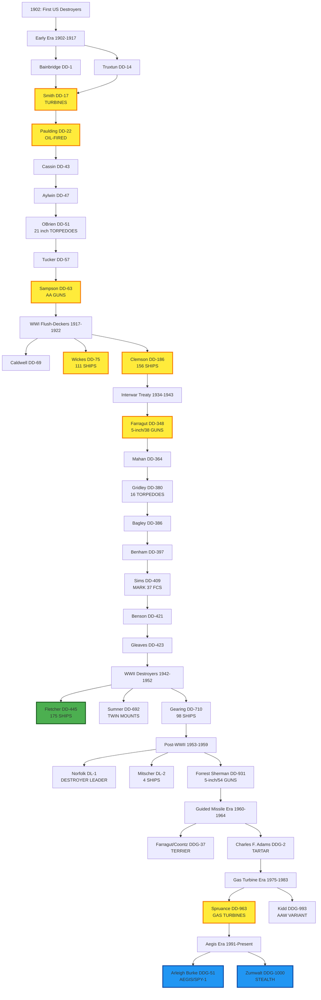

# US Navy Destroyer Research Tree (1902-Present)

## Era Overview

| Era | Years | Key Innovation | Classes |
|-----|-------|----------------|---------|
| **Early Destroyers** | 1902-1917 | Coal→Oil, Turbines | 9 classes |
| **WWI Flush-Deckers** | 1917-1922 | Mass production, Flush deck | 3 classes (267 ships!) |
| **Interwar Treaty** | 1934-1943 | 5"/38 dual-purpose guns | 8 classes |
| **WWII** | 1942-1952 | Large hulls, Heavy AA | 3 classes (331 ships!) |
| **Post-WWII** | 1953-1959 | High-pressure steam, Destroyer leaders | 3 classes |
| **Guided Missile** | 1960-1964 | SAM systems, Terrier/Tartar | 2 classes |
| **Gas Turbine** | 1975-1983 | Gas turbines, VLS | 2 classes |
| **Aegis Era** | 1991-Present | Phased array radar, BMD | 2 classes |

**Total:** 29 major classes, ~1,200+ destroyers built

## Production Summary

| Type | Classes | Total Ships | Peak Era |
|------|---------|-------------|----------|
| Early Destroyers | 9 | ~100 ships | 1902-1917 |
| WWI Flush-Deckers | 3 | 267 ships | 1917-1922 (Clemson: 156) |
| Interwar Treaty | 8 | ~160 ships | 1934-1943 |
| WWII Destroyers | 3 | 331 ships | 1942-1952 (Fletcher: 175) |
| Post-WWII Conventional | 3 | ~50 ships | 1953-1959 |
| Guided Missile | 2 | ~33 ships | 1960-1964 |
| Gas Turbine | 2 | 35 ships | 1975-1983 |
| Aegis Era | 2 | 92+ ships | 1991-Present (Arleigh Burke: 89+) |
| **Grand Total** | **32** | **~1,068+** | **122 years** |

## Research Tree Diagram

## Major Milestones

### Technological Firsts

| Achievement | Class | Year |
|-------------|-------|------|
| **First US destroyers** | Bainbridge | 1902 |
| **First turbines** | Smith | 1909 |
| **First oil-fired** | Paulding | 1910 |
| **First 21-inch torpedoes** | O'Brien | 1914 |
| **First AA guns** | Sampson | 1916 |
| **First flush-deck** | Caldwell | 1917 |
| **Largest class ever** | Clemson | 1919 (156 ships) |
| **First 5-inch/38 guns** | Farragut | 1934 |
| **Most numerous wartime** | Fletcher | 1942 (175 ships) |
| **First twin mounts** | Allen M. Sumner | 1943 |
| **First 5-inch/54 guns** | Forrest Sherman | 1955 |
| **First guided missiles** | Farragut/Coontz | 1960 |
| **First gas turbines** | Spruance | 1975 |
| **First Aegis system** | Arleigh Burke | 1991 |
| **First stealth destroyer** | Zumwalt | 2016 |

## Timeline

```mermaid
graph LR
    A[1902<br/>Bainbridge<br/>First destroyer] --> B[1909<br/>Smith<br/>First turbines]
    B --> C[1910<br/>Paulding<br/>First oil-fired]
    C --> D[1916<br/>Sampson<br/>First AA guns]
    D --> E[1918<br/>Wickes<br/>111 ships]
    E --> F[1919<br/>Clemson<br/>156 ships]
    F --> G[1934<br/>Farragut<br/>5-inch/38 guns]
    G --> H[1942<br/>Fletcher<br/>175 ships]
    H --> I[1943<br/>Sumner<br/>Twin mounts]
    I --> J[1955<br/>Forrest Sherman<br/>5-inch/54 guns]
    J --> K[1960<br/>Farragut DDG<br/>First missiles]
    K --> L[1975<br/>Spruance<br/>Gas turbines]
    L --> M[1991<br/>Arleigh Burke<br/>Aegis system]
    M --> N[2016<br/>Zumwalt<br/>Stealth]

    style A fill:#f9f,stroke:#333,stroke-width:4px
    style F fill:#ff0,stroke:#333,stroke-width:4px
    style H fill:#0f0,stroke:#333,stroke-width:4px
    style M fill:#00f,stroke:#fff,stroke-width:4px,color:#fff
```

---

## Key Technological Innovations

### Propulsion Evolution
1. **1902-1909**: Coal-fired, Triple-expansion engines
2. **1909**: First turbines ([[Smith-Class]])
3. **1910**: Oil-fired boilers ([[Paulding-Class]])
4. **1934**: Superheated steam ([[Farragut-Class]])
5. **1953**: 1200 psi high-pressure ([[Forrest Sherman-Class]])
6. **1975**: Gas turbines ([[Spruance-Class]])
7. **2016**: Integrated electric ([[Zumwalt-Class]])

### Armament Evolution
1. **1902**: 2× 3"/50 guns
2. **1913**: 4× 4"/50 guns ([[Cassin-Class]])
3. **1916**: First AA guns ([[Sampson-Class]])
4. **1934**: 5"/38 dual-purpose ([[Farragut-Class]])
5. **1943**: Twin 5" mounts ([[Allen M. Sumner-Class]])
6. **1955**: 5"/54 guns ([[Forrest Sherman-Class]])
7. **1960**: Guided missiles ([[Farragut-Coontz-Class]])
8. **1975**: VLS cells ([[Spruance-Class]])
9. **1991**: Aegis + 90-96 VLS ([[Arleigh Burke-Class]])

### Fire Control Evolution
1. **1902-1934**: Manual optical sights
2. **1934**: Mark 33 GFCS ([[Farragut-Class]])
3. **1939**: Mark 37 GFCS with computer ([[Sims-Class]])
4. **1942**: Radar fire control ([[Fletcher-Class]])
5. **1960**: Missile fire control ([[Farragut-Coontz-Class]])
6. **1991**: Aegis Combat System ([[Arleigh Burke-Class]])

---

## Production Numbers (Top 10)

| Rank | Class | Ships | Years | Notes |
|------|-------|-------|-------|-------|
| 1 | [[Clemson-Class]] | 156 | 1919-22 | Largest ever |
| 2 | [[Fletcher-Class]] | 175 | 1942-44 | Most numerous wartime |
| 3 | [[Wickes-Class]] | 111 | 1918-21 | WWI mass production |
| 4 | [[Gearing-Class]] | 98 | 1945-52 | Extended Sumner |
| 5 | [[Arleigh Burke-Class]] | 89+ | 1991-Present | Still building |
| 6 | [[Gleaves-Class]] | 66 | 1940-43 | WWII workhorse |
| 7 | [[Allen M. Sumner-Class]] | 58 | 1943-46 | Twin mounts |
| 8 | [[Spruance-Class]] | 31 | 1975-83 | Gas turbines |
| 9 | [[Benson-Class]] | 30 | 1940-43 | Quintuple torpedoes |
| 10 | [[Charles F. Adams-Class]] | 23 | 1960-64 | Tartar DDG |

---

## Research Links by Era

### Early Destroyers (1902-1917)
- [[USA/USA Cruisers/Bainbridge-Class]] (DD-1, 1902) - First US destroyers
- [[USA/USA Cruisers/Truxtun-Class]] (DD-14, 1902)
- [[Smith-Class]] (DD-17, 1909) - **First turbines, last coal**
- [[Paulding-Class]] (DD-22, 1910) - **First oil-fired**
- [[Cassin-Class]] (DD-43, 1913) - First 4" guns
- [[Aylwin-Class]] (DD-47, 1913)
- [[O'Brien-Class]] (DD-51, 1914) - **First 21" torpedoes**
- [[Tucker-Class]] (DD-57, 1915) - First geared turbines
- [[Sampson-Class]] (DD-63, 1916) - **First AA guns**

### WWI Flush-Deckers (1917-1922)
- [[Caldwell-Class]] (DD-69, 1917) - First flush-deck
- [[Wickes-Class]] (DD-75, 1918) - **111 ships**
- [[Clemson-Class]] (DD-186, 1919) - **156 ships, largest class ever**

### Interwar Treaty Ships (1934-1943)
- [[Farragut-Class]] (DD-348, 1934) - **First 5"/38 dual-purpose**
- [[Mahan-Class]] (DD-364, 1936) - 12 torpedoes
- [[Gridley-Class]] (DD-380, 1937) - 16 torpedoes (max)
- [[Bagley-Class]] (DD-386, 1937)
- [[Benham-Class]] (DD-397, 1939) - 3 boilers
- [[Sims-Class]] (DD-409, 1939) - **Mark 37 FCS**
- [[Benson-Class]] (DD-421, 1940) - Quintuple torpedoes
- [[Gleaves-Class]] (DD-423, 1940) - 850°F steam

### WWII Destroyers (1942-1952)
- [[Fletcher-Class]] (DD-445, 1942) - **175 ships, legendary**
- [[Allen M. Sumner-Class]] (DD-692, 1943) - **Twin gun mounts**
- [[Gearing-Class]] (DD-710, 1945) - Extended Sumner, **98 ships**

### Post-WWII Conventional (1953-1959)
- [[Norfolk-Class]] (DL-1, 1953) - **Experimental destroyer leader, 1 ship**
- [[Mitscher-Class]] (DL-2 to DL-5, 1953-1954) - **Destroyer leaders, 2 converted to DDG**
- [[Forrest Sherman-Class]] (DD-931, 1955) - **5"/54 guns, 1200 psi**

### Guided Missile Age (1960-1964)
- [[Farragut-Coontz-Class]] (DDG-37, 1960) - **Terrier SAM**
- [[Charles F. Adams-Class]] (DDG-2, 1960) - **Tartar SAM, 23 ships**

### Gas Turbine Era (1975-1983)
- [[Spruance-Class]] (DD-963, 1975) - **Gas turbines, VLS, 31 ships**
- [[Kidd-Class]] (DDG-993, 1981-1982) - **AAW variant, built for Iran, 4 ships**

### Aegis Era (1991-Present)
- [[Arleigh Burke-Class]] (DDG-51, 1991) - **Aegis, 89+ ships, still building**
- [[Zumwalt-Class]] (DDG-1000, 2016) - **Stealth, 3 ships only**

---

## Comparison by Era

### Displacement Growth
| Era | Typical | Example |
|-----|---------|---------|
| Early (1902-17) | 420-1,225t | Bainbridge 420t |
| WWI (1917-22) | 1,154-1,190t | Wickes 1,154t |
| Treaty (1934-43) | 1,500-1,630t | Farragut 1,500t |
| WWII (1942-52) | 2,050-2,616t | Fletcher 2,050t |
| Post-WWII (1955-59) | 2,800-4,050t | Sherman 2,800t |
| DDG (1960-64) | 3,370-5,648t | Adams 3,370t |
| Gas Turbine (1975-83) | 8,040-9,600t | Spruance 8,040t |
| Aegis (1991-Present) | 8,315-15,995t | Burke 8,315t |

### Speed Trend
- **1902-1918**: 29-35 knots
- **1918-1943**: 35-37 knots (peak)
- **1943-Present**: 30-35 knots (slower but more capable)

### Main Battery Evolution
- **1902-1913**: 2-5× 3" guns
- **1913-1934**: 4-5× 4" guns
- **1934-1955**: 4-6× 5"/38 guns
- **1955-1960**: 1-3× 5"/54 guns
- **1960-Present**: 1-2× 5"/54 or 5"/62 guns + missiles

---

**Tree:** Master Research Tree | **Classes:** 32 | **Ships:** ~1,068+

#destroyer #us-navy #research-tree #complete #1902-present #all-classes #evolution
