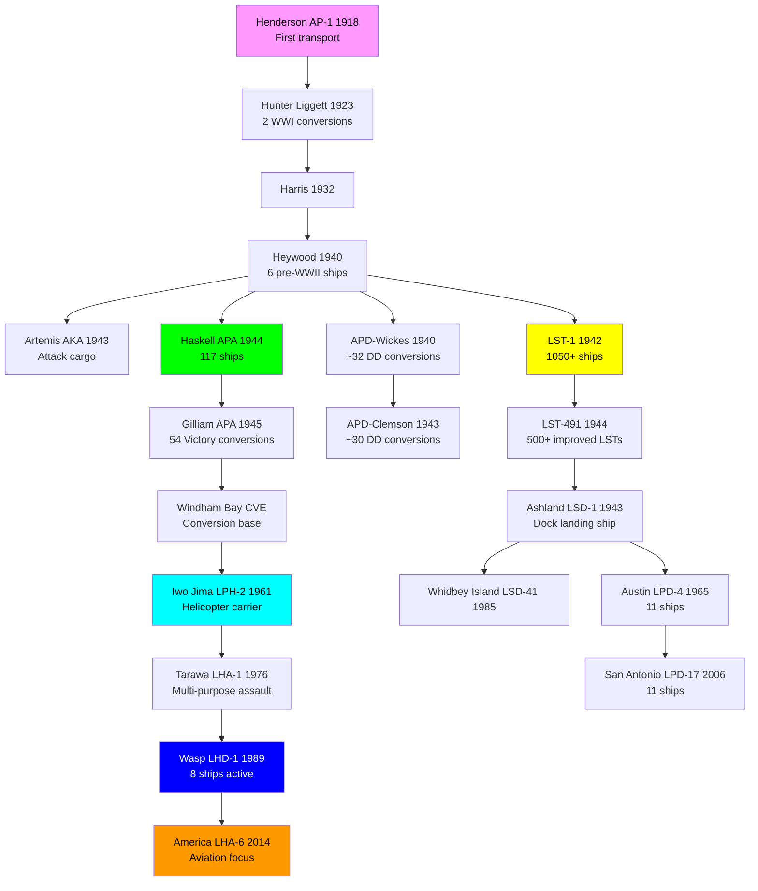

# US Navy Transport & Amphibious Ship Research Tree (1918-Present)

## Era Overview

| Era | Years | Key Innovation | Classes | Ships |
|-----|-------|----------------|---------|-------|
| **Early Transports** | 1918-1941 | First purpose-built transports | 10 classes | ~35 ships |
| **WWII Attack Transports** | 1942-1946 | Mass production APA, converted | 9 classes | 400+ ships |
| **WWII Attack Cargo** | 1943-1945 | AKA cargo ships | 6 classes | 108+ ships |
| **High Speed Transports** | 1940-1945 | APD converted destroyers | 4 classes | 175+ ships |
| **Landing Ship Tank** | 1942-1945 | LST mass production | 3 classes | 1,050+ ships |
| **Landing Ship Dock** | 1943-1945 | LSD well decks | 3 classes | 37 ships |
| **Cold War Amphibious** | 1950-1990 | LPH, LPD, LSD improvements | 10+ classes | 100+ ships |
| **Modern Assault Ships** | 1976-Present | LHA/LHD helicopter carriers | 3 classes | 19+ ships |

**Total:** 54 major classes, ~2,000+ transport/amphibious ships built

## Production Summary

| Type | Classes | Total Ships | Peak Era |
|------|---------|-------------|----------|
| Early Transports (AP) | 10 | ~35 ships | 1918-1941 |
| WWII Attack Transports (APA) | 9 | 400+ ships | 1942-1946 (Haskell: 117, Bayfield: 62) |
| WWII Attack Cargo (AKA) | 6 | 108 ships | 1943-1945 (Artemis: 41, Andromeda: 35, Tolland: 32) |
| High Speed Transports (APD) | 4 | 175+ ships | 1940-1945 (Crosley: 50, Charles Lawrence: 43) |
| Landing Ship Tank (LST) | 3 | 1,050+ ships | 1942-1945 (LST-1 to LST-1152) |
| Landing Ship Dock (LSD) | 3 | 37 ships | 1943-1945 |
| Amphibious Helicopter (LPH) | 2 | 12 ships | 1961-1970 (Iwo Jima: 7) |
| Amphibious Transport Dock (LPD) | 4 | 29 ships | 1965-Present (San Antonio: 11) |
| Amphibious Assault Ships (LHA/LHD) | 3 | 19 ships | 1976-Present (Wasp: 8, America: 2) |
| **Grand Total** | **54** | **~2,000+** | **107 years** |

## Research Tree Diagram

## Major Milestones

### Technological Firsts

| Achievement | Class | Year |
|-------------|-------|------|
| **First purpose-built transport** | Henderson (AP-1) | 1918 |
| **First attack transports (APA)** | Haskell-class | 1944 |
| **Most numerous APA** | Haskell-class | 1944 (117 ships) |
| **First attack cargo (AKA)** | Artemis-class | 1943 |
| **High speed transports (APD)** | Converted destroyers | 1940 |
| **Mass production LST** | LST-1 class | 1942 (1,050+ ships) |
| **First landing ship dock** | Ashland (LSD-1) | 1943 |
| **First helicopter assault ship** | Iwo Jima (LPH-2) | 1961 |
| **First multi-purpose assault** | Tarawa (LHA-1) | 1976 |
| **Current assault ships** | Wasp-class | 1989 |
| **Aviation-focused assault** | America-class | 2014 |

## Timeline

```mermaid
graph LR
    A[1918<br/>Henderson AP-1<br/>First transport] --> B[1940<br/>Heywood class<br/>Pre-WWII]
    B --> C[1943<br/>Artemis AKA<br/>Attack cargo]
    C --> D[1944<br/>Haskell APA<br/>117 attack transports]
    D --> E[1942<br/>LST-1<br/>1050+ landing ships]
    E --> F[1943<br/>APD<br/>High speed transports]
    F --> G[1943<br/>Ashland LSD<br/>Dock landing ship]
    G --> H[1961<br/>Iwo Jima LPH<br/>Helicopter assault]
    H --> I[1976<br/>Tarawa LHA<br/>Multi-purpose]
    I --> J[1989<br/>Wasp LHD<br/>8 ships active]
    J --> K[2014<br/>America LHA<br/>Aviation focused]

    style A fill:#f9f,stroke:#333,stroke-width:4px
    style D fill:#0f0,stroke:#333,stroke-width:4px
    style E fill:#ff0,stroke:#333,stroke-width:4px
    style J fill:#00f,stroke:#fff,stroke-width:4px,color:#fff
```

## Class Listing by Era

### Early Transports (1918-1941)
1. [[Henderson-Class-AP]] (AP-1, 1918) - **First purpose-built transport**
2. [[Hunter-Liggett-Class-AP]] (AP-27/28, 1923) - WWI German liner conversions, 2 ships
3. [[Harris-Class-APA]] (AP-8/9, 1932) - Purpose-built transports
4. [[Heywood-Class-AP]] (AP-12 to AP-21, 1940) - Pre-WWII purpose-built, 6 ships
5. [[Doyen-Class-APA]] (APA-1, 1940) - Early attack transports
6. [[McCawley-Class-APA]] (APA-4, 5, 1940-1941) - Foreign-built passenger ship conversions, 2 ships
7. [[Harry Lee-Class-APA]] (APA-10, 1940) - Passenger ship conversion, 1 ship
8. [[President Jackson-Class-APA]] (APA-18, 19, 20, 1940-1941) - President Line conversions, 3 ships
9. [[John Penn-Class-APA]] (APA-23, 1941) - Passenger ship conversion, 1 ship (war loss)
10. [[Admiral W.S. Benson-Class-AP]] (AP-120, 1943) - C3 transport conversions

### WWII Attack Transports (APA) (1942-1946)
11. [[Arthur Middleton-Class-APA]] (APA-25, 1942) - Early C3 conversions, 3 ships
12. [[Frederick Funston-Class-APA]] (APA-89, 94, 1942) - C3-S-A1 conversions, 2 ships
13. [[Crescent City-Class-APA]] (APA-21, 1942) - C3 passenger ship conversions, 4 ships
14. [[Ormsby-Class-APA]] (APA-49, 50, 51, 1943) - C2-S-B1 conversions, 3 ships
15. [[Sumter-Class-APA]] (APA-52, 53, 54, 1943) - C2-S-E1 conversions, 4 ships
16. [[Bayfield-Class-APA]] (APA-33, 1943) - C2 conversions, 62 ships
17. [[Windsor-Class-APA]] (APA-55, 56, 58, 59, 180-184, 1943-1944) - C3-S-A1/A3/A2 conversions, 9 ships
18. [[Haskell-Class]] (APA-117, 1944) - **Victory ship conversions, 117 ships**
19. [[Gilliam-Class-APA]] (APA-57, 1945) - Victory ship conversions, 54 ships

### WWII Attack Cargo Ships (AKA/LKA) (1943-1945)
20. [[Arcturus-Class-AKA]] (AKA-1 to AKA-14, 1943) - **First AKAs, converted from AK cargo ships, 14 ships**
21. [[Andromeda-Class-LKA]] (AKA-15, 1943) - C2 cargo conversions, 35 ships
22. [[Artemis-Class-AKA]] (AKA-21, 1943) - Victory cargo conversions, 41 ships
23. [[Tolland-Class-AKA]] (AKA-64, 1944) - C2 cargo conversions, 32 ships
24. [[Tulare-Class-LKA]] (AKA-112, 1954) - Mariner-class conversions
25. [[Charleston-Class-LKA]] (LKA-113, 1968) - Modern amphibious cargo ships

### High Speed Transports (APD) (1940-1945)
26. [[APD-Wickes-Conversion]] (APD-1, 1940) - Converted flush-deck destroyers, ~32 ships
27. [[APD-Clemson-Conversion]] (APD-21, 1943) - Converted Clemson destroyers, ~30 ships
28. [[Charles Lawrence-Class]] (APD-37, 1943) - Converted Buckley-class destroyer escorts, 43 ships
29. [[Crosley-Class-APD]] (APD-87 to APD-142, 1944-1945) - **Converted Rudderow-class destroyer escorts, 50 ships**

### Landing Craft Infantry (LCI) (1943-1945)
30. [[LCI(G)-Class]] (LCI(G), 1943) - Gunboat support craft
31. [[LCI(L)-1-Class]] (LCI(L)-1, 1943) - Large landing craft, 350+ built
32. [[LCI(L)-351-Class]] (LCI(L)-351, 1944) - Improved LCI(L), 272 built
33. [[LCI(M)-Class]] (LCI(M), 1943) - Mortar support craft
34. [[LCI(R)-Class]] (LCI(R), 1943) - Rocket support craft

### Landing Ship Medium (LSM) (1944-1945)
35. [[LSM-1-Class]] (LSM-1, 1944) - Medium landing ships, 500+ built
36. [[LSM(R)-188-Class]] (LSM(R)-188, 1944) - Rocket support ships

### Landing Ship Tank (LST) (1942-Present)
37. [[LST-1-Class]] (LST-1, 1942) - **Mass production, 1,050+ ships**
38. [[LST-491-Class]] (LST-491, 1944) - Improved LST design, 500+ ships
39. [[LST-542-Class]] (LST-542, 1944) - Further improved LST
40. [[Terrebonne Parish-Class-LST]] (LST-1156, 1952) - Modernized LST, 15 ships
41. [[De Soto County-Class-LST]] (LST-1171, 1958) - Post-war LST, 7 ships
42. [[Newport-Class-LST]] (LST-1179, 1969) - Modern LST, 20 ships

### Landing Ship Dock (LSD) (1943-Present)
43. [[Ashland-Class-LSD]] (LSD-1, 1943) - **First LSD, 8 ships**
44. [[Casa Grande-Class-LSD]] (LSD-13, 1944) - 10 ships
45. [[Thomaston-Class-LSD]] (LSD-28, 1954) - 8 ships
46. [[Anchorage-Class-LSD]] (LSD-36, 1969) - 5 ships
47. [[Whidbey Island-Class-LSD]] (LSD-41, 1985) - 8 ships
48. [[Harpers Ferry-Class-LSD]] (LSD-49, 1995) - Cargo variant LSD, 4 ships

### Amphibious Helicopter Carriers (LPH) (1961-1970)
49. [[Iwo Jima-Class-LPH]] (LPH-2, 1961) - **First helicopter assault ships, 7 ships**

### Amphibious Transport Docks (LPD) (1965-Present)
50. [[Austin-Class-LPD]] (LPD-4, 1965) - 11 ships, served through 2006
51. [[San Antonio-Class]] (LPD-17, 2006) - **Modern LPD, 11 ships**

### Amphibious Assault Ships (LHA/LHD) (1976-Present)
52. [[Tarawa-Class]] (LHA-1, 1976) - Multi-purpose assault, 5 ships
53. [[Wasp-Class]] (LHD-1, 1989) - **8 ships, all active**
54. [[America-Class-LHA]] (LHA-6, 2014) - Aviation-focused LHA, 2 active + more planned

## Key Technologies

### Transport Evolution
- **1918-1940:** Converted civilian ships and purpose-built transports (AP)
- **1942-1946:** Attack transports (APA) with landing craft
- **1943-1945:** Attack cargo ships (AKA) for amphibious ops
- **1940-1945:** High speed transports (APD) from destroyers

### Landing Ship Evolution
- **1942:** LST - beach directly, mass production (1,050+ ships)
- **1943:** LSD - Well deck for landing craft
- **1954:** LSD with ballast tanks for flooding well deck

### Amphibious Assault Evolution
- **1961:** LPH - Helicopter assault ships (Iwo Jima)
- **1965:** LPD - Transport dock with well deck
- **1976:** LHA - Multi-purpose: helos + landing craft + vehicles
- **1989:** LHD - Improved LHA with better aviation
- **2014:** America-class - Aviation-focused (no well deck on LHA-6/7)

### Aircraft Capabilities
- **LPH (Iwo Jima):** 20-25 helicopters
- **LHA (Tarawa):** 19 CH-46 + 4 CH-53 + 6 AV-8B Harrier
- **LHD (Wasp):** 30-40 helicopters or 20 helos + 6 F-35B
- **LHA (America):** 25-30 helicopters or F-35B focused

### Size Growth
- **Henderson (1918):** 8,100 tons
- **Haskell APA (1944):** 14,000 tons
- **Iwo Jima LPH (1961):** 18,000 tons
- **Tarawa LHA (1976):** 39,400 tons
- **Wasp LHD (1989):** 40,500 tons
- **America LHA (2014):** 45,000 tons

## Notable Operations

### World War II (1942-1945)
- **Guadalcanal (1942):** First major amphibious assault
- **Tarawa (1943):** LST and LSD debut
- **Normandy (1944):** 2,700+ landing ships and craft
- **Iwo Jima (1945):** 450 landing ships
- **Okinawa (1945):** Largest amphibious assault (1,300+ ships)

### Korean War (1950-1953)
- **Inchon (1950):** LST and APA critical to landing

### Vietnam War (1965-1975)
- **Riverine operations:** LST and LPH operations
- **Marine operations:** Iwo Jima-class LPH critical

### Modern Era (1990-Present)
- **Desert Storm (1991):** Amphibious threat pinned Iraqi forces
- **Afghanistan/Iraq (2001-2011):** Aviation support from LHDs
- **Humanitarian:** LHDs as hospital ships, disaster relief

---

**Tree:** Master Research Tree | **Classes:** 54 | **Ships:** ~2,000+

#transport #amphibious #apa #aka #apd #lst #lsd #lph #lpd #lha #lhd #assault-ship #landing-ship #us-navy
