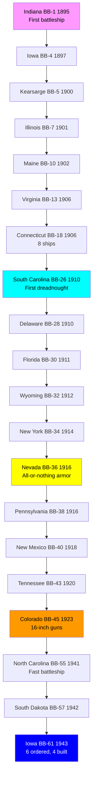

# US Navy Battleship Research Tree (1895-1992)

## Era Overview

| Era | Years | Key Innovation | Classes | Ships |
|-----|-------|----------------|---------|-------|
| **Pre-Dreadnoughts** | 1895-1906 | First battleships, Spanish-American War | 7 classes | 24 ships |
| **Dreadnoughts** | 1910-1916 | All-big-gun ships, turbines | 7 classes | 16 ships |
| **Super-Dreadnoughts** | 1916-1923 | Oil-fired, all-or-nothing armor, 16" guns | 6 classes | 12 ships |
| **Cancelled/Design Studies** | 1916-1943 | Various cancelled programs and design studies | 4 designs | 0 built |
| **Treaty Battleships** | 1941-1944 | Fast battleships, WWII | 3 classes | 10 ships |

**Total:** 27 major classes (23 built, 4 cancelled/design studies), 62 battleships built

## Production Summary

| Type | Classes | Total Ships | Peak Era |
|------|---------|-------------|----------|
| Pre-Dreadnoughts | 7 | 24 ships | 1895-1906 (Spanish-American War era) |
| Dreadnoughts | 7 | 16 ships | 1910-1916 (WWI era) |
| Super-Dreadnoughts | 6 | 12 ships | 1916-1923 (Post-WWI, 16-inch guns) |
| Cancelled/Design Studies | 4 | 0 ships | 1916-1943 (Tillman, Lexington BC, SD 1920, Montana) |
| Treaty Battleships | 3 | 10 ships | 1941-1944 (WWII fast battleships) |
| **Grand Total** | **27** | **62** | **97 years** |

## Research Tree Diagram

## Major Milestones

### Technological Firsts

| Achievement | Class | Year |
|-------------|-------|------|
| **First US battleships** | Indiana | 1895 |
| **Spanish-American War** | Indiana/Iowa/Kearsarge | 1898 |
| **First dreadnought** | South Carolina | 1910 |
| **First all-or-nothing armor** | Nevada | 1916 |
| **First oil-fired** | Nevada | 1916 |
| **First 16-inch guns** | Colorado | 1923 |
| **First treaty battleships** | North Carolina | 1941 |
| **Most powerful class** | Iowa | 1943 |
| **Last battleship commissioned** | Missouri (Iowa-class) | 1944 |
| **Last in service** | Missouri | 1992 |

### Famous Ships

- **Oregon (BB-3)** - 14,000 mile dash around South America 1898
- **Maine (BB-10)** - Named after USS Maine (ACR-1) lost in Havana 1898
- **Arizona (BB-39)** - Memorial at Pearl Harbor
- **Missouri (BB-63)** - Surrender signed, museum ship
- **New Jersey (BB-62)** - Most active Iowa, museum ship
- **Wisconsin (BB-64)** - Desert Storm, museum ship

## Timeline

```mermaid
graph LR
    A[1895<br/>Indiana<br/>First battleship] --> B[1906<br/>Connecticut<br/>8 ships]
    B --> C[1910<br/>South Carolina<br/>First dreadnought]
    C --> D[1914<br/>New York<br/>14-inch guns]
    D --> E[1916<br/>Nevada<br/>All-or-nothing]
    E --> F[1918<br/>New Mexico<br/>Turbo-electric]
    F --> G[1920<br/>Tennessee<br/>Post-WWI]
    G --> H[1923<br/>Colorado<br/>16-inch guns]
    H --> I[1941<br/>North Carolina<br/>Fast battleship]
    I --> J[1942<br/>South Dakota<br/>Compact armor]
    J --> K[1943<br/>Iowa<br/>33 knots]
    K --> L[1992<br/>Missouri<br/>Last in service]

    style A fill:#f9f,stroke:#333,stroke-width:4px
    style C fill:#0ff,stroke:#333,stroke-width:4px
    style E fill:#ff0,stroke:#333,stroke-width:4px
    style K fill:#00f,stroke:#fff,stroke-width:4px,color:#fff
```

## Class Listing by Era

### Pre-Dreadnought Battleships (1895-1906)
1. [[Indiana-Class-BB]] (BB-1 to BB-3, 1895) - **First US battleships, 3 ships**
2. [[Iowa-Class-BB-4]] (BB-4, 1897) - Improved Indiana
3. [[Kearsarge-Class]] (BB-5/6, 1900) - Superimposed turrets
4. [[Illinois-Class]] (BB-7/8, 1901) - Improved Kearsarge
5. [[Maine-Class-BB]] (BB-10, 1902) - Named after lost cruiser
6. [[Virginia-Class-BB]] (BB-13 to BB-17, 1906) - 5 ships
7. [[Connecticut-Class]] (BB-18 to BB-25, 1906) - **8 ships, Great White Fleet**

### Dreadnought Battleships (1910-1916)
8. [[South Carolina-Class]] (BB-26/27, 1910) - **First US dreadnoughts**
9. [[Delaware-Class]] (BB-28/29, 1910) - 10× 12-inch guns
10. [[Florida-Class]] (BB-30/31, 1911) - 10× 12-inch guns
11. [[Wyoming-Class]] (BB-32/33, 1912) - 12× 12-inch guns
12. [[New York-Class-BB]] (BB-34/35, 1914) - **First 14-inch guns**
13. [[Nevada-Class]] (BB-36/37, 1916) - **All-or-nothing armor, oil-fired**
14. [[Pennsylvania-Class]] (BB-38/39, 1916) - 12× 14-inch guns

### Super-Dreadnought Battleships (1916-1923)
15. [[New Mexico-Class]] (BB-40/41/42, 1918) - Turbo-electric, 3 ships
16. [[Tennessee-Class-BB]] (BB-43/44, 1920) - 2 ships
17. [[Colorado-Class]] (BB-45/46/48, 1923) - **First 16-inch guns, 3 ships**

### Cancelled Post-WWI Designs (1916-1922)
18. [[Tillman-Maximum-Battleships]] (1916-1917) - **DESIGN STUDIES ONLY - Up to 24× 16" OR 15× 18" guns, 70,000-80,000 tons, never proceeded beyond paper**
19. [[Lexington-Class-Battlecruiser]] (CC-1 to CC-6, 1916) - **Battlecruisers, 8× 16" guns, 6 ordered, 2 converted to carriers, 4 cancelled**
20. [[South Dakota-Class-1920]] (BB-49 to BB-54, 1920) - **12× 16" guns, 6 ordered, all cancelled under Washington Treaty**

### Treaty Battleships (1941-1944)
21. [[North Carolina-Class]] (BB-55/56, 1941) - First modern fast battleships
22. [[South Dakota-Class-BB]] (BB-57 to BB-60, 1942) - **Compact armor scheme, 4 ships**
23. [[Iowa-Class]] (BB-61 to BB-66, 1943) - **33 knots, most powerful, 4 built, 2 cancelled**

### Large Cruisers / Battlecruisers (1944)
24. [[USA/USA Battleships/Alaska-Class]] (CB-1/2, 1944) - **12-inch guns, 2 built, 4 cancelled - unique battlecruisers**

### Never Built
25. [[Montana-Class]] (BB-67 to BB-71) - Super battleships, cancelled 1943

## Key Technologies

### Main Battery Evolution
- **1895-1906:** 4× 13-inch guns (Indiana)
- **1910-1914:** 10-12× 12-inch guns (dreadnoughts)
- **1914-1923:** 10-12× 14-inch guns (New York to Tennessee)
- **1923-1944:** 8-9× 16-inch guns (Colorado, North Carolina, Iowa)
- **Montana (cancelled):** 12× 16-inch guns

### Armor Evolution
- **1895-1916:** Traditional armor scheme
- **1916:** All-or-nothing armor (Nevada) - thick belt, thin elsewhere
- **1941:** Modern armor with internal protection
- **1942:** Compact armor scheme (South Dakota)

### Propulsion Evolution
- **1895-1916:** Coal-fired, reciprocating engines/turbines
- **1916:** Oil-fired boilers (Nevada)
- **1918:** Turbo-electric drive (New Mexico)
- **1941:** High-pressure steam turbines

### Speed Evolution
- **1895-1906:** 16-18 knots (pre-dreadnoughts)
- **1910-1923:** 20-21 knots (dreadnoughts)
- **1941:** 28 knots (North Carolina)
- **1942:** 27.5 knots (South Dakota)
- **1943:** 33 knots (Iowa) - fastest battleships

### Fire Control Evolution
- **1895-1920:** Optical rangefinders
- **1920s:** Mechanical fire control computers
- **1930s:** Radar fire control
- **1940s:** Advanced radar FCS, proximity fuses

## Size Growth

| Class | Year | Displacement | Length | Main Guns | Speed |
|-------|------|--------------|--------|-----------|-------|
| Indiana | 1895 | 10,288 tons | 351 ft | 4× 13" | 16 kn |
| South Carolina | 1910 | 16,000 tons | 453 ft | 8× 12" | 18.5 kn |
| Nevada | 1916 | 27,500 tons | 583 ft | 10× 14" | 20.5 kn |
| Colorado | 1923 | 32,600 tons | 624 ft | 8× 16" | 21 kn |
| North Carolina | 1941 | 35,000 tons | 729 ft | 9× 16" | 28 kn |
| Iowa | 1943 | 45,000 tons | 887 ft | 9× 16" | 33 kn |

## Notable Service

### Spanish-American War (1898)
- Indiana, Iowa, Oregon, Massachusetts - Santiago de Cuba

### World War I (1917-1918)
- New York, Wyoming, Florida, Delaware - Atlantic Fleet
- Nevada, Pennsylvania - Gun crews to France

### World War II (1941-1945)
- **Pearl Harbor (1941):** Arizona, Oklahoma, West Virginia sunk; Nevada, California, Tennessee, Maryland, Pennsylvania damaged
- **Pacific War:** All surviving pre-1941 battleships modernized and returned to service
- **Fast battleships:** North Carolina, South Dakota, Iowa classes dominated Pacific 1942-1945
- **Shore bombardment:** All classes supported amphibious landings

### Cold War (1945-1992)
- **Korea (1950-1953):** Iowa, Missouri, New Jersey, Wisconsin
- **Vietnam (1968-1969):** New Jersey
- **Lebanon (1983-1984):** New Jersey
- **Persian Gulf (1991):** Missouri, Wisconsin - Desert Storm

### Reactivations
- **1950s:** Iowa class for Korea
- **1968:** New Jersey for Vietnam
- **1980s:** All four Iowas reactivated (Reagan administration)
- **1991:** Missouri and Wisconsin Gulf War
- **1992:** Last battleship (Missouri) decommissioned

---

**Tree:** Master Research Tree | **Classes:** 27 | **Ships:** 62

#battleship #us-navy #research-tree #dreadnought #bb #iowa #fast-battleship #wwii

## Cancelled Battleship Programs & Design Studies
Four cancelled/design study programs documented separately:
- [[Tillman-Maximum-Battleships]] - Design studies only, up to 24× 16" OR 15× 18" guns (1916-1917) - **Most extreme battleship designs ever**
- [[Lexington-Class-Battlecruiser]] - Battlecruisers, 2 converted to carriers, 4 cancelled (1916-1922)
- [[South Dakota-Class-1920]] - 12× 16" guns, cancelled under Washington Treaty (1920-1922)
- [[Montana-Class]] - 12× 16" guns, cancelled for aircraft carriers (1943)
