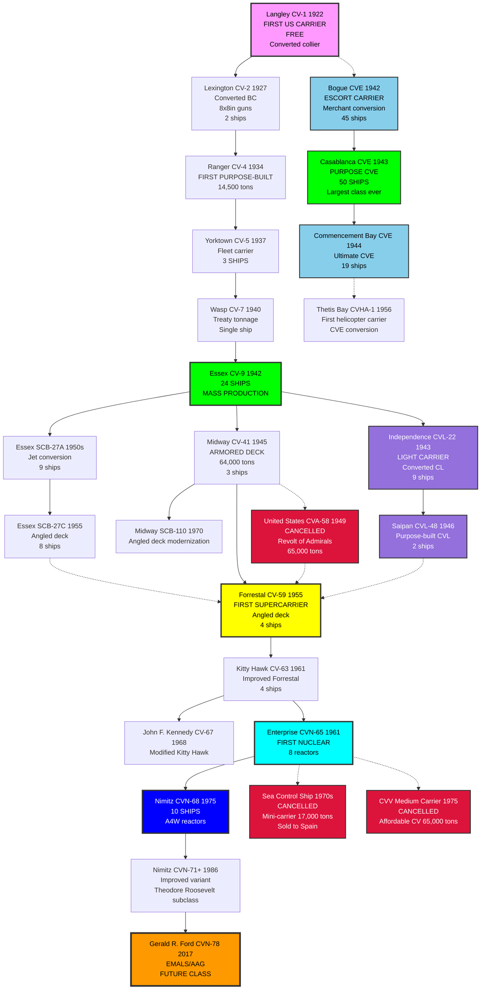
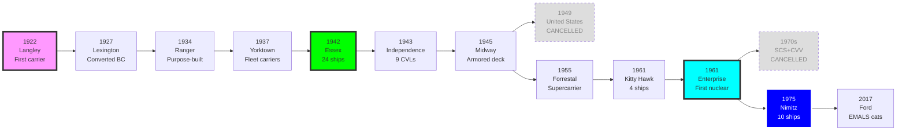

# US Navy Aircraft Carrier Research Tree (1922-Present)

## Era Overview

| Era | Years | Key Innovation | Classes | Ships |
|-----|-------|----------------|---------|-------|
| **Early Carriers** | 1922-1934 | First carriers, conversions | 2 classes | 3 ships |
| **Pre-WWII Fleet Carriers** | 1934-1940 | Purpose-built carriers | 3 classes | 5 ships |
| **WWII Fleet Carriers** | 1942-1945 | Mass production, Essex class | 1 class | 24 ships |
| **WWII Light Carriers** | 1943-1945 | Converted cruisers, CVLs | 1 class | 9 ships |
| **WWII Escort Carriers** | 1942-1945 | Convoy escort, mass production | 3 classes | 114 ships |
| **Late WWII** | 1945-1947 | Armored flight decks | 1 class | 3 ships |
| **Postwar Light Carriers** | 1946-1947 | Purpose-built CVLs | 1 class | 2 ships |
| **Essex Modernizations** | 1951-1959 | Jet conversion, angled decks | 2 variants | 17 conversions |
| **Midway Modernizations** | 1960-1970 | Angled deck, aluminum deck | 1 variant | 2 conversions |
| **Helicopter Carriers** | 1956 | First helo assault carrier | 1 conversion | 1 ship |
| **Cancelled Carriers** | 1949, 1970s | Various cancelled programs | 3 designs | 0 ships |
| **Supercarriers** | 1955-1968 | Angled decks, steam catapults | 3 classes | 9 ships |
| **Nuclear Carriers** | 1961-1975 | Nuclear propulsion | 2 classes | 9 ships |
| **Improved Nuclear** | 1986-1998 | Enhanced Nimitz variant | 1 subclass | 5 ships |
| **Future Nuclear** | 2017-Present | EMALS catapults | 1 class | 3+ ships |

**Total:** 26 major classes/variants (23 built, 3 cancelled), ~184+ aircraft carriers built

## Production Summary

| Type | Classes | Total Ships | Peak Era |
|------|---------|-------------|----------|
| Converted Carriers | 2 | 3 ships | 1922-1927 (Langley, Lexington) |
| Pre-WWII Fleet Carriers | 3 | 5 ships | 1934-1940 |
| WWII Fleet Carriers (CV) | 1 | 24 ships | 1942-1945 (Essex class) |
| WWII Light Carriers (CVL) | 1 | 9 ships | 1943-1945 (Independence) |
| WWII Escort Carriers (CVE) | 3 | 114 ships | 1942-1945 (Bogue, Casablanca, Commencement Bay) |
| Late WWII Heavy Carriers | 1 | 3 ships | 1945-1947 (Midway) |
| Postwar Light Carriers (CVL) | 1 | 2 ships | 1946-1947 (Saipan) |
| Essex Modernizations | 2 | 17 conversions | 1951-1959 (SCB-27A, SCB-27C) |
| Midway Modernizations | 1 | 2 conversions | 1960-1970 (SCB-110) |
| Helicopter Assault Carriers | 1 | 1 ship | 1956 (Thetis Bay CVHA-1) |
| Cancelled Carriers | 3 | 0 ships (cancelled) | 1949, 1970s (United States, SCS, CVV) |
| Conventional Supercarriers | 3 | 9 ships | 1955-1968 (Forrestal, Kitty Hawk, JFK) |
| Nuclear Supercarriers (Early) | 2 | 9 ships | 1961-1975 (Enterprise, Nimitz CVN-68-70) |
| Improved Nuclear Carriers | 1 | 5 ships | 1986-1998 (Nimitz CVN-71-75) |
| Future Nuclear Carriers | 1 | 3+ ships | 2017-Present (Ford) |
| **Grand Total** | **26** | **~184+** | **102 years** |

## Research Tree Diagram

## Major Milestones

### Technological Firsts

| Achievement | Class | Year |
|-------------|-------|------|
| **First US carrier** | Langley | 1922 |
| **First converted battlecruisers** | Lexington | 1927 |
| **First purpose-built carrier** | Ranger | 1934 |
| **First modern fleet carriers** | Yorktown | 1937 |
| **Most numerous class** | Essex | 1942 (24 ships) |
| **First light carriers (CVL)** | Independence | 1943 |
| **First armored flight deck** | Midway | 1945 |
| **First angled deck** | Forrestal | 1955 |
| **First supercarriers** | Forrestal | 1955 |
| **First nuclear carrier** | Enterprise | 1961 |
| **Largest class ever** | Nimitz | 1975 (10 ships) |
| **Newest class** | Gerald R. Ford | 2017 |

## Timeline

## Class Listing by Era

### Early Carriers (1922-1927)
1. [[Langley-Class]] (CV-1, 1922) - **First US carrier, converted collier**
2. [[Lexington-Class-CV]] (CV-2/3, 1927) - Converted battlecruisers, 2 ships

### Pre-WWII Fleet Carriers (1934-1940)
3. [[Ranger-Class]] (CV-4, 1934) - **First purpose-built carrier**
4. [[Yorktown-Class-CV]] (CV-5/6/8, 1937) - 3 ships
5. [[Wasp-Class-CV]] (CV-7, 1940) - Treaty tonnage carrier

### WWII Fleet Carriers (1942-1945)
6. [[Essex-Class]] (CV-9, 1942) - **24 ships, most numerous class**

### WWII Light Carriers (1943-1945)
7. [[Independence-Class]] (CVL-22, 1943) - 9 light carriers, converted cruisers

### WWII Escort Carriers (1942-1945)
8. [[Bogue-Class]] (CVE-9+, 1942) - **45 ships, first mass-produced CVE, merchant conversions**
9. [[Casablanca-Class]] (CVE-55+, 1943) - **50 ships, largest class ever built**
10. [[Commencement-Bay-Class]] (CVE-105+, 1944) - **19 ships, ultimate CVE design**

### Late WWII Heavy Carriers (1945-1947)
11. [[Midway-Class]] (CV-41, 1945) - 3 ships, armored flight deck

### Postwar Light Carriers (1946-1947)
12. [[Saipan-Class]] (CVL-48, 1946) - **2 ships, first purpose-built light carriers**

### Essex Modernizations (1951-1959)
13. [[Essex-SCB-27A-Class]] (SCB-27A, 1951) - **9 ships, jet conversion, H-8 hydraulic catapults**
14. [[Essex-SCB-27C-Class]] (SCB-27C, 1955) - **8 ships, angled deck, steam catapults**

### Midway Modernizations (1960-1970)
15. [[Midway-SCB-110-Class]] (SCB-110, 1960-1970) - **2 ships, angled deck, aluminum flight deck**

### Helicopter Assault Carriers (1956)
16. [[Thetis-Bay-Class]] (CVHA-1, 1956) - **First helicopter assault carrier, CVE conversion**

### Cancelled Supercarriers (1949)
17. [[United States-Class-CVA-58]] (CVA-58, 1949) - **CANCELLED after 5 days, "Revolt of the Admirals"**

### Conventional Supercarriers (1955-1968)
18. [[Forrestal-Class]] (CV-59, 1955) - **First supercarriers, 4 ships**
19. [[Kitty Hawk-Class]] (CV-63, 1961) - 4 ships
20. [[John-F-Kennedy-Class]] (CV-67, 1968) - **Last conventional carrier, 1 ship**

### Cancelled Mini-Carriers (1970s)
21. [[Sea-Control-Ship-SCS]] (SCS, 1970s) - **CANCELLED mini-carrier, 17,000 tons, Harriers + helicopters**
22. [[CVV-Medium-Carrier]] (CVV-1+, 1970s) - **CANCELLED "affordable" medium carrier concept**

### Nuclear Supercarriers (1961-1975)
23. [[Enterprise-Class-CVN]] (CVN-65, 1961) - **First nuclear carrier, 1 ship**
24. [[Nimitz-Class]] (CVN-68, 1975) - **4 ships, CVN-68 through CVN-70**

### Improved Nuclear Carriers (1986-1998)
25. [[Nimitz-CVN-71-Class]] (CVN-71+, 1986) - **5 ships, improved Nimitz variant, Theodore Roosevelt subclass**

### Future Nuclear Carriers (2017-Present)
26. [[Gerald R. Ford-Class]] (CVN-78, 2017) - **3+ ships under construction, EMALS catapults**

## Key Technologies

### Flight Deck Evolution
- **1922-1945:** Straight deck, arresting wires
- **1945:** Armored flight deck (Midway)
- **1955:** Angled flight deck (Forrestal)
- **2017:** Electromagnetic catapults - EMALS (Ford)

### Propulsion Evolution
- **1922-1934:** Turbo-electric (Langley, Lexington)
- **1934-1961:** Geared steam turbines
- **1961-Present:** Nuclear reactors (A2W, A4W, A1B)

### Catapult Systems
- **1922-1950:** Hydraulic catapults
- **1955:** Steam catapults (Forrestal)
- **2017:** Electromagnetic Aircraft Launch System - EMALS (Ford)

### Size Growth
- **Langley (1922):** 11,500 tons, 542 ft
- **Essex (1942):** 27,100 tons, 888 ft
- **Forrestal (1955):** 60,000 tons, 1,039 ft
- **Nimitz (1975):** 100,000 tons, 1,092 ft
- **Ford (2017):** 100,000 tons, 1,106 ft

---

**Tree:** Master Research Tree | **Classes:** 22 | **Ships:** ~184+

#carrier #aircraft-carrier #us-navy #research-tree #cv #cvn #cvl #cve #naval-aviation

## Cancelled Carrier Programs
Three cancelled carrier programs documented separately:
- [[United States-Class-CVA-58]] - First supercarrier, cancelled after 5 days (1949) - "Revolt of the Admirals"
- [[Sea-Control-Ship-SCS]] - Mini-carrier (17,000 tons), Zumwalt "High-Low" concept (1970s) - Design sold to Spain
- [[CVV-Medium-Carrier]] - "Affordable" medium carrier (65,000 tons, 50-60 aircraft) (1970s)
