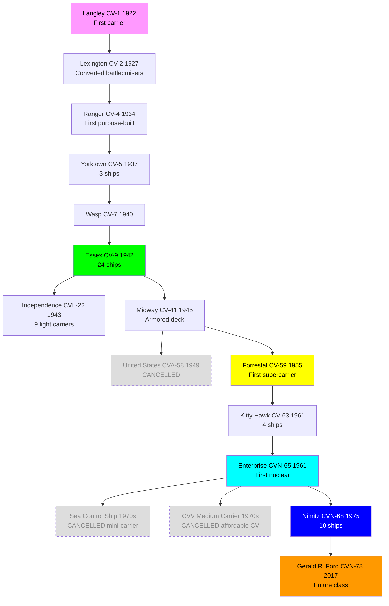
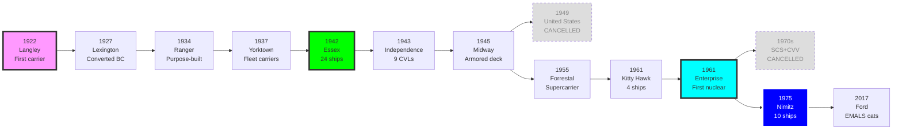

# US Navy Aircraft Carrier Research Tree (1922-Present)

## Era Overview

| Era | Years | Key Innovation | Classes | Ships |
|-----|-------|----------------|---------|-------|
| **Early Carriers** | 1922-1934 | First carriers, conversions | 2 classes | 3 ships |
| **Pre-WWII Fleet Carriers** | 1934-1940 | Purpose-built carriers | 3 classes | 5 ships |
| **WWII Fleet Carriers** | 1942-1945 | Mass production, Essex class | 1 class | 24 ships |
| **WWII Light Carriers** | 1943-1945 | Converted cruisers, CVLs | 1 class | 9 ships |
| **Late WWII** | 1945-1947 | Armored flight decks | 1 class | 3 ships |
| **Cancelled Carriers** | 1949, 1970s | Various cancelled programs | 3 designs | 0 ships |
| **Supercarriers** | 1955-1968 | Angled decks, steam catapults | 2 classes | 8 ships |
| **Nuclear Carriers** | 1961-Present | Nuclear propulsion | 3 classes | 14+ ships |

**Total:** 16 major classes (13 built, 3 cancelled), ~66+ aircraft carriers built

## Production Summary

| Type | Classes | Total Ships | Peak Era |
|------|---------|-------------|----------|
| Converted Carriers | 2 | 3 ships | 1922-1927 (Langley, Lexington) |
| Pre-WWII Fleet Carriers | 3 | 5 ships | 1934-1940 |
| WWII Fleet Carriers (CV) | 1 | 24 ships | 1942-1945 (Essex class) |
| WWII Light Carriers (CVL) | 1 | 9 ships | 1943-1945 (Independence) |
| Late WWII Heavy Carriers | 1 | 3 ships | 1945-1947 (Midway) |
| Cancelled Carriers | 3 | 0 ships (cancelled) | 1949, 1970s (United States, SCS, CVV) |
| Conventional Supercarriers | 2 | 8 ships | 1955-1968 (Forrestal, Kitty Hawk) |
| Nuclear Supercarriers | 3 | 14 ships | 1961-Present (Enterprise, Nimitz, Ford) |
| **Grand Total** | **16** | **~66+** | **102 years** |

## Research Tree Diagram

## Major Milestones

### Technological Firsts

| Achievement | Class | Year |
|-------------|-------|------|
| **First US carrier** | Langley | 1922 |
| **First converted battlecruisers** | Lexington | 1927 |
| **First purpose-built carrier** | Ranger | 1934 |
| **First modern fleet carriers** | Yorktown | 1937 |
| **Most numerous class** | Essex | 1942 (24 ships) |
| **First light carriers (CVL)** | Independence | 1943 |
| **First armored flight deck** | Midway | 1945 |
| **First angled deck** | Forrestal | 1955 |
| **First supercarriers** | Forrestal | 1955 |
| **First nuclear carrier** | Enterprise | 1961 |
| **Largest class ever** | Nimitz | 1975 (10 ships) |
| **Newest class** | Gerald R. Ford | 2017 |

## Timeline

## Class Listing by Era

### Early Carriers (1922-1927)
1. [[Langley-Class]] (CV-1, 1922) - **First US carrier, converted collier**
2. [[Lexington-Class-CV]] (CV-2/3, 1927) - Converted battlecruisers, 2 ships

### Pre-WWII Fleet Carriers (1934-1940)
3. [[Ranger-Class]] (CV-4, 1934) - **First purpose-built carrier**
4. [[Yorktown-Class-CV]] (CV-5/6/8, 1937) - 3 ships
5. [[Wasp-Class-CV]] (CV-7, 1940) - Treaty tonnage carrier

### WWII Fleet Carriers (1942-1945)
6. [[Essex-Class]] (CV-9, 1942) - **24 ships, most numerous class**

### WWII Light Carriers (1943-1945)
7. [[Independence-Class]] (CVL-22, 1943) - 9 light carriers, converted cruisers

### Late WWII Heavy Carriers (1945-1947)
8. [[Midway-Class]] (CV-41, 1945) - 3 ships, armored flight deck

### Cancelled Supercarriers (1949)
9. [[United States-Class-CVA-58]] (CVA-58, 1949) - **CANCELLED after 5 days, "Revolt of the Admirals"**

### Conventional Supercarriers (1955-1968)
10. [[Forrestal-Class]] (CV-59, 1955) - **First supercarriers, 4 ships**
11. [[Kitty Hawk-Class]] (CV-63, 1961) - 4 ships

### Cancelled Mini-Carriers (1970s)
12. [[Sea-Control-Ship-SCS]] (SCS, 1970s) - **CANCELLED mini-carrier, 17,000 tons, Harriers + helicopters**
13. [[CVV-Medium-Carrier]] (CVV-1+, 1970s) - **CANCELLED "affordable" medium carrier concept**

### Nuclear Supercarriers (1961-Present)
14. [[Enterprise-Class-CVN]] (CVN-65, 1961) - **First nuclear carrier, 1 ship**
15. [[Nimitz-Class]] (CVN-68, 1975) - **10 ships, still active**
16. [[Gerald R. Ford-Class]] (CVN-78, 2017) - 3+ ships under construction

## Key Technologies

### Flight Deck Evolution
- **1922-1945:** Straight deck, arresting wires
- **1945:** Armored flight deck (Midway)
- **1955:** Angled flight deck (Forrestal)
- **2017:** Electromagnetic catapults - EMALS (Ford)

### Propulsion Evolution
- **1922-1934:** Turbo-electric (Langley, Lexington)
- **1934-1961:** Geared steam turbines
- **1961-Present:** Nuclear reactors (A2W, A4W, A1B)

### Catapult Systems
- **1922-1950:** Hydraulic catapults
- **1955:** Steam catapults (Forrestal)
- **2017:** Electromagnetic Aircraft Launch System - EMALS (Ford)

### Size Growth
- **Langley (1922):** 11,500 tons, 542 ft
- **Essex (1942):** 27,100 tons, 888 ft
- **Forrestal (1955):** 60,000 tons, 1,039 ft
- **Nimitz (1975):** 100,000 tons, 1,092 ft
- **Ford (2017):** 100,000 tons, 1,106 ft

---

**Tree:** Master Research Tree | **Classes:** 16 | **Ships:** ~66+

#carrier #aircraft-carrier #us-navy #research-tree #cv #cvn #cvl #naval-aviation

## Cancelled Carrier Programs
Three cancelled carrier programs documented separately:
- [[United States-Class-CVA-58]] - First supercarrier, cancelled after 5 days (1949) - "Revolt of the Admirals"
- [[Sea-Control-Ship-SCS]] - Mini-carrier (17,000 tons), Zumwalt "High-Low" concept (1970s) - Design sold to Spain
- [[CVV-Medium-Carrier]] - "Affordable" medium carrier (65,000 tons, 50-60 aircraft) (1970s)
