# US Navy Submarine Research Tree (1900-Present)

## Era Overview

| Era | Years | Key Innovation | Classes | Boats |
|-----|-------|----------------|---------|-------|
| **Early Diesel** | 1900-1918 | First submarines, coal→diesel | 15 classes | ~100 boats |
| **WWI Diesel** | 1917-1925 | Mass production, 21" torpedoes | 2 classes | 71 boats |
| **Interwar Diesel** | 1921-1941 | Fleet submarines, V-boats | 11 classes | 116 boats |
| **WWII Diesel** | 1941-1951 | Gato/Balao mass production | 4 classes | 228 boats |
| **Post-WWII Diesel** | 1951-1959 | Hunter-killers, streamlined hulls | 5 classes | 15 boats |
| **First Nuclear (SSN)** | 1954-1961 | Nuclear power revolution | 7 classes | 18 boats |
| **Cold War SSN** | 1961-1996 | Quieting, speed, Tomahawk | 6 classes | 117 boats |
| **Modern SSN** | 1997-Present | Seawolf, Virginia classes | 2 classes | 27+ boats |
| **Ballistic Missile (SSBN)** | 1959-Present | Strategic deterrent | 7 classes | 55 boats |
| **Experimental Submarines** | 1953-2008 | Research and development | 5 submarines | 5 boats |
| **Future Programs** | 2040s+ | Next-generation submarines | TBD | Future |

**Total:** 62 submarine classes built (including experimental), plus future programs, ~750 submarines built

## Production Summary

| Type | Classes | Total Boats | Peak Production |
|------|---------|-------------|-----------------|
| Diesel (SS) | 37 | ~530 boats | 1942-1945 (Balao: 120 boats) |
| Nuclear Attack (SSN) | 13 | ~160 boats | 1976-1996 (Los Angeles: 62 boats) |
| Ballistic Missile (SSBN) | 7 | 55 boats | 1963-1967 (41 for Freedom) |
| Experimental (AGSS/SSRN/NR/X) | 5 | 5 boats | 1953-2008 (Albacore, Dolphin, Triton, NR-1, X-1) |
| **Grand Total** | **62** | **~750** | **125 years** |

## Research Tree Diagram

```mermaid
graph TD
    HOL[Holland 1900] --> PLUN[Plunger/A-Class]
    PLUN --> EARLY[B-O Classes<br/>1905-1918]
    EARLY --> R[R-Class 1918]
    R --> S[S-Class 1920<br/>51 boats]

    S --> BARV[Barracuda V-boats 1924]
    BARV --> ARG[Argonaut 1928]
    ARG --> NARV[Narwhal 1930]
    NARV --> POR[Porpoise 1935]
    POR --> SAL[Salmon 1938]
    SAL --> SAR[Sargo 1939]
    SAR --> TAM[Tambor 1940]
    TAM --> GAT[Gato 1941<br/>77 boats]

    GAT --> BAL[Balao 1943<br/>120 boats]
    BAL --> TEN[Tench 1944]
    TEN --> BARSK[Barracuda SSK 1951]
    BARSK --> TANG[Tang 1951]
    TANG --> BARB[Barbel 1959<br/>Last Diesel]

    BARB -.-> NAUT[Nautilus SSN 1954<br/>First Nuclear]
    NAUT --> SEAW[Seawolf SSN-575 1957]
    SEAW --> SKAT[Skate 1957]
    SKAT --> SKIP[Skipjack 1959<br/>Teardrop Hull]
    SKIP --> PERM[Permit 1961]
    PERM --> STUR[Sturgeon 1967<br/>37 boats]
    STUR --> LA[Los Angeles 1976<br/>62 boats]
    LA --> SEAW2[Seawolf 1997]
    SEAW2 --> VIRG[Virginia 2004<br/>24+ boats]

    SKIP -.-> GW[George Washington SSBN 1959<br/>First SSBN]
    GW --> EA[Ethan Allen 1961]
    EA --> LAF[Lafayette 1963]
    LAF --> JM[James Madison 1964]
    JM --> BF[Benjamin Franklin 1965]
    BF --> OHIO[Ohio 1981<br/>18 boats]
    OHIO --> COL[Columbia 2031<br/>Future]

    style HOL fill:#f9f,color:#000
    style NAUT fill:#0ff,color:#000
    style GW fill:#ff0,color:#000
    style BAL fill:#0f0,color:#000
    style LA fill:#0f0,color:#000
    style OHIO fill:#00f,color:#fff
    style VIRG fill:#0ff,color:#000
    style COL fill:#f90,color:#000
```

## Major Milestones

### Technological Firsts

| Achievement | Class | Year |
|-------------|-------|------|
| **First US submarine** | Holland | 1900 |
| **First diesel submarine** | D-Class | 1909 |
| **First 21-inch torpedoes** | R-Class | 1918 |
| **First fleet submarines** | Barracuda (V-boats) | 1924 |
| **First 8 torpedo tubes** | Salmon | 1938 |
| **First 10 torpedo tubes** | Tambor | 1940 |
| **Most numerous class** | Balao | 1943 (120 boats) |
| **First nuclear submarine** | Nautilus | 1954 |
| **Revolutionary teardrop hull** | Albacore | 1953 (experimental, influenced all modern subs) |
| **Only midget submarine** | X-1 | 1955 (experimental) |
| **First teardrop hull SSN** | Skipjack | 1959 |
| **First SSBN** | George Washington | 1959 |
| **Only twin-reactor submarine** | Triton | 1959 (radar picket, experimental) |
| **Deepest diving submarine** | Dolphin | 1968 (3,000+ ft, experimental) |
| **Smallest nuclear submarine** | NR-1 | 1969 (experimental) |
| **Largest class ever** | Los Angeles | 1976 (62 boats) |
| **Quietest/fastest SSN** | Seawolf | 1997 |

## Timeline

```mermaid
graph LR
    A[1900<br/>Holland<br/>First submarine] --> B[1918<br/>R-Class<br/>21-inch torpedoes]
    B --> C[1920<br/>S-Class<br/>51 boats]
    C --> D[1924<br/>V-boats<br/>Fleet submarines]
    D --> E[1941<br/>Gato<br/>77 boats]
    E --> F[1943<br/>Balao<br/>120 boats]
    F --> G[1954<br/>Nautilus SSN<br/>First nuclear]
    G --> H[1959<br/>Skipjack SSN<br/>Teardrop hull]
    H --> I[1959<br/>George Washington<br/>First SSBN]
    I --> J[1967<br/>Sturgeon<br/>37 boats]
    J --> K[1976<br/>Los Angeles<br/>62 boats]
    K --> L[1981<br/>Ohio SSBN<br/>18 boats]
    L --> M[1997<br/>Seawolf<br/>Quietest]
    M --> N[2004<br/>Virginia<br/>24+ boats]
    N --> O[2031<br/>Columbia SSBN<br/>Future]

    style A fill:#f9f,stroke:#333,stroke-width:4px
    style G fill:#0ff,stroke:#333,stroke-width:4px
    style I fill:#ff0,stroke:#333,stroke-width:4px
    style N fill:#0f0,stroke:#333,stroke-width:4px
```

---

**Tree:** Master Research Tree | **Classes:** 62 | **Boats:** ~750

#submarine #research-tree #us-navy #naval-history #ssn #ssbn #diesel #nuclear #experimental

## Experimental Submarines
Five unique experimental submarines documented separately:
- [[Albacore-AGSS-569-Experimental]] - Revolutionary teardrop hull (1953-1972) - **Influenced ALL modern submarines**
- [[X-1-Experimental]] - Only midget submarine (1955-1973)
- [[Triton-SSRN-586-Experimental]] - Only twin-reactor submarine, first submerged circumnavigation (1959-1969)
- [[Dolphin-AGSS-555-Experimental]] - Deepest diving submarine, 3,000+ ft (1968-2007)
- [[NR-1-Experimental]] - Smallest nuclear submarine, ocean floor wheels (1969-2008)