# Royal Navy Destroyer Research Tree (1893-Present)

## Era Overview

| Era | Years | Key Innovation | Classes | Ships |
|-----|-------|----------------|---------|-------|
| **Torpedo Boat Destroyers** | 1893-1901 | First TBDs, 26-30 knots | 25+ types | 110+ ships |
| **Pre-WWI Destroyers** | 1903-1915 | High forecastle, turbines | 8 classes | 186 ships |
| **WWI Destroyers** | 1914-1924 | Mass production, V&W class | 10+ classes | 260+ ships |
| **Interwar Standard** | 1926-1941 | Letter classes, flotillas | 12 classes | 110+ ships |
| **WWII Emergency Programme** | 1939-1946 | Mass production, Hunt/Battle | 11 classes | 245+ ships |
| **Post-War Gun Destroyers** | 1949-1952 | All-gun design | 1 class | 8 ships |
| **Guided Missile Destroyers** | 1961-Present | SAM systems, Aegis | 5 classes | 29 ships |

**Total:** ~72+ major classes, ~950+ destroyers built

## Production Summary

| Type | Classes | Total Ships | Peak Era |
|------|---------|-------------|----------|
| Torpedo Boat Destroyers | 25+ types | 110+ ships | 1893-1901 (26-30 knot types) |
| Pre-WWI Destroyers | 8 | 186 ships | 1903-1915 (River to L-class) |
| WWI Destroyers | 10+ | 260+ ships | 1914-1924 (M, R, S, V&W classes) |
| Interwar Standard | 12 | 110+ ships | 1926-1941 (A-I, Tribal classes) |
| WWII Emergency | 11 | 245+ ships | 1939-1946 (Hunt, Battle classes) |
| Post-War Gun | 1 | 8 ships | 1949-1952 (Daring) |
| Guided Missile | 5 | 29 ships | 1961-Present (County, Type 42, Type 45) |
| **Grand Total** | **~72+** | **~950+** | **132 years** |

## Research Tree Diagram

```mermaid
graph TD
    %% ============================================================
    %% BRANCH 1: FLEET DESTROYER MAIN LINE
    %% ============================================================
    HAVE[Havock-class 1893<br/>FIRST TBD<br/>FREE<br/>26 knots, 240 tons]
    HAVE --> RIVER[River-class 1903<br/>HIGH FORECASTLE<br/>36 ships<br/>Turbines, 25 kn]
    RIVER --> TRIBAL1[Tribal/F-class 1907<br/>Oil-fired<br/>13 ships]
    TRIBAL1 --> ACORN[Acorn/H-class 1910<br/>20 ships]
    ACORN --> BEAG[Beagle/G-class 1909<br/>16 ships]
    BEAG --> ACAST[Acasta/K-class 1912<br/>20 ships]

    %% WWI Mass Production
    ACAST --> M[Admiralty M-class 1914<br/>WWI MASS PRODUCTION<br/>74 ships]
    M --> R[R-class 1916<br/>39 ships]
    R --> VW[V&W-class 1916<br/>WWI ULTIMATE<br/>68 ships<br/>4x4in guns, 34 kn]

    %% Interwar Standard
    VW --> A[A-class 1928<br/>Standard design<br/>9 ships]
    A --> B[B-class 1929<br/>9 ships]

    %% WWII Emergency Programme
    B --> OP[O/P-class 1941<br/>WWII EMERGENCY<br/>16 ships]
    OP --> QR[Q/R-class 1941<br/>16 ships]
    QR --> ST[S/T-class 1942<br/>16 ships]
    ST --> UV[U/V-class 1942<br/>16 ships]
    UV --> WZ[W/Z-class 1943<br/>16 ships]
    WZ --> BATT[Battle-class 1943<br/>MOST HEAVILY ARMED<br/>23 ships<br/>4-5x4.5in DP]

    %% Post-War Gun Destroyers
    BATT --> DAR[Daring-class 1949<br/>LARGEST GUN DD<br/>8 ships<br/>6x4.5in, 2,830 tons]

    %% Guided Missile Destroyers
    DAR --> CNTY[County-class 1961<br/>FIRST GUIDED MISSILE<br/>8 ships<br/>Seaslug SAM]
    CNTY --> T42B1[Type 42 Batch 1 1971<br/>Sea Dart SAM<br/>6 ships]
    T42B1 --> T42B3[Type 42 Batch 3 1975<br/>FALKLANDS WAR<br/>4 ships<br/>HMS Sheffield]
    T42B3 --> T45[Type 45 Daring 2009<br/>SAMPSON AESA<br/>6 ships<br/>48x Sea Viper SAM]
    T45 --> T45MOD[Type 45 Modernized<br/>Enhanced systems<br/>2020s upgrade]
    T45MOD --> T83[Type 83 Future<br/>ULTIMATE DD<br/>Type 45 replacement]

    %% ============================================================
    %% BRANCH 2: LARGE DESTROYER / FLEET LEADER LINE
    %% ============================================================
    B --> TRIBAL2[Tribal-class 1936<br/>LARGE DESTROYER<br/>27 ships<br/>8x4.7in guns]
    TRIBAL2 --> JKN[J/K/N-class 1938<br/>Fleet destroyers<br/>24 ships]
    JKN --> LM[L/M-class 1939<br/>16 ships]
    LM -.-> BATT

    %% Alternative modern path
    TRIBAL2 -.-> T82[Type 82 Bristol 1969<br/>PROTOTYPE<br/>1 ship<br/>For cancelled CVA-01]
    T82 -.-> T42B1

    %% ============================================================
    %% BRANCH 3: ESCORT DESTROYER / ASW LINE
    %% ============================================================
    TRIBAL2 --> HUNT[Hunt-class 1939<br/>ESCORT DD<br/>86 ships<br/>4 types, convoy escort]
    HUNT --> CWWII[C-class WWII 1943<br/>ASW destroyers<br/>32 ships<br/>Ca/Ch/Co/Cr groups]
    CWWII --> WEAP[Weapon-class 1945<br/>ASW specialist<br/>4 ships]
    WEAP -.-> DAR
    CWWII -.-> T42B3

    %% ============================================================
    %% STYLING
    %% ============================================================

    %% First TBD
    style HAVE fill:#FFD700,stroke:#333,stroke-width:3px,color:#000

    %% WWI mass production
    style M fill:#0f0,stroke:#333,stroke-width:2px,color:#000
    style VW fill:#0f0,stroke:#333,stroke-width:3px,color:#000

    %% Large destroyers
    style TRIBAL2 fill:#ff0,stroke:#333,stroke-width:3px,color:#000

    %% WWII mass production
    style HUNT fill:#0f0,stroke:#333,stroke-width:2px,color:#000

    %% Most heavily armed
    style BATT fill:#f90,stroke:#333,stroke-width:3px,color:#000

    %% Largest gun destroyer
    style DAR fill:#9370DB,stroke:#333,stroke-width:2px,color:#fff

    %% First guided missile
    style CNTY fill:#0ff,stroke:#333,stroke-width:3px,color:#000

    %% Type 82 prototype
    style T82 fill:#DC143C,stroke:#333,stroke-width:2px,color:#fff

    %% SAMPSON radar
    style T45 fill:#f90,stroke:#333,stroke-width:3px,color:#000

    %% Ultimate endgame
    style T83 fill:#00f,stroke:#333,stroke-width:4px,color:#fff
```

## Major Milestones

### Technological Firsts

| Achievement | Class | Year |
|-------------|-------|------|
| **First torpedo boat destroyer** | Havock | 1893 |
| **First with high forecastle** | River/E-class | 1903 |
| **First oil-fueled** | Tribal/F-class | 1907 |
| **First turbine destroyers** | River class | 1903 |
| **Most numerous WWI class** | Admiralty M-class | 1914 (74 ships) |
| **Best WWI destroyer** | V&W classes | 1916 (68 ships) |
| **Most numerous WWII class** | Hunt class | 1939 (86 ships) |
| **Most heavily armed** | Battle class | 1943 (4-5× 4.5") |
| **Largest gun destroyers** | Daring class | 1949 (2,830 tons) |
| **First guided missile** | County class | 1961 |
| **Most advanced** | Type 45 | 2009 (Sampson AESA radar) |

## Timeline

```mermaid
graph LR
    A[1893<br/>Havock<br/>First TBD] --> B[1903<br/>River<br/>High forecastle]
    B --> C[1907<br/>Tribal<br/>Oil-fired]
    C --> D[1914<br/>M-Class<br/>74 ships]
    D --> E[1916<br/>V&W<br/>68 ships]
    E --> F[1928<br/>A-Class<br/>Standard type]
    F --> G[1936<br/>Tribal<br/>27 ships]
    G --> H[1939<br/>Hunt<br/>86 ships]
    H --> I[1943<br/>Battle<br/>23 ships]
    I --> J[1949<br/>Daring<br/>8 ships]
    J --> K[1961<br/>County<br/>Guided missile]
    K --> L[1971<br/>Type 42<br/>14 ships]
    L --> M[2009<br/>Type 45<br/>6 ships]

    style A fill:#f9f,stroke:#333,stroke-width:4px
    style E fill:#0f0,stroke:#333,stroke-width:4px
    style G fill:#ff0,stroke:#333,stroke-width:4px
    style I fill:#f90,stroke:#333,stroke-width:4px
    style M fill:#00f,stroke:#fff,stroke-width:4px,color:#fff
```

## Class Listing by Era

### Torpedo Boat Destroyers (1893-1901)

**26-Knotters (1893-1894)**
1. [[Daring-Class-TBD]] (1893) - 2 ships
2. [[Havock-Class]] (1893) - **2 ships, first TBDs**
3. [[Ferret-Class]] (1893) - 2 ships

**27-Knotters - A Class (1894-1895)**
4. 14 distinct builder types - ~37 ships total

**30-Knotters - B Class (4-funnelled, 1895-1900)**
5. 4 builder types - ~14 ships total

**30-Knotters - C Class (3-funnelled, 1896-1901)**
6. 12 builder types - ~45 ships total

**30-Knotters - D Class (2-funnelled, 1896-1899)**
7. Thornycroft designs - 4 batches, 10 ships total

8. [[Taku-Type]] (1900) - 1 ship

### Pre-WWI Destroyers (1903-1915)

9. [[River-Class/E-Class]] (1903) - **36 ships, first high forecastle**
10. [[Cricket-Class]] (1906) - 36 ships
11. [[Tribal-Class-1907]] (1907) - **13 ships, oil-fired**
12. [[Beagle-Class/G-Class]] (1909) - 16 ships
13. [[Acorn-Class/H-Class]] (1910) - 20 ships
14. [[Acheron-Class/I-Class]] (1910) - 23 ships
15. [[Acasta-Class/K-Class]] (1912) - 20 ships
16. [[Laforey-Class/L-Class]] (1913) - 22 ships

### WWI Destroyers (1914-1924)

17. [[Admiralty-M-Class]] (1914) - **74 ships, mass production**
18. Various M-Class variants (1914) - 18 ships
19. [[Admiralty-R-Class]] (1916) - 39 ships
20. [[Admiralty-S-Class]] (1918) - 55 ships
21. [[V-and-W-Class]] (1916) - **68 ships, best WWI destroyers**
22. Flotilla leader classes (1914-1919) - ~35 ships various types

### Interwar Standard Classes (1926-1941)

**Prototypes**
23. [[Ambuscade-Type]] (1926) - 1 ship, Yarrow prototype
24. [[Amazon-Type]] (1926) - 1 ship, Thornycroft prototype

**Letter Classes (Standard Design)**
25. [[A-Class-Destroyer]] (1928) - 9 ships
26. [[B-Class-Destroyer]] (1929) - 9 ships
27. [[C-Class-Destroyer-Interwar]] (1930) - 5 ships
28. [[D-Class-Destroyer]] (1931) - 9 ships
29. [[E-Class-Destroyer]] (1933) - 9 ships
30. [[F-Class-Destroyer]] (1933) - 9 ships
31. [[G-Class-Destroyer]] (1934) - 9 ships
32. [[H-Class-Destroyer]] (1935) - 9 ships + 6 ex-Brazilian (1938)
33. [[I-Class-Destroyer]] (1936) - 9 ships + 2 ex-Turkish (1939)

**Large Destroyer Classes**
34. [[Tribal-Class-1936]] (1936) - **27 ships, heavily armed**
35. [[J-K-N-Class]] (1938) - 24 ships
36. [[L-M-Class-Destroyer]] (1939) - 16 ships

**Escort Destroyers**
37. [[Hunt-Class]] (1939) - **86 ships, 4 types, escort destroyers**

**Lend-Lease**
38. [[Town-Class-Destroyer]] (1940) - 50 ex-US destroyers

### WWII Emergency Programme (1941-1946)

39. [[O-P-Class]] (1941) - 16 ships
40. [[Q-R-Class]] (1941) - 16 ships
41. [[S-T-Class]] (1942) - 16 ships
42. [[U-V-Class]] (1942) - 16 ships
43. [[W-Z-Class]] (1943) - 16 ships
44. [[C-Class-WWII]] (1943) - **32 ships (Ca, Ch, Co, Cr sub-groups)**
45. [[Battle-Class]] (1943) - **23 ships, most heavily armed**
46. [[Weapon-Class]] (1945) - 4 ships

### Cancelled WWII
47. [[G-Class-WWII]] - **CANCELLED, 8 ordered 1944**

### Post-War Gun Destroyers (1949-1952)

48. [[Daring-Class-1949]] (1949) - **8 ships, largest gun destroyers**

### Guided Missile Destroyers (1961-Present)

49. [[County-Class-Destroyer]] (1961) - **8 ships, first guided missile**
50. [[Bristol-Type-82]] (1969) - 1 ship, prototype for cancelled carriers
51. [[Type-42-Destroyer]] (1971) - **14 ships, Falklands War**
52. [[Type-45-Destroyer]] (2009) - **6 ships, Sampson AESA radar**

### Cancelled Post-WWII
53. [[Type-43-Destroyer]] - **CANCELLED 1981, feasibility stage only**

### Future Planned
54. [[Type-83-Destroyer]] - **PLANNED, replacement for Type 45 (2030s)**

## Key Technologies

### Hull Evolution
- **1893-1903:** "Turtleback" bow, 240-260 ft
- **1903:** High forecastle (River class) - modern configuration
- **1916-1924:** 312 ft (V&W class)
- **1936:** 377 ft (Tribal class) - large destroyers
- **1949:** 390 ft (Daring class) - largest gun destroyers
- **2009:** 500 ft (Type 45) - modern frigates sized as destroyers

### Armament Evolution
- **1893-1901:** 1× 12-pdr, 3-5× 6-pdr, 2× torpedo tubes
- **1903-1915:** 2-3× 4-inch guns, 2× torpedo tubes
- **1916:** 4× 4-inch guns, 6× torpedo tubes (V&W)
- **1936:** 8× 4.7-inch guns (Tribal) - gun emphasis
- **1943:** 4-5× 4.5-inch dual-purpose (Battle)
- **1949:** 6× 4.5-inch guns (Daring)
- **1961:** Seaslug SAM + 4× 4.5-inch (County)
- **1971:** Sea Dart SAM + 1× 4.5-inch (Type 42)
- **2009:** 48× Sea Viper SAM + 1× 4.5-inch (Type 45)

### Propulsion Evolution
- **1893-1907:** Coal-fired boilers, reciprocating engines
- **1907:** Oil-fired boilers (Tribal/F-class)
- **1903:** Steam turbines (River class)
- **1916-1952:** Oil-fired boilers, geared turbines
- **1961:** Steam turbines (County)
- **2009:** Gas turbines (Type 45) - all-electric propulsion

### Speed Evolution
- **1893:** 26-27 knots (26-knotters)
- **1894:** 27 knots (A-class)
- **1895:** 30 knots (B/C-class)
- **1916:** 34 knots (V&W class)
- **1936:** 36 knots (Tribal class)
- **1943:** 35.75 knots (Battle class)
- **1949:** 34 knots (Daring)
- **2009:** 29+ knots (Type 45)

### Combat Systems Evolution
- **1893-1940:** Optical fire control
- **1943:** Radar fire control (Battle class)
- **1961:** First SAM system - Seaslug (County)
- **1971:** Sea Dart SAM (Type 42)
- **2009:** SAMPSON AESA radar + Sea Viper SAM (Type 45)

## Size Growth

| Class | Year | Displacement | Length | Main Guns | Speed |
|-------|------|--------------|--------|-----------|-------|
| Havock | 1893 | 240 tons | 180 ft | 1× 12-pdr | 26 kn |
| River | 1903 | 550 tons | 225 ft | 1× 12-pdr | 25.5 kn |
| V&W | 1916 | 1,100 tons | 312 ft | 4× 4\" | 34 kn |
| Tribal | 1936 | 1,870 tons | 377 ft | 8× 4.7\" | 36 kn |
| Battle | 1943 | 2,315 tons | 379 ft | 4-5× 4.5\" | 35.75 kn |
| Daring | 1949 | 2,830 tons | 390 ft | 6× 4.5\" | 34 kn |
| County | 1961 | 5,440 tons | 521 ft | Seaslug SAM | 32.5 kn |
| Type 42 | 1971 | 3,500-4,775 tons | 410-463 ft | Sea Dart SAM | 30 kn |
| Type 45 | 2009 | 7,350 tons | 500 ft | 48× Sea Viper | 29+ kn |

## Notable Service

### Pre-WWI
- **Russo-Japanese War (1904-1905):** Multiple destroyers participated
- **Dover Patrol:** River and Tribal classes
- **North Sea patrols:** Beagle, Acorn, Acheron classes

### World War I (1914-1918)
- **Battle of Jutland (1916):** Multiple destroyer flotillas engaged
- **Dover Patrol:** M, R, S classes heavily used
- **North Sea:** V&W class dominated late-war operations
- **Zeebrugge Raid (1918):** Multiple destroyers participated
- **Anti-submarine warfare:** Destroyers primary ASW platform

### Interwar Period (1918-1939)
- **Modernization:** WWI destroyers converted, upgraded
- **Standardization:** A-I letter classes created standard flotillas
- **Treaty era:** Tribal class pushed destroyer limits

### World War II (1939-1945)
- **Norway campaign (1940):** Heavy destroyer losses
- **Dunkirk (1940):** Destroyers evacuated troops
- **Battle of the Atlantic:** Hunt class convoy escorts
- **Mediterranean:** Tribal, J/K/N classes heavily engaged
- **Battle of North Cape (1943):** Destroyers helped sink Scharnhorst
- **D-Day (1944):** Multiple flotillas provided fire support
- **Pacific:** Battle class joined British Pacific Fleet 1945

### Cold War (1945-1991)
- **Korean War (1950-1953):** Destroyers provided fire support
- **Suez Crisis (1956):** Multiple destroyers participated
- **Falklands War (1982):** **Type 42 HMS Sheffield sunk, Coventry sunk, Glasgow damaged**
- **Post-Falklands:** Accelerated Type 42 upgrades

### Modern Era (1991-Present)
- **Gulf War (1991):** Type 42 destroyers participated
- **Iraq War (2003):** Type 42 destroyers operated
- **Libya (2011):** Type 45 first combat deployment
- **Current:** Type 45 primary air defence destroyers

### Famous Ships

- **HMS Havock (H43):** First torpedo boat destroyer, revolutionary
- **HMS Cossack (F03):** Tribal-class, Altmark incident 1940
- **HMS Kelly (F01):** Mountbatten's command, sunk 1941
- **HMS Campbeltown (I42):** St. Nazaire Raid 1942, suicide ship
- **HMS Eskimo (F75):** Tribal-class, survived heavy damage
- **HMS Sheffield (D80):** First Type 42 sunk in Falklands by Exocet
- **HMS Daring (D32):** First Type 45, most advanced RN destroyer

## Cancelled Destroyer Programs

### G-Class (WWII) - CANCELLED 1944
- **Ordered:** 8 ships under 1944 emergency programme
- **Specifications:** Similar to C-class WWII destroyers
- **Cancellation:** End of WWII approaching, resources redirected
- **Impact:** Would have continued War Emergency Programme pattern

### Type 43 - CANCELLED 1981
- **Ordered:** Feasibility studies only
- **Specifications:** Enlarged Type 42 with improved capabilities
- **Cancellation:** 1981 Defence Review, budget constraints
- **Impact:** Type 42 production extended instead, eventually replaced by Type 45

## Design Philosophy Evolution

### Early Destroyers (1893-1914)
- **Purpose:** Torpedo boat destroyers - protect fleet from torpedo boats
- **Design:** Small, fast, lightly armed
- **Innovation:** Speed and maneuverability primary

### WWI Era (1914-1924)
- **Purpose:** Fleet screening, ASW, mine warfare
- **Design:** Larger, more seaworthy, oil-fired
- **Innovation:** V&W class - best WWI destroyers

### Interwar Standard (1926-1941)
- **Purpose:** Standardized flotilla design
- **Design:** Letter classes - incremental improvements
- **Innovation:** Tribal class - gun emphasis vs torpedoes

### WWII Emergency (1939-1946)
- **Purpose:** Mass production, convoy escort
- **Design:** Hunt class - simplified for ASW
- **Innovation:** Battle class - dual-purpose AA guns

### Post-War Gun (1949-1952)
- **Purpose:** Large fleet destroyers
- **Design:** Daring class - ultimate gun destroyer
- **Innovation:** Largest gun destroyers ever built

### Guided Missile Era (1961-Present)
- **Purpose:** Area air defence
- **Design:** SAM systems primary armament
- **Innovation:** Type 45 - SAMPSON AESA radar, most capable RN destroyer

---

**Tree:** Master Research Tree | **Classes:** ~72+ | **Ships:** ~950+

#destroyer #royal-navy #research-tree #v-and-w-class #tribal-class #battle-class #type-42 #type-45 #hms-sheffield #falklands

## Cancelled Destroyer Programs
Two cancelled programs documented separately:
- [[G-Class-WWII]] - War emergency programme destroyers, 8 ordered, cancelled 1944 (end of WWII approaching)
- [[Type-43-Destroyer]] - Enlarged Type 42, cancelled 1981 (feasibility stage, budget constraints)
