# Royal Navy Submarine Research Tree (1901-Present)

## Era Overview

| Era | Years | Key Innovation | Classes | Ships |
|-----|-------|----------------|---------|-------|
| **Petrol-Electric** | 1901-1910 | First submarines | 3 classes | 54 boats |
| **Diesel-Electric (WWI)** | 1908-1919 | Diesel engines, fleet submarines | 9 classes | 173 boats |
| **Interwar Diesel-Electric** | 1926-1945 | Ocean patrol, T-class | 4 classes | 129 boats |
| **WWII Diesel-Electric** | 1945-1947 | Post-war designs | 1 class | 16 boats |
| **Cold War Diesel-Electric** | 1956-1992 | Advanced diesel boats | 3 classes | 25 boats |
| **Nuclear Attack (SSN)** | 1959-Present | Nuclear propulsion | 7 classes | 37+ boats |
| **Ballistic Missile (SSBN)** | 1964-Present | Strategic deterrent | 3 classes | 12 boats |

**Total:** ~30 major classes, ~446+ submarines built/planned

## Production Summary

| Type | Classes | Total Boats | Peak Era |
|------|---------|-------------|----------|
| Petrol-Electric | 3 | 54 boats | 1901-1910 (Holland, A, B, C) |
| Diesel WWI | 9 | 173 boats | 1908-1919 (D, E, F, G, H, J, K, L, M, R) |
| Diesel Interwar | 4 | 129 boats | 1926-1945 (Odin, Parthian, S, T) |
| Diesel WWII | 1 | 16 boats | 1945-1947 (Amphion/A-class) |
| Diesel Cold War | 3 | 25 boats | 1956-1992 (Porpoise, Oberon, Upholder) |
| Nuclear SSN | 7 | 37+ boats | 1959-Present (Dreadnought to SSN-AUKUS) |
| Nuclear SSBN | 3 | 12 boats | 1964-Present (Resolution, Vanguard, Dreadnought) |
| **Grand Total** | **~30** | **~446+** | **124 years** |

## Research Tree Diagram

```mermaid
graph TD
    %% ============================================================
    %% BRANCH 1: DIESEL SUBMARINE LINE
    %% ============================================================
    HOL[Holland-class 1901<br/>FIRST RN SUBMARINE<br/>FREE<br/>5 boats, petrol-electric]
    HOL --> A[A-class 1902<br/>First British design<br/>13 boats]
    A --> B[B-class 1904<br/>11 boats]
    B --> C[C-class 1905<br/>38 boats<br/>Last petrol-electric]

    %% WWI Diesel Revolution
    C --> D[D-class 1908<br/>FIRST DIESEL<br/>8 boats]
    D --> E[E-class 1912<br/>WWI WORKHORSE<br/>58 boats]
    E --> F[F-class 1913<br/>3 boats]
    F --> G[G-class 1915<br/>14 boats]
    G --> H[H-class 1915<br/>44 boats]
    H --> J[J-class 1915<br/>7 boats]

    %% WWI Special Types
    J --> K[K-class 1916<br/>STEAM TURBINES<br/>"Kalamity Class"<br/>18 boats]
    K --> L[L-class 1917<br/>34 boats]
    L --> M[M-class 1917<br/>12-INCH GUN<br/>3 boats, experimental]
    L --> R[R-class 1918<br/>Hunter-killer<br/>12 boats]

    %% Interwar Diesel
    R --> ODIN[Odin-class 1926<br/>9 boats]
    ODIN --> PART[Parthian-class 1929<br/>6 boats]
    PART --> S[S-class 1931<br/>MOST NUMEROUS<br/>62 boats]
    S --> T[T-class 1937<br/>OCEAN PATROL<br/>52 boats<br/>WWII workhorse]

    %% WWII and Post-War Diesel
    T --> U[U-class 1937<br/>Medium patrol<br/>49 boats]
    U --> V[V-class 1943<br/>46 boats]
    V --> AMPH[A-class 1945<br/>Post-war design<br/>16 boats]

    %% Cold War Diesel
    AMPH --> PORP[Porpoise-class 1956<br/>Advanced diesel<br/>8 boats]
    PORP --> OBER[Oberon-class 1959<br/>LAST CONVENTIONAL<br/>13 boats]
    OBER --> UPH[Upholder-class 1986<br/>ULTIMATE DIESEL<br/>4 boats<br/>To Canada as Victoria]

    %% ============================================================
    %% BRANCH 2: NUCLEAR ATTACK SUBMARINE LINE (SSN)
    %% ============================================================
    PORP --> DREAD[HMS Dreadnought SSN-571 1959<br/>FIRST NUCLEAR<br/>US S5W reactor<br/>1 boat]
    DREAD --> VAL[Valiant-class 1962<br/>FIRST BRITISH PWR<br/>PWR1 reactor<br/>2 boats]
    VAL --> CHUR[Churchill-class 1967<br/>Improved Valiant<br/>3 boats]
    CHUR --> SWIFT[Swiftsure-class 1969<br/>Shorter, quieter<br/>6 boats]
    SWIFT --> TRAF[Trafalgar-class 1979<br/>PWR1, Tomahawk<br/>7 boats]
    TRAF --> AST[Astute-class 2001<br/>PWR2 reactor<br/>7 boats]
    AST --> AUKUS[SSN-AUKUS 2030s<br/>ULTIMATE SSN<br/>12 planned<br/>Next generation]

    %% ============================================================
    %% BRANCH 3: BALLISTIC MISSILE SUBMARINE LINE (SSBN)
    %% ============================================================
    VAL --> RES[Resolution-class 1964<br/>FIRST SSBN<br/>Polaris A3<br/>4 boats<br/>CASD begins 1969]
    RES --> VANG[Vanguard-class 1986<br/>Trident II D5<br/>4 boats<br/>Current deterrent]
    VANG --> DREAD2[Dreadnought-class 2030s<br/>ULTIMATE SSBN<br/>PWR3 reactor<br/>4 planned]

    %% Cross-branch alternatives
    T -.-> X[X-craft 1943<br/>MIDGET SUBMARINE<br/>~20 boats<br/>Special operations]
    X -.-> AMPH

    %% ============================================================
    %% STYLING
    %% ============================================================

    %% First submarine
    style HOL fill:#FFD700,stroke:#333,stroke-width:3px,color:#000

    %% First diesel
    style D fill:#f90,stroke:#333,stroke-width:2px,color:#000

    %% WWI mass production
    style E fill:#0f0,stroke:#333,stroke-width:3px,color:#000

    %% Special experimental
    style K fill:#DC143C,stroke:#333,stroke-width:2px,color:#fff
    style M fill:#DC143C,stroke:#333,stroke-width:2px,color:#fff

    %% Most numerous diesel
    style S fill:#0f0,stroke:#333,stroke-width:2px,color:#000

    %% WWII workhorse
    style T fill:#0ff,stroke:#333,stroke-width:3px,color:#000

    %% Last diesel
    style UPH fill:#9370DB,stroke:#333,stroke-width:2px,color:#fff

    %% First nuclear
    style DREAD fill:#f0f,stroke:#333,stroke-width:3px,color:#000

    %% First British PWR
    style VAL fill:#f90,stroke:#333,stroke-width:2px,color:#000

    %% First SSBN
    style RES fill:#ff0,stroke:#333,stroke-width:3px,color:#000

    %% Current SSBN deterrent
    style VANG fill:#0ff,stroke:#333,stroke-width:2px,color:#000

    %% Midget submarine
    style X fill:#DC143C,stroke:#333,stroke-width:2px,color:#fff

    %% Ultimate SSN
    style AUKUS fill:#00f,stroke:#333,stroke-width:4px,color:#fff

    %% Ultimate SSBN
    style DREAD2 fill:#00f,stroke:#333,stroke-width:4px,color:#fff
```

## Major Milestones

### Technological Firsts

| Achievement | Class | Year |
|-------------|-------|------|
| **First RN submarines** | Holland | 1901 |
| **First British-designed** | A-class | 1902 |
| **First diesel-powered** | D-class | 1908 |
| **Most numerous WWI class** | E-class | 1912 (58 boats) |
| **Only steam submarines** | K-class | 1916 |
| **Only 12-inch gun submarines** | M-class | 1917 |
| **Most numerous diesel class** | S-class | 1931 (62 boats) |
| **First nuclear submarine** | HMS Dreadnought | 1959 |
| **First ballistic missile** | Resolution | 1964 |
| **Most advanced SSN** | Astute | 2001 |

## Timeline

```mermaid
graph LR
    A[1901<br/>Holland<br/>First submarines] --> B[1902<br/>A-Class<br/>British design]
    B --> C[1908<br/>D-Class<br/>First diesel]
    C --> D[1912<br/>E-Class<br/>58 boats]
    D --> E[1916<br/>K-Class<br/>Steam turbines]
    E --> F[1931<br/>S-Class<br/>62 boats]
    F --> G[1937<br/>T-Class<br/>52 boats]
    G --> H[1959<br/>Dreadnought<br/>First nuclear]
    H --> I[1964<br/>Resolution<br/>First SSBN]
    I --> J[1979<br/>Trafalgar<br/>7 boats]
    J --> K[1986<br/>Vanguard<br/>SSBN]
    K --> L[2001<br/>Astute<br/>Most advanced]

    style A fill:#f9f,stroke:#333,stroke-width:4px
    style D fill:#0f0,stroke:#333,stroke-width:4px
    style E fill:#ff0,stroke:#333,stroke-width:4px
    style H fill:#f00,stroke:#fff,stroke-width:4px,color:#fff
    style L fill:#00f,stroke:#fff,stroke-width:4px,color:#fff
```



## Class Listing by Era

### Petrol-Electric Submarines (1901-1910)

1. [[Holland-Class-RN]] (1901) - **5 boats, first RN submarines**
2. [[A-Class-1902]] (1902) - **13 boats, first British-designed**
3. [[B-Class-Submarine]] (1904) - 11 boats
4. [[C-Class-Submarine]] (1905) - **38 boats, last petrol-powered**

### Diesel-Electric Submarines - WWI Era (1908-1919)

5. [[D-Class-Submarine]] (1908) - **8 boats, first diesel-powered**
6. [[E-Class-Submarine]] (1912) - **58 boats, most numerous WWI class**
7. [[F-Class-Submarine]] (1913) - 3 boats
8. [[G-Class-Submarine]] (1915) - 14 boats
9. [[H-Class-Submarine]] (1915) - 44 boats
10. [[J-Class-Submarine]] (1915) - 7 boats
11. [[K-Class-Submarine]] (1916) - **18 boats, steam turbines, "Kalamity Class"**
12. [[L-Class-Submarine]] (1917) - 34 boats
13. [[M-Class-Submarine]] (1917) - **3 boats, 12-inch gun submarines**
14. [[R-Class-Submarine-RN]] (1918) - 12 boats, high-speed hunter-killers

### Diesel-Electric Submarines - Interwar (1926-1945)

15. [[Odin-Class]] (1926) - 9 boats
16. [[Parthian-Class]] (1929) - 6 boats
17. [[S-Class-Submarine-RN]] (1931) - **62 boats, most numerous diesel class**
18. [[T-Class-Submarine]] (1937) - **52 boats, ocean patrol submarines**

### Diesel-Electric Submarines - Post-WWII (1945-1947)

19. [[Amphion-Class/A-Class-1945]] (1945) - **16 boats, post-war design**

### Diesel-Electric Submarines - Cold War (1956-1992)

20. [[Porpoise-Class-RN]] (1956) - 8 boats
21. [[Oberon-Class]] (1959) - **13 boats, last conventional submarines built**
22. [[Upholder-Class]] (1986) - **4 boats, transferred to Canada as Victoria-class**

### Nuclear Attack Submarines - SSN (1959-Present)

23. [[HMS-Dreadnought-SSN]] (1959) - **1 boat, first British nuclear submarine**
24. [[Valiant-Class-SSN]] (1962) - 2 boats, first all-British nuclear design
25. [[Churchill-Class-SSN]] (1967) - 3 boats
26. [[Swiftsure-Class-SSN]] (1969) - 6 boats
27. [[Trafalgar-Class]] (1979) - **7 boats, last retired 2024**
28. [[Astute-Class]] (2001) - **7 boats (5 in service, 2 building)**
29. [[SSN-AUKUS]] - **12 boats planned, 2030s-2040s**

### Ballistic Missile Submarines - SSBN (1964-Present)

30. [[Resolution-Class]] (1964) - **4 boats, first British SSBN**
31. [[Vanguard-Class]] (1986) - **4 boats, Trident missiles, current deterrent**
32. [[Dreadnought-Class-SSBN]] (2016) - **4 boats planned, 2030s replacement**

### Experimental/Unique Submarines

33. [[HMS-X1]] (1923) - **1 boat, largest interwar submarine, 4× 5.2" guns**
34. [[X-Class-Midget]] (1943) - **Midget submarines, ~20 built, special operations**

## Key Technologies

### Propulsion Evolution
- **1901-1910:** Petrol engines, electric motors
- **1908:** Diesel engines (D-class) - revolutionary change
- **1916:** Steam turbines (K-class) - failed experiment
- **1959:** Nuclear reactor (HMS Dreadnought) - game changer
- **1962:** All-British PWR1 reactor (Valiant)
- **2001:** PWR2 reactor (Astute) - British design

### Hull Evolution
- **1901:** 63 tons, 105 ft (Holland)
- **1912:** 660 tons, 181 ft (E-class)
- **1916:** 1,780 tons, 338 ft (K-class) - steam-powered giants
- **1937:** 1,090 tons, 275 ft (T-class)
- **1959:** 3,500 tons, 266 ft (HMS Dreadnought)
- **1979:** 4,700 tons, 280 ft (Trafalgar)
- **2001:** 7,400 tons, 318 ft (Astute) - largest RN attack submarines

### Weapons Evolution
- **1901-1945:** Torpedoes only (18-inch, then 21-inch)
- **1917:** 12-inch gun (M-class) - unique
- **1964:** Polaris A3 ballistic missiles (Resolution)
- **1982:** Tomahawk cruise missiles (Trafalgar)
- **1994:** Trident II D5 ballistic missiles (Vanguard)
- **2001:** Spearfish torpedoes + Tomahawk (Astute)

### Diving Depth Evolution
- **1901:** 100 ft (Holland)
- **1912:** 200 ft (E-class)
- **1937:** 300 ft (T-class)
- **1959:** 700 ft (HMS Dreadnought)
- **1979:** 900 ft (Trafalger estimated)
- **2001:** 980+ ft (Astute estimated)

### Sonar Evolution
- **1901-1945:** Hydrophones only
- **1950s:** First active sonar
- **1960s:** Bow-mounted sonar arrays
- **1970s:** Towed array sonar
- **2001:** Advanced sonar suite (Type 2076) - Astute

## Size Growth

| Class | Year | Displacement | Length | Armament | Speed |
|-------|------|--------------|--------|----------|-------|
| Holland | 1901 | 63/120 tons | 105 ft | 1× torpedo tube | 8/5 kn |
| E-class | 1912 | 660/800 tons | 181 ft | 5× torpedo tubes | 16/10 kn |
| K-class | 1916 | 1,780/2,140 tons | 338 ft | 10× torpedo tubes | 24/9 kn |
| S-class | 1931 | 640/960 tons | 202 ft | 6× torpedo tubes | 13.75/10 kn |
| T-class | 1937 | 1,090/1,575 tons | 275 ft | 10× torpedo tubes | 15.25/9 kn |
| Dreadnought | 1959 | 3,500/4,000 tons | 266 ft | 6× torpedo tubes | 20/30 kn |
| Trafalgar | 1979 | 4,700/5,300 tons | 280 ft | 5× torpedo tubes + Tomahawk | 32+ kn |
| Astute | 2001 | 7,400 tons | 318 ft | 6× torpedo tubes + Tomahawk | 29+ kn |

## Notable Service

### Pre-WWI
- **Development:** Holland submarines proved concept
- **A-class:** First British-designed submarines
- **Exercises:** Early submarines tested in fleet operations

### World War I (1914-1918)
- **North Sea:** E-class dominated German waters
- **Dardanelles (1915):** E-class sank Ottoman battleship
- **Battle of May Island (1918):** K-class disaster, multiple losses
- **Baltic Sea:** E-class supported Russia
- **Mediterranean:** Multiple classes operated against Austria-Hungary
- **Anti-submarine warfare:** R-class designed as submarine hunters

### Interwar Period (1918-1939)
- **Treaty restrictions:** London Naval Treaty limited submarine construction
- **S-class:** Excellent medium patrol submarines
- **T-class:** Large ocean patrol submarines for Far East

### World War II (1939-1945)
- **Atlantic:** S-class and T-class convoy protection
- **Mediterranean:** Heavy submarine losses, aggressive operations
- **Far East:** T-class vs Japanese shipping
- **Arctic:** Submarines vs German convoys to Norway
- **Special operations:** X-class midget submarines vs Tirpitz
- **Losses:** Over 70 submarines lost in WWII

### Cold War (1945-1991)
- **Nuclear revolution:** HMS Dreadnought (1959) changed everything
- **Strategic deterrent:** Resolution-class (1964-1994)
- **Falklands War (1982):** HMS Conqueror sank ARA General Belgrano
- **Continuous at-sea deterrent:** Started 1969, continues to present
- **Soviet tracking:** Nuclear submarines tracked Soviet fleet

### Modern Era (1991-Present)
- **Gulf War (1991):** Submarines launched Tomahawk missiles
- **Iraq War (2003):** Submarines provided Tomahawk strike capability
- **Afghanistan (2001-2021):** Land attack missions
- **Current:** Vanguard-class SSBN maintains continuous deterrent
- **Astute-class:** Most capable RN attack submarines ever

### Famous Ships

- **HMS E11:** Most successful WWI submarine, Dardanelles
- **HMS Upholder (N99):** Most successful Mediterranean submarine WWII
- **HMS Conqueror (S48):** Only nuclear submarine to sink ship in combat (Falklands 1982)
- **HMS Dreadnought (S101):** First British nuclear submarine
- **HMS Resolution (S22):** First British SSBN, continuous deterrent
- **HMS Astute (S119):** Most advanced RN submarine

## Cancelled/Experimental Programs

### HMS X1 (1923) - EXPERIMENTAL
- **Built:** 1 submarine, largest interwar submarine
- **Specifications:** 2,780/3,600 tons, 363 ft, 4× 5.2-inch guns
- **Innovation:** Submarine cruiser concept
- **Fate:** Scrapped 1937, concept abandoned

### K-Class Steam Submarines (1916) - EXPERIMENTAL FAILURE
- **Built:** 18 submarines
- **Specifications:** 1,780/2,140 tons, steam turbines, 24 knots surface
- **Problem:** "Kalamity Class" - 6 lost in accidents, none to enemy action
- **Innovation:** Only steam-powered submarines
- **Lesson:** Steam power incompatible with submarine operations

### M-Class Gun Submarines (1917) - EXPERIMENTAL
- **Built:** 3 submarines (4 ordered)
- **Specifications:** 1,650 tons, 1× 12-inch gun
- **Innovation:** Largest gun ever mounted on submarine
- **Fate:** Concept abandoned post-WWI, M1 lost 1925

### X-Class Midget Submarines (1943) - SUCCESSFUL EXPERIMENTAL
- **Built:** ~20 midget submarines
- **Specifications:** 30 tons, 51 ft, limpet mines
- **Success:** Damaged Tirpitz (Operation Source 1943)
- **Impact:** Proved midget submarine concept viable

## Design Philosophy Evolution

### Early Era (1901-1914)
- **Purpose:** Coastal defence
- **Design:** Small, short-range, petrol/diesel
- **Innovation:** Proving submarine concept

### WWI Era (1914-1918)
- **Purpose:** Fleet screening, commerce warfare
- **Design:** E-class dominant, K-class failed experiment
- **Innovation:** Diesel power, larger submarines

### Interwar Era (1926-1945)
- **Purpose:** Ocean patrol, Far East operations
- **Design:** S-class medium, T-class large patrol
- **Innovation:** Improved diesel engines, better range

### WWII Era (1939-1945)
- **Purpose:** Commerce warfare, Mediterranean operations
- **Design:** S-class and T-class workhorses
- **Innovation:** Special operations (X-class midgets)

### Early Cold War (1945-1960)
- **Purpose:** ASW, conventional patrol
- **Design:** Porpoise and Oberon classes
- **Innovation:** Advanced diesels, streamlined hulls

### Nuclear Era (1959-Present)
- **Purpose:** Strategic deterrent, multi-role attack
- **Design:** SSN (hunter-killers), SSBN (ballistic missile)
- **Innovation:** Nuclear propulsion, unlimited endurance

## British Nuclear Submarine Programme

### SSN Development Timeline
1. **HMS Dreadnought (1959):** US reactor, proof of concept
2. **Valiant class (1962):** First all-British nuclear design
3. **Churchill class (1967):** Improved Valiant
4. **Swiftsure class (1969):** Shorter, quieter design
5. **Trafalgar class (1979):** PWR1 reactor, most successful
6. **Astute class (2001):** PWR2 reactor, most advanced

### SSBN Development Timeline
1. **Resolution class (1964):** Polaris A3 missiles
2. **Vanguard class (1986):** Trident II D5 missiles
3. **Dreadnought class (2030s):** PWR3 reactor, replacement

### Continuous At-Sea Deterrent (CASD)
- **Started:** 1969
- **Current:** 4× Vanguard-class SSBNs
- **Pattern:** 1 on patrol, 1 workup, 1 maintenance, 1 deep maintenance
- **Record:** Unbroken since 1969 - longest continuous deterrent patrol
- **Future:** Dreadnought class will maintain CASD from 2030s

---

**Tree:** Master Research Tree | **Classes:** ~30 | **Ships:** ~446+

#submarine #royal-navy #research-tree #nuclear-submarine #ssbn #ssn #t-class #s-class #astute #vanguard #continuous-deterrent

## Experimental/Cancelled Submarine Programs
Four experimental/unique programs documented separately:
- [[HMS-X1]] - Submarine cruiser, 4× 5.2" guns, experimental (1923-1937)
- [[K-Class-Submarine]] - Steam-powered, 18 built, "Kalamity Class" experimental failure (1916-1926)
- [[M-Class-Submarine]] - 12-inch gun submarines, 3 built, experimental (1917-1932)
- [[X-Class-Midget]] - Midget submarines, ~20 built, successful special operations (1943-1950s)
