# US Navy Cruiser Research Tree (1883-Present)

## Era Overview

| Era | Years | Key Innovation | Classes |
|-----|-------|----------------|---------|
| **Protected Cruisers** | 1883-1909 | First steel warships | 14 classes |
| **Armored Cruisers** | 1893-1908 | Belt armor, 8-10" guns | 5 classes |
| **Light Cruisers (Post-WWI)** | 1923 | First post-WWI designs | 1 class |
| **Treaty Cruisers** | 1930-1939 | Washington Treaty limits | 5 heavy classes |
| **WWII Light Cruisers** | 1937-1949 | Mass production, AA focus | 6 classes |
| **WWII Heavy Cruisers** | 1943-1949 | 8" autoloaders | 3 classes |
| **Large Cruisers** | 1944 | 12" guns, battlecruisers | 1 class |
| **Guided Missile Conversions** | 1955-1964 | SAM systems retrofit | 4 classes |
| **Cancelled Nuclear Frigates** | 1960s | Typhon missile system | 1 class (cancelled) |
| **Purpose-Built Missile** | 1962-1967 | Designed for missiles | 2 classes |
| **Nuclear Cruisers** | 1961-1980 | Nuclear propulsion | 5 classes |
| **Cancelled Strike Cruisers** | 1970s | Nuclear strike cruisers | 1 class (cancelled) |
| **Aegis Cruisers** | 1983-Present | Aegis combat system | 1 class |

**Total:** 49 major classes (47 built, 2 cancelled), ~220 cruisers built

## Production Summary

| Category | Classes | Total Ships | Peak Era |
|----------|---------|-------------|----------|
| Protected Cruisers | 14 | ~45 ships | 1883-1909 |
| Armored Cruisers | 5 | ~20 ships | 1893-1908 |
| Light Cruisers | 7 | 61 ships | 1923-1949 |
| Heavy Cruisers | 8 | 28 ships | 1930-1949 |
| Large Cruisers | 1 | 2 ships | 1944 |
| Conversion Cruisers | 4 | 10 ships | 1955-1964 |
| Cancelled Nuclear Frigates | 1 | 0 ships (cancelled) | 1960s |
| Missile Cruisers | 2 | 18 ships | 1962-1967 |
| Nuclear Cruisers | 5 | 9 ships | 1961-1980 |
| Cancelled Strike Cruisers | 1 | 0 ships (cancelled) | 1970s |
| Aegis Cruisers | 1 | 27 ships | 1983-Present |
| **Grand Total** | **49** | **~220** | **141 years** |

## Research Tree Diagram

```mermaid
graph TD
    %% ============================================================
    %% EARLY ERA - PROTECTED CRUISER MAIN LINE (1883-1908)
    %% ============================================================
    ATL[Atlanta-Boston 1883<br/>FIRST STEEL CRUISERS<br/>FREE<br/>2 ships]
    ATL --> CHAR[Charleston C-2 1889<br/>2 ships]
    CHAR --> NEWARK[Newark C-1 1891<br/>FIRST C DESIGNATION<br/>5,100 tons]
    NEWARK --> CINCI[Cincinnati C-7 1894<br/>2 ships]
    CINCI --> COLUM[Columbia 1894<br/>COMMERCE RAIDERS<br/>Fast cruisers, 2 ships]
    COLUM --> OLYM[Olympia C-6 1895<br/>MANILA BAY FLAGSHIP<br/>Museum ship]
    OLYM --> NEWORL[New Orleans-PC 1898<br/>Purchased from Brazil<br/>2 ships]
    NEWORL --> DENV[Denver C-16 1904<br/>Small protected<br/>5 ships]
    DENV --> STLOU[St. Louis C-20 1906<br/>Large protected<br/>2 ships]
    STLOU --> CHES[Chester CL-1 1908<br/>FIRST TURBINES<br/>Scout cruisers, 3 ships]

    %% Alternative protected cruiser paths
    ATL -.-> CHIC[Chicago 1889<br/>Single ship]
    CHIC -.-> BALT[Baltimore-PC C-3 1890<br/>Single ship]
    BALT -.-> PHIL[Philadelphia C-4 1890<br/>3 ships incl Olympia]
    PHIL -.-> OLYM

    ATL -.-> MONT[Montgomery 1893<br/>UNPROTECTED<br/>3 ships]
    MONT -.-> CINCI

    %% ============================================================
    %% ARMORED CRUISER LINE (1893-1906)
    %% ============================================================
    ATL --> NYORK[New York ACR-2 1893<br/>FIRST ARMORED CRUISER<br/>8,200 tons]
    NYORK --> BRKACR[Brooklyn ACR-3 1896<br/>8in/6in guns<br/>6 ships]
    BRKACR --> MAINE[Maine ACR-1 1903<br/>10in guns<br/>3 ships]
    MAINE --> PENN[Pennsylvania ACR-4 1905<br/>8in guns<br/>5 SHIPS]
    PENN --> TENN[Tennessee ACR-10 1906<br/>10in guns<br/>4 ships]

    %% ============================================================
    %% CONVERGE TO POST-WWI (1923)
    %% ============================================================
    CHES --> OMAH[Omaha CL-4 1923<br/>POST-WWI CRUISER<br/>10 ships, 35 knots]
    TENN --> OMAH

    %% ============================================================
    %% SPLIT INTO THREE BRANCHES (1930s-1940s)
    %% ============================================================

    %% BRANCH 1: LIGHT CRUISER LINE
    OMAH --> BROOK[Brooklyn CL 1937<br/>15x6in GUNS<br/>9 ships]
    BROOK --> CLEVE[Cleveland CL 1942<br/>27 SHIPS<br/>MASS PRODUCTION]
    CLEVE --> FARGO[Fargo CL 1945<br/>2 ships]
    FARGO --> WORC[Worcester CL 1948<br/>6-INCH AUTO<br/>Ultimate gun CL]

    %% BRANCH 2: HEAVY CRUISER LINE
    OMAH --> PENS[Pensacola CA 1930<br/>FIRST TREATY HEAVY<br/>10x8in, 2 ships]
    PENS --> NORTH[Northampton CA 1930<br/>9x8in, 6 ships]
    NORTH --> PORT[Portland CA 1933<br/>Indianapolis, 2 ships]
    PORT --> NEWOR[New Orleans CA 1934<br/>7 ships]
    NEWOR --> WICH[Wichita CA 1939<br/>Unique design]
    WICH --> BALT[Baltimore CA 1943<br/>14 SHIPS<br/>MASS PRODUCTION]
    BALT --> OREG[Oregon City CA 1946<br/>4 ships]
    OREG --> DESM[Des Moines CA 1948<br/>8-INCH AUTO<br/>Ultimate gun CA]

    %% BRANCH 3: AA SPECIALIST LINE
    BROOK --> ATLAN[Atlanta CLAA 1941<br/>AA SPECIALIST<br/>16x5in DP, 8 ships]
    ATLAN --> OAKL[Oakland CLAA 1943<br/>4 ships]
    OAKL --> JUNE[Juneau CLAA 1946<br/>ULTIMATE AA<br/>3 ships]

    %% Large Cruiser side branch
    BALT --> ALAS[Alaska CB 1944<br/>12-INCH GUNS<br/>BATTLECRUISER<br/>2 ships]

    %% ============================================================
    %% MISSILE CONVERSION ERA (1950s-1960s)
    %% ============================================================

    %% Light conversions
    CLEVE -.-> GALV[Galveston CLG 1958<br/>Talos, 3 ships]
    CLEVE -.-> PROV[Providence CLG 1959<br/>Terrier, 2 ships]

    %% Heavy conversions
    BALT -.-> BOST[Boston CAG 1955<br/>First missile CA<br/>Terrier, 2 ships]
    BALT -.-> ALBAN[Albany CG 1962<br/>All-missile<br/>Talos+Tartar, 3 ships]

    %% ============================================================
    %% THREE ENDGAME PATHS EMERGE
    %% ============================================================

    %% PATH 1: CONVENTIONAL AEGIS (from Light Cruisers)
    WORC --> LEAHY[Leahy CG 1962<br/>FIRST PURPOSE MISSILE<br/>Twin Terrier, 9 ships]
    LEAHY --> BELK[Belknap CG 1964<br/>Single-ended<br/>9 ships]
    BELK --> TICO1[Ticonderoga CG-47 1983<br/>FIRST AEGIS<br/>Mk 26, 2 ships]
    TICO1 --> TICO2[Ticonderoga CG-52 1986<br/>VLS FROM START<br/>Baseline 2, 7 ships]
    TICO2 --> TICO3[Ticonderoga CG-59 1989<br/>Baseline 3, 6 ships]
    TICO3 --> TICO5[Ticonderoga CG-65 1991<br/>ULTIMATE AEGIS<br/>Baseline 4, 9 ships]

    %% PATH 2: NUCLEAR CRUISER (from AA Specialists and Heavy)
    JUNE --> LONGB[Long Beach CGN 1961<br/>FIRST NUCLEAR<br/>Unique design]
    DESM -.-> LONGB
    ALAS -.-> LONGB
    LONGB --> BAINB[Bainbridge CGN 1962<br/>Nuclear Leahy<br/>Twin Terrier]
    LEAHY -.-> BAINB
    BAINB --> TRUXT[Truxtun CGN 1967<br/>Nuclear Belknap]
    BELK -.-> TRUXT
    TRUXT --> CALIF[California CGN 1974<br/>Standard SAM, 2 ships]
    CALIF --> VIRG[Virginia CGN 1976<br/>TOMAHAWK VLS<br/>4 SHIPS]
    VIRG --> VIRGMOD[Virginia Modernized<br/>ULTIMATE NUCLEAR<br/>NTU upgrade]

    %% PATH 3: GUN CRUISER ENDGAME
    %% Des Moines and Alaska are ultimate gun cruisers

    %% Cross-branch option Nuclear to Aegis
    VIRG -.-> TICO1

    %% Cancelled designs
    TICO5 -.-> CGX[CG-X Future<br/>CANCELLED]
    VIRGMOD -.-> STRIKE[Strike Cruiser CSGN<br/>CANCELLED<br/>80-100 Tomahawk]
    LONGB -.-> TYPH[Typhon DLGN 1964<br/>CANCELLED<br/>Nuclear frigate<br/>Typhon missile system]

    %% ============================================================
    %% STYLING
    %% ============================================================

    %% Free starter
    style ATL fill:#FFD700,stroke:#333,stroke-width:4px,color:#000

    %% Famous ships
    style OLYM fill:#f90,stroke:#333,stroke-width:3px,color:#000

    %% First innovations
    style NEWARK fill:#0ff,stroke:#333,stroke-width:2px,color:#000
    style NYORK fill:#0ff,stroke:#333,stroke-width:2px,color:#000
    style CHES fill:#0ff,stroke:#333,stroke-width:2px,color:#000

    %% Special roles
    style COLUM fill:#9370DB,stroke:#333,stroke-width:2px,color:#fff
    style MONT fill:#9370DB,stroke:#333,stroke-width:2px,color:#fff

    %% Early production ships
    style PENN fill:#0f0,stroke:#333,stroke-width:2px,color:#000
    style DENV fill:#0f0,stroke:#333,stroke-width:2px,color:#000

    %% Mass production
    style CLEVE fill:#0f0,stroke:#333,stroke-width:3px,color:#000
    style BALT fill:#0f0,stroke:#333,stroke-width:3px,color:#000

    %% Ultimate gun cruisers
    style WORC fill:#f90,stroke:#333,stroke-width:3px,color:#000
    style DESM fill:#f90,stroke:#333,stroke-width:3px,color:#000
    style ALAS fill:#f90,stroke:#333,stroke-width:3px,color:#000

    %% First missile/nuclear
    style LONGB fill:#0ff,stroke:#333,stroke-width:3px,color:#000
    style TICO1 fill:#0ff,stroke:#333,stroke-width:3px,color:#000

    %% AA specialists
    style ATLAN fill:#9370DB,stroke:#333,stroke-width:2px,color:#fff
    style OAKL fill:#9370DB,stroke:#333,stroke-width:2px,color:#fff
    style JUNE fill:#9370DB,stroke:#333,stroke-width:2px,color:#fff

    %% Nuclear line
    style BAINB fill:#f0f,stroke:#333,stroke-width:2px,color:#fff
    style VIRG fill:#f0f,stroke:#333,stroke-width:3px,color:#fff
    style VIRGMOD fill:#f0f,stroke:#333,stroke-width:3px,color:#fff

    %% Ultimate endgame
    style TICO5 fill:#00f,stroke:#333,stroke-width:4px,color:#fff

    %% Cancelled designs
    style CGX fill:#DC143C,stroke:#333,stroke-width:2px,color:#fff
    style STRIKE fill:#DC143C,stroke:#333,stroke-width:2px,color:#fff
    style TYPH fill:#DC143C,stroke:#333,stroke-width:2px,color:#fff
```

## Major Milestones

### Firsts & Records

| Achievement | Class | Year |
|-------------|-------|------|
| **First steel warships** | Atlanta-Boston | 1883 |
| **First armored cruiser** | New York | 1893 |
| **Only unprotected cruisers** | Montgomery | 1893 |
| **First turbine cruisers** | Chester | 1908 |
| **Most 6-inch guns (15)** | Brooklyn (CL) | 1937 |
| **Most numerous LC (27)** | Cleveland | 1942 |
| **Only battlecruisers** | Alaska | 1944 |
| **First 6-inch autoloaders** | Worcester | 1948 |
| **First 8-inch autoloaders** | Des Moines | 1948 |
| **First missile cruisers** | Boston | 1955 |
| **First nuclear cruiser** | Long Beach | 1961 |
| **First Aegis cruisers** | Ticonderoga | 1983 |

### Museum Ships

- **Olympia** (C-6): Philadelphia, PA - Only surviving protected cruiser
- **Little Rock** (CLG-4): Buffalo, NY - Cleveland/Galveston-class
- **Salem** (CA-139): Quincy, MA - Des Moines-class

## Timeline

```mermaid
graph LR
    A[1883<br/>Atlanta-Boston<br/>First steel ships] --> B[1893<br/>New York<br/>First armored]
    B --> C[1895<br/>Olympia<br/>Manila Bay]
    C --> D[1908<br/>Chester<br/>First turbines]
    D --> E[1923<br/>Omaha<br/>Post-WWI]
    E --> F[1930<br/>Pensacola<br/>Treaty heavy]
    F --> G[1937<br/>Brooklyn<br/>15x 6-inch guns]
    G --> H[1942<br/>Cleveland<br/>27 ships]
    H --> I[1943<br/>Baltimore<br/>14 ships]
    I --> J[1944<br/>Alaska<br/>Battlecruisers]
    J --> K[1948<br/>Des Moines<br/>8-inch auto]
    K --> L[1955<br/>Boston<br/>First missile]
    L --> M[1961<br/>Long Beach<br/>First nuclear]
    M --> N[1962<br/>Leahy<br/>9 ships]
    N --> O[1983<br/>Ticonderoga<br/>Aegis 27 ships]

    style A fill:#f9f,stroke:#333,stroke-width:4px
    style H fill:#0f0,stroke:#333,stroke-width:4px
    style J fill:#ff0,stroke:#333,stroke-width:4px
    style M fill:#f0f,stroke:#333,stroke-width:4px
    style O fill:#00f,stroke:#fff,stroke-width:4px,color:#fff
```

## Class Listing

### Protected Cruisers (1883-1909)
1. [[Atlanta-Boston-Class]] - First steel cruisers (1883)
2. [[Charleston-Class]] - 2 ships, C-2/C-19 (1889)
3. [[Chicago-Class]] - Protected cruiser (1889)
4. [[Baltimore-Class-PC]] - Protected cruiser, C-3 (1890)
5. [[Philadelphia-Class]] - 3 ships including Olympia, C-4/5/6 (1890)
6. [[Newark-Class]] - First "C" designation, C-1 (1891)
7. [[Montgomery-Class]] - Only unprotected cruisers, 3 ships (1893)
8. [[Cincinnati-Class]] - 2 ships, C-7/8 (1894)
9. [[Columbia-Class]] - Fast commerce raiders, 2 ships (1894)
10. [[Olympia-Class]] - Museum ship, Manila Bay flagship (1895)
11. [[New Orleans-Class-PC]] - Purchased from Brazil, 2 ships (1898)
12. [[Denver-Class]] - Small protected cruisers, 5 ships (1904)
13. [[St. Louis-Class]] - Large protected cruisers, 2 ships (1906)
14. [[Chester-Class]] - First turbine cruisers, scout cruisers (1908)

### Armored Cruisers (1893-1908)
15. [[New York-Class]] - First armored cruiser, ACR-2 (1893)
16. [[Brooklyn-Class-ACR]] - 6 ships, ACR-3 to ACR-8 (1896)
17. [[Maine-Class]] - 10" guns, 3 ships (1903)
18. [[USA/USA Cruisers/Pennsylvania-Class]] - 5 ships, 8" guns (1905)
19. [[Tennessee-Class]] - 10" guns (1906)

### Post-WWI Light Cruisers (1923)
20. [[Omaha-Class]] - 10 ships, 35 knots (1923)

### Treaty Heavy Cruisers (1930-1939)
21. [[Pensacola-Class]] - First treaty cruisers (1930)
22. [[Northampton-Class]] - 6 ships (1930)
23. [[Portland-Class]] - Includes Indianapolis (1933)
24. [[New Orleans-Class]] - 7 ships (1934)
25. [[Wichita-Class]] - Unique design (1939)

### WWII Light Cruisers (1937-1949)
26. [[Brooklyn-Class]] - 15× 6" guns, 9 ships (1937)
27. [[Atlanta-Class]] - AA cruisers, 8 ships (1941)
28. [[Cleveland-Class]] - **Most numerous (27 ships)** (1942)
29. [[Fargo-Class]] - Modified Cleveland, 2 ships (1945)
30. [[Juneau-Class]] - Improved AA cruisers, 3 ships (1946)
31. [[Worcester-Class]] - 6" autoloaders, 2 ships (1948)

### WWII Heavy Cruisers (1943-1949)
32. [[Baltimore-Class]] - Best heavy cruiser, 14 ships (1943)
33. [[Oregon City-Class]] - Modified Baltimore, 4 ships (1946)
34. [[Des Moines-Class]] - 8" autoloaders, 3 ships (1948)

### Large Cruisers (1944)
35. [[USA/USA Battleships/Alaska-Class]] - 12" guns, battlecruisers, 2 ships (1944)

### Guided Missile Conversions (1955-1964)
36. [[Boston-Class]] - First missile cruisers (CAG), Terrier (1955)
37. [[Galveston-Class]] - Cleveland conversions, Talos (1958)
38. [[Providence-Class]] - Cleveland conversions, Terrier (1959)
39. [[Albany-Class]] - All-missile, Talos+Tartar (1962)

### Cancelled Nuclear Frigates (1960s)
40. [[Typhon-DLGN-Frigate]] (DLGN, 1964) - **CANCELLED nuclear frigate, Typhon missile system**

### Purpose-Built Guided Missile Cruisers (1962-1967)
41. [[Leahy-Class]] - First purpose-built, 9 ships (1962)
42. [[Belknap-Class]] - Single-ended, 9 ships (1964)

### Nuclear Guided Missile Cruisers (1961-1980)
43. [[Long Beach-Class]] - First nuclear surface ship (1961)
44. [[USA/USA Cruisers/Bainbridge-Class]] - Nuclear Leahy (1962)
45. [[USA/USA Cruisers/Truxtun-Class]] - Nuclear Belknap (1967)
46. [[California-Class]] - Standard SAM, 2 ships (1974)
47. [[USA/USA Cruisers/Virginia-Class]] - Tomahawk, 4 ships (1976)

### Cancelled Strike Cruisers (1970s)
48. [[Strike-Cruiser-CSGN]] (CSGN-1+, 1970s) - **CANCELLED nuclear strike cruiser, 80-100 Tomahawk**

### Aegis Cruisers (1983-Present)
49. [[Ticonderoga-Class]] - **27 ships, still active** (1983)

## Key Technologies

### Propulsion Evolution
- **1883-1920:** Coal-fired boilers → Oil-fired boilers
- **1920-1960:** Geared steam turbines (standard)
- **1961-1980:** Nuclear reactors (9 ships)
- **1983-Present:** Gas turbines (LM2500)

### Armament Evolution
- **1883-1939:** Gun cruisers (6", 8", 10", 12")
- **1948-1949:** Automatic 6" and 8" guns (Worcester, Des Moines)
- **1955-1964:** Guided missiles (Terrier, Talos, Tartar)
- **1976-Present:** VLS, Tomahawk, Standard SAM
- **1983-Present:** Aegis SPY-1 radar

### Combat Systems
- **Pre-1960:** Optical fire control
- **1961:** First phased-array radar (Long Beach SPS-32/33)
- **1974:** Digital combat systems (California)
- **1983:** Aegis combat system (Ticonderoga)

---

**Tree:** Master Research Tree | **Classes:** 49 | **Ships:** ~220

#cruiser #research-tree #us-navy #naval-history #obsidian
