# US Navy Submarine Research Tree (1900-Present)

## Era Overview

| Era | Years | Key Innovation | Classes | Boats |
|-----|-------|----------------|---------|-------|
| **Early Diesel** | 1900-1918 | First submarines, coal→diesel | 15 classes | ~100 boats |
| **WWI Diesel** | 1917-1925 | Mass production, 21" torpedoes | 2 classes | 71 boats |
| **Interwar Diesel** | 1921-1941 | Fleet submarines, V-boats | 11 classes | 116 boats |
| **WWII Diesel** | 1941-1951 | Gato/Balao mass production | 4 classes | 228 boats |
| **Post-WWII Diesel** | 1951-1959 | Hunter-killers, streamlined hulls | 5 classes | 15 boats |
| **First Nuclear (SSN)** | 1954-1961 | Nuclear power revolution | 7 classes | 18 boats |
| **Cold War SSN** | 1961-1996 | Quieting, speed, Tomahawk | 6 classes | 117 boats |
| **Modern SSN** | 1997-Present | Seawolf, Virginia classes | 2 classes | 27+ boats |
| **Ballistic Missile (SSBN)** | 1959-Present | Strategic deterrent | 7 classes | 55 boats |
| **Experimental Submarines** | 1953-2008 | Research and development | 5 submarines | 5 boats |
| **Future Programs** | 2040s+ | Next-generation submarines | TBD | Future |

**Total:** 61 submarine classes built (including experimental), plus future programs, ~750 submarines built

## Production Summary

| Type | Classes | Total Boats | Peak Production |
|------|---------|-------------|-----------------|
| Diesel (SS) | 37 | ~530 boats | 1942-1945 (Balao: 120 boats) |
| Nuclear Attack (SSN) | 13 | ~160 boats | 1976-1996 (Los Angeles: 62 boats) |
| Ballistic Missile (SSBN) | 7 | 55 boats | 1963-1967 (41 for Freedom) |
| Experimental (AGSS/SSRN/NR/X) | 5 | 5 boats | 1953-2008 (Albacore, Dolphin, Triton, NR-1, X-1) |
| **Grand Total** | **61** | **~750** | **125 years** |

## Research Tree Diagram

```mermaid
graph TD
    %% ============================================================
    %% MAIN DIESEL SUBMARINE LINE - CHRONOLOGICAL (1900-1959)
    %% ============================================================
    HOLLAND[Holland SS-1 1900<br/>FIRST US SUBMARINE<br/>FREE<br/>Gasoline engine]
    HOLLAND --> PLUNGE[Plunger A-Class 1903<br/>First large subs<br/>SS-2 to SS-7]
    PLUNGE --> BCLASS[B-Class SS-8 1907<br/>3 boats]
    BCLASS --> CCLASS[C-Class SS-9 1909<br/>5 boats]
    CCLASS --> DCLASS[D-Class SS-17 1909<br/>FIRST DIESEL<br/>3 boats]
    DCLASS --> ECLASS[E-Class SS-24 1911<br/>2 boats]
    ECLASS --> FCLASS[F-Class SS-20 1912<br/>4 boats]
    FCLASS --> GCLASS[G-Class SS-19½ 1913<br/>4 boats]
    GCLASS --> HCLASS[H-Class SS-28 1913<br/>9 boats]
    HCLASS --> KCLASS[K-Class SS-32 1914<br/>8 boats]
    KCLASS --> LCLASS[L-Class SS-40 1915<br/>11 boats]
    LCLASS --> MCLASS[M-Class SS-47 1915<br/>2 boats]
    MCLASS --> NCLASS[N-Class SS-53 1917<br/>7 boats]
    NCLASS --> OCLASS[O-Class SS-62 1918<br/>16 boats]
    OCLASS --> RCLASS[R-Class SS-78 1918<br/>21-INCH TORPEDOES<br/>20 boats]

    %% WWI Mass Production
    RCLASS --> SCLASS[S-Class SS-105 1920<br/>WWI PRODUCTION<br/>51 BOATS]

    %% Interwar Fleet Submarines
    SCLASS --> BARRAV[Barracuda V-1 1924<br/>FIRST FLEET SUBS<br/>V-boats, 3 ships]
    BARRAV --> ARGO[Argonaut V-4 1928<br/>Minelayer sub]
    ARGO --> NARW[Narwhal V-5 1930<br/>Cruiser subs<br/>2 boats]
    NARW --> DOLPH[Dolphin V-7 1932<br/>Experimental]
    DOLPH --> CACH[Cachalot SS-170 1933<br/>2 boats]
    CACH --> PORP[Porpoise SS-172 1935<br/>10 boats]
    PORP --> SALM[Salmon SS-182 1938<br/>8 TORPEDO TUBES<br/>6 boats]
    SALM --> SARGO[Sargo SS-188 1939<br/>10 boats]
    SARGO --> TAMB[Tambor SS-198 1940<br/>10 TORPEDO TUBES<br/>12 boats]

    %% Side branches interwar
    SCLASS -.-> MACK[Mackerel SS-204 1940<br/>Small subs, 2 boats]
    MACK -.-> TAMB
    TAMB -.-> DART[Darter SS-227 1941<br/>1 boat only]

    %% WWII Mass Production
    TAMB --> GATO[Gato SS-212 1941<br/>WWII WORKHORSE<br/>77 BOATS]
    DART -.-> GATO
    GATO --> BALAO[Balao SS-285 1943<br/>MASS PRODUCTION<br/>120 BOATS]
    BALAO --> TENCH[Tench SS-417 1944<br/>Ultimate WWII<br/>31 boats]

    %% Post-WWII Diesel Submarines
    TENCH --> BARRSSK[Barracuda SSK-1 1951<br/>Hunter-killer<br/>3 boats]
    BARRSSK --> TANG[Tang SS-563 1951<br/>Post-war design<br/>6 boats]
    TANG --> GRAYB[Grayback SS-574 1954<br/>Cruise missile sub<br/>2 boats]
    GRAYB --> HALIB[Halibut SSGN-587 1959<br/>Guided missile sub<br/>Regulus missiles]
    HALIB --> BARBEL[Barbel SS-580 1959<br/>LAST DIESEL<br/>Teardrop hull<br/>3 boats]

    %% ============================================================
    %% NUCLEAR ATTACK SUBMARINE LINE (from Barbel 1954+)
    %% ============================================================
    BARBEL --> NAUT[Nautilus SSN-571 1954<br/>FIRST NUCLEAR<br/>Underway on nuclear power]
    NAUT --> SEAWOLF1[Seawolf SSN-575 1957<br/>Sodium reactor<br/>Failed experiment]
    NAUT --> SKATE[Skate SSN-578 1957<br/>Production nuclear<br/>4 boats]
    SKATE --> TRITON[Triton SSRN-586 1959<br/>Twin reactors<br/>Radar picket]

    %% Teardrop hull revolution
    BARBEL -.-> ALBACORE
    ALBACORE[Albacore AGSS-569 1953<br/>EXPERIMENTAL<br/>Revolutionary teardrop<br/>Influenced all modern subs]
    ALBACORE --> SKIP[Skipjack SSN-585 1959<br/>TEARDROP SSN<br/>Revolutionary hull<br/>6 boats]
    TRITON -.-> SKIP

    %% Quiet submarine development
    SKIP --> TULL[Tullibee SSN-597 1960<br/>Quiet prototype<br/>Turbo-electric]
    TULL --> PERM[Permit SSN-594 1962<br/>QUIET & DEEP<br/>14 boats]

    %% Production SSN line
    PERM --> NARWSSN[Narwhal SSN-671 1969<br/>Natural circulation<br/>Quieter reactor]
    NARWSSN --> STUR[Sturgeon SSN-637 1967<br/>PRODUCTION RUN<br/>37 boats]
    STUR --> LIPS[Lipscomb SSN-685 1974<br/>Turbo-electric drive<br/>Test platform]
    LIPS --> LA6881[Los Angeles SSN-688 1976<br/>LARGEST CLASS<br/>62 BOATS TOTAL]
    LA6881 --> LA688I[Los Angeles 688I 1988<br/>VLS, improved<br/>31 boats]

    %% Modern SSN
    LA688I --> SEAWOLF2[Seawolf SSN-21 1997<br/>ULTRA-QUIET<br/>Fastest/quietest<br/>3 boats]
    SEAWOLF2 --> VIRG[Virginia SSN-774 2004<br/>Blocks I-V<br/>MODULAR DESIGN<br/>24+ boats]
    VIRG --> SSNX[SSN-X 2040s<br/>FUTURE SSN<br/>Next generation]

    %% ============================================================
    %% BALLISTIC MISSILE SUBMARINE LINE (from Skipjack 1959+)
    %% ============================================================
    SKIP --> GW[George Washington SSBN-598 1959<br/>FIRST SSBN<br/>Polaris A1/A2<br/>5 boats]
    GW --> ETHAN[Ethan Allen SSBN-608 1961<br/>Polaris A2<br/>5 boats]
    ETHAN --> LAF[Lafayette SSBN-616 1963<br/>Poseidon C3<br/>9 boats]
    LAF --> JMAD[James Madison SSBN-627 1964<br/>10 boats]
    JMAD --> BFRANK[Benjamin Franklin SSBN-640 1965<br/>12 boats<br/>41 FOR FREEDOM total]
    BFRANK --> OHIO[Ohio SSBN-726 1981<br/>TRIDENT<br/>18 boats<br/>Largest SSBNs]
    OHIO --> COLUM[Columbia SSBN-826 2031<br/>FUTURE SSBN<br/>12 planned]

    %% ============================================================
    %% EXPERIMENTAL SUBMARINES (side branches)
    %% ============================================================
    SCLASS -.-> X1[X-1 1955<br/>EXPERIMENTAL<br/>Only midget sub<br/>Unique design]
    X1 -.-> SKIP

    PERM -.-> DOLPH555[Dolphin AGSS-555 1968<br/>EXPERIMENTAL<br/>Deepest diving<br/>3,000+ ft]
    DOLPH555 -.-> STUR

    NARWSSN -.-> NR1[NR-1 1969<br/>EXPERIMENTAL<br/>Smallest nuclear sub<br/>Deep ocean research]
    NR1 -.-> LIPS

    %% ============================================================
    %% STYLING
    %% ============================================================

    %% First submarine (FREE)
    style HOLLAND fill:#FFD700,stroke:#333,stroke-width:3px,color:#000

    %% Revolutionary firsts (cyan)
    style DCLASS fill:#0ff,stroke:#333,stroke-width:2px,color:#000
    style NAUT fill:#0ff,stroke:#333,stroke-width:3px,color:#000
    style ALBACORE fill:#0ff,stroke:#333,stroke-width:3px,color:#000
    style SKIP fill:#0ff,stroke:#333,stroke-width:3px,color:#000

    %% Famous innovations (orange)
    style RCLASS fill:#f90,stroke:#333,stroke-width:2px,color:#000
    style BARRAV fill:#f90,stroke:#333,stroke-width:2px,color:#000
    style SALM fill:#f90,stroke:#333,stroke-width:2px,color:#000
    style TAMB fill:#f90,stroke:#333,stroke-width:2px,color:#000
    style GW fill:#f90,stroke:#333,stroke-width:3px,color:#000
    style SEAWOLF2 fill:#f90,stroke:#333,stroke-width:3px,color:#000

    %% Mass production WWII (green)
    style SCLASS fill:#0f0,stroke:#333,stroke-width:2px,color:#000
    style GATO fill:#0f0,stroke:#333,stroke-width:2px,color:#000
    style BALAO fill:#0f0,stroke:#333,stroke-width:3px,color:#000

    %% Mass production nuclear (green)
    style STUR fill:#0f0,stroke:#333,stroke-width:2px,color:#000
    style LA6881 fill:#0f0,stroke:#333,stroke-width:3px,color:#000
    style LA688I fill:#0f0,stroke:#333,stroke-width:2px,color:#000

    %% Mass production SSBN (green)
    style BFRANK fill:#0f0,stroke:#333,stroke-width:2px,color:#000
    style OHIO fill:#0f0,stroke:#333,stroke-width:2px,color:#000

    %% Experimental submarines (purple)
    style X1 fill:#9370DB,stroke:#333,stroke-width:2px,color:#fff
    style TRITON fill:#9370DB,stroke:#333,stroke-width:2px,color:#fff
    style DOLPH555 fill:#9370DB,stroke:#333,stroke-width:2px,color:#fff
    style NR1 fill:#9370DB,stroke:#333,stroke-width:2px,color:#fff
    style SEAWOLF1 fill:#9370DB,stroke:#333,stroke-width:2px,color:#fff

    %% Last diesel / special (purple)
    style BARBEL fill:#9370DB,stroke:#333,stroke-width:2px,color:#fff

    %% Ultimate endgame (blue)
    style VIRG fill:#00f,stroke:#333,stroke-width:4px,color:#fff
    style SSNX fill:#00f,stroke:#333,stroke-width:4px,color:#fff
    style COLUM fill:#00f,stroke:#333,stroke-width:4px,color:#fff
```

## Major Milestones

### Technological Firsts

| Achievement | Class | Year |
|-------------|-------|------|
| **First US submarine** | Holland | 1900 |
| **First diesel submarine** | D-Class | 1909 |
| **First 21-inch torpedoes** | R-Class | 1918 |
| **First fleet submarines** | Barracuda (V-boats) | 1924 |
| **First 8 torpedo tubes** | Salmon | 1938 |
| **First 10 torpedo tubes** | Tambor | 1940 |
| **Most numerous class** | Balao | 1943 (120 boats) |
| **First nuclear submarine** | Nautilus | 1954 |
| **Revolutionary teardrop hull** | Albacore | 1953 (experimental, influenced all modern subs) |
| **Only midget submarine** | X-1 | 1955 (experimental) |
| **First teardrop hull SSN** | Skipjack | 1959 |
| **First SSBN** | George Washington | 1959 |
| **Only twin-reactor submarine** | Triton | 1959 (radar picket, experimental) |
| **Deepest diving submarine** | Dolphin | 1968 (3,000+ ft, experimental) |
| **Smallest nuclear submarine** | NR-1 | 1969 (experimental) |
| **Largest class ever** | Los Angeles | 1976 (62 boats) |
| **Quietest/fastest SSN** | Seawolf | 1997 |

## Timeline

```mermaid
graph LR
    A[1900<br/>Holland<br/>First submarine] --> B[1918<br/>R-Class<br/>21-inch torpedoes]
    B --> C[1920<br/>S-Class<br/>51 boats]
    C --> D[1924<br/>V-boats<br/>Fleet submarines]
    D --> E[1941<br/>Gato<br/>77 boats]
    E --> F[1943<br/>Balao<br/>120 boats]
    F --> G[1954<br/>Nautilus SSN<br/>First nuclear]
    G --> H[1959<br/>Skipjack SSN<br/>Teardrop hull]
    H --> I[1959<br/>George Washington<br/>First SSBN]
    I --> J[1967<br/>Sturgeon<br/>37 boats]
    J --> K[1976<br/>Los Angeles<br/>62 boats]
    K --> L[1981<br/>Ohio SSBN<br/>18 boats]
    L --> M[1997<br/>Seawolf<br/>Quietest]
    M --> N[2004<br/>Virginia<br/>24+ boats]
    N --> O[2031<br/>Columbia SSBN<br/>Future]

    style A fill:#f9f,stroke:#333,stroke-width:4px
    style G fill:#0ff,stroke:#333,stroke-width:4px
    style I fill:#ff0,stroke:#333,stroke-width:4px
    style N fill:#0f0,stroke:#333,stroke-width:4px
```

## Class Listing by Era

### Early Diesel Submarines (1900-1918)
1. [[Holland-Class]] (SS-1, 1900) - **First US submarine**
2. [[Plunger-Class]] (A-Class, SS-2 to SS-7, 1903) - First large submarines
3. [[B-Class]] (SS-8 to SS-10, 1907) - 3 boats
4. [[C-Class]] (SS-9 to SS-13, 1909) - 5 boats
5. [[D-Class]] (SS-17 to SS-19, 1909) - First diesel submarines
6. [[E-Class]] (SS-24, SS-25, 1911) - 2 boats
7. [[F-Class]] (SS-20 to SS-23, 1912) - 4 boats
8. [[G-Class]] (SS-19½ to SS-31, 1913) - 4 boats
9. [[H-Class]] (SS-28 to SS-32, 1913) - 9 boats (some Canadian, Chilean)
10. [[K-Class]] (SS-32 to SS-39, 1914) - 8 boats
11. [[L-Class]] (SS-40 to SS-51, 1915) - 11 boats
12. [[M-Class]] (SS-47 to SS-48, 1915) - 2 boats
13. [[N-Class]] (SS-53 to SS-57, 1917) - 7 boats
14. [[O-Class]] (SS-62 to SS-77, 1918) - 16 boats
15. [[R-Class]] (SS-78 to SS-97, 1918) - **20 boats, first 21-inch torpedoes**

### WWI Mass Production (1917-1925)
16. [[S-Class]] (SS-105 to SS-162, 1920) - **51 boats, largest class until WWII**

### Interwar Fleet Submarines (1921-1941)
17. [[Barracuda-Class-V]] (V-1 to V-3, 1924) - **First fleet submarines**
18. [[Argonaut-Class]] (V-4, 1928) - Minelayer submarine
19. [[Narwhal-Class]] (V-5, V-6, 1930) - 2 boats, cruiser submarines
20. [[Dolphin-Class]] (V-7, 1932) - Experimental
21. [[Cachalot-Class]] (SS-170, SS-171, 1933) - 2 boats
22. [[Porpoise-Class]] (SS-172 to SS-176, 1935) - 10 boats
23. [[Salmon-Class]] (SS-182 to SS-187, 1938) - **6 boats, first 8 torpedo tubes**
24. [[Sargo-Class]] (SS-188 to SS-197, 1939) - 10 boats
25. [[Tambor-Class]] (SS-198 to SS-203, 1940) - **12 boats, first 10 torpedo tubes**
26. [[Mackerel-Class]] (SS-204, SS-205, 1940) - 2 small boats
27. [[Darter-Class]] (SS-227, 1941) - 1 boat only

### WWII Mass Production (1941-1951)
28. [[Gato-Class]] (SS-212 to SS-285, 1941) - **77 boats, backbone of WWII Pacific war**
29. [[Balao-Class]] (SS-285 to SS-416, 1943) - **120 boats, most numerous class**
30. [[Tench-Class]] (SS-417 to SS-525, 1944) - 31 boats (most cancelled)
31. [[Barracuda-Class-SSK]] (SSK-1 to SSK-3, 1951) - Hunter-killer submarines

### Post-WWII Diesel (1951-1959)
32. [[Tang-Class]] (SS-563 to SS-568, 1951) - 6 boats, improved design
33. [[Grayback-Class]] (SS-574, SS-577, 1954) - Cruise missile submarines
34. [[Halibut-Class]] (SSGN-587, 1959) - Guided missile submarine
35. [[Barbel-Class]] (SS-580 to SS-582, 1959) - **Last diesel submarines, teardrop hull**

### First Nuclear Attack Submarines (1954-1961)
36. [[Nautilus-Class]] (SSN-571, 1954) - **First nuclear submarine**
37. [[Seawolf-Class-SSN-575]] (SSN-575, 1957) - Sodium-cooled reactor (failed)
38. [[Skate-Class]] (SSN-578 to SSN-583, 1957) - 4 boats, production nuclear
39. [[Triton-Class]] (SSRN-586, 1959) - Radar picket submarine
40. [[Skipjack-Class]] (SSN-585 to SSN-592, 1959) - **6 boats, teardrop hull, revolutionary**
41. [[Tullibee-Class]] (SSN-597, 1960) - Quiet submarine prototype
42. [[Permit-Class]] (SSN-594 to SSN-621, 1961) - **14 boats, deep-diving, quiet**

### Cold War Nuclear Attack Submarines (1961-1996)
43. [[Narwhal-Class-SSN]] (SSN-671, 1969) - Natural circulation reactor
44. [[Sturgeon-Class]] (SSN-637 to SSN-687, 1967) - **37 boats, long production run**
45. [[Lipscomb-Class]] (SSN-685, 1974) - Turbo-electric drive
46. [[Los Angeles-Class]] (SSN-688 to SSN-773, 1976) - **62 boats, largest SSN class**

### Modern Nuclear Attack Submarines (1997-Present)
47. [[Seawolf-Class]] (SSN-21 to SSN-23, 1997) - **3 boats, quietest/fastest**
48. [[Virginia-Class]] (SSN-774+, 2004) - **24+ boats in service, ongoing production**
49. [[SSN-X-Class]] (2040s+) - **Future SSN program**

### Ballistic Missile Submarines (1959-Present)
50. [[George Washington-Class-SSBN]] (SSBN-598 to SSBN-602, 1959) - **First SSBNs, 5 boats**
51. [[Ethan Allen-Class-SSBN]] (SSBN-608 to SSBN-611, 1961) - 5 boats
52. [[Lafayette-Class-SSBN]] (SSBN-616 to SSBN-636, 1963) - **9 boats**
53. [[James Madison-Class-SSBN]] (SSBN-627 to SSBN-629, 1964) - 10 boats
54. [[Benjamin Franklin-Class-SSBN]] (SSBN-640 to SSBN-645, 1965) - **12 boats (total 41 for Freedom)**
55. [[Ohio-Class-SSBN]] (SSBN-726 to SSBN-743, 1981) - **18 boats, largest SSBNs**
56. [[Columbia-Class-SSBN]] (SSBN-826+, 2031+) - **Future SSBN program, 12 planned**

### Experimental Submarines (1953-2008)
57. [[Albacore-AGSS-569-Experimental]] (AGSS-569, 1953) - **Revolutionary teardrop hull**
58. [[X-1-Experimental]] (X-1, 1955) - Only midget submarine
59. [[Triton-SSRN-586-Experimental]] (SSRN-586, 1959) - Twin-reactor radar picket
60. [[Dolphin-AGSS-555-Experimental]] (AGSS-555, 1968) - **Deepest diving, 3,000+ ft**
61. [[NR-1-Experimental]] (NR-1, 1969) - **Smallest nuclear submarine**

---

**Tree:** Master Research Tree | **Classes:** 61 | **Boats:** ~750

#submarine #research-tree #us-navy #naval-history #ssn #ssbn #diesel #nuclear #experimental