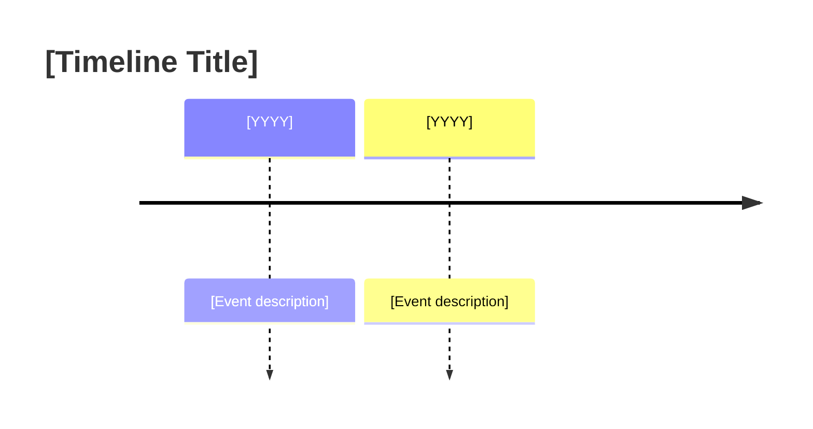

# [Nation] [Category] Overview ([Year Range or Topic])

## Summary

[1-2 paragraph executive summary of the overview topic, covering scope, time period, and key themes]

## Contents

1. [Major Section 1]
2. [Major Section 2]
3. [Major Section 3]

## [Major Section 1]

### [Subsection Title]

[Content with tables, lists, or prose as appropriate]

| Category | Details | Specifications |
|----------|---------|----------------|
| [Item] | [Description] | [Key specs] |

### [Subsection Title]

[Continue with additional subsections]

## [Major Section 2]

[Use appropriate formatting: tables for comparisons, lists for sequences, prose for explanations]

### Key Statistics

- **Total [Items]**: [Number]
- **Time Period**: [Years]
- **[Other Stat]**: [Value]

## [Major Section 3]

### Comparison Table

| Item | [Attribute 1] | [Attribute 2] | [Attribute 3] | Notes |
|------|--------------|--------------|--------------|-------|
| [[Item-1]] | [Value] | [Value] | [Value] | [Notes] |
| [[Item-2]] | [Value] | [Value] | [Value] | [Notes] |

## Timeline (Optional)

## References

- [[Related-Document-1]]
- [[Related-Document-2]]
- [[Research-Tree-Link]]

## Notes

[Additional context, sources, or clarifications]

---
**Category:** [Category] | **Nation:** [Nation] | **Period:** [Years] | **Items Covered:** [Count]

#[relevant-hashtags]

