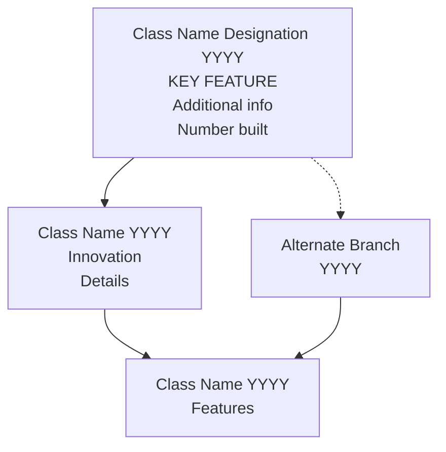
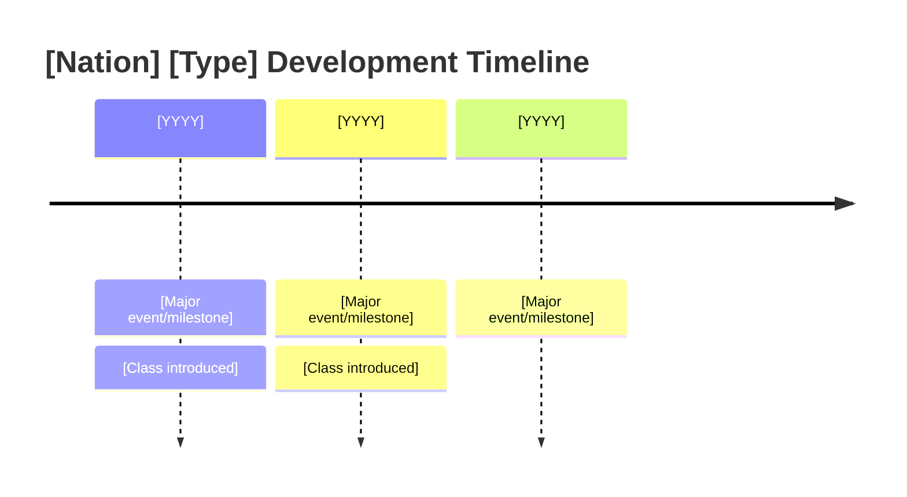

# [Nation] [Ship/Aircraft Type] Research Tree ([Year Range])

## Era Overview

| Era | Years | Key Innovation | Classes | Ships/Aircraft |
|-----|-------|----------------|---------|----------------|
| **[Era Name]** | [YYYY-YYYY] | [Key innovation/characteristic] | [Number] classes | [Number] ships/aircraft |
| **[Era Name]** | [YYYY-YYYY] | [Key innovation/characteristic] | [Number] classes | [Number] ships/aircraft |
| **[Era Name]** | [YYYY-YYYY] | [Key innovation/characteristic] | [Number] classes | [Number] ships/aircraft |

**Total:** [Number] major classes/variants ([Number] built, [Number] cancelled), ~[Number] total ships/aircraft built

## Production Summary

| Type/Era | Classes | Total Ships/Aircraft | Peak Era/Years |
|----------|---------|---------------------|----------------|
| [Type/Era Name] | [Number] | [Number] ships/aircraft | [Years or description] |
| [Type/Era Name] | [Number] | [Number] ships/aircraft | [Years or description] |
| **Grand Total** | **[Number]** | **[Number]** | **[Number] years** |

## Research Tree Diagram

## Major Milestones

### Technological Firsts

| Year | Achievement | Class |
|------|-------------|-------|
| [YYYY] | [First achievement description] | [[Class-Name]] |
| [YYYY] | [First achievement description] | [[Class-Name]] |

### Historical Context

#### [Era Name] ([Years])
[2-3 sentence paragraph covering the historical context, doctrine, and strategic needs that drove development during this era]

#### [Era Name] ([Years])
[2-3 sentence paragraph for each major era]

## Timeline

## Class Listing by Era

### [Era Name] ([Years])

1. **[[Class-Name]]** ([Years]) - [Brief description]
   - Ships/Aircraft: [Names or count]
   - Key Specs: [displacement/weight] | [speed] | [armament/capacity]
   - Innovation: [Key innovation or characteristic]
   - Service: [Brief operational summary]

2. **[[Class-Name]]** ([Years]) - [Brief description]
   - Ships/Aircraft: [Names or count]
   - Key Specs: [Key specifications]
   - Innovation: [Key innovation]
   - Service: [Brief operational summary]

[Continue for all classes in era]

### [Next Era Name] ([Years])

[Continue same format for all eras]

## Key Technologies

### [Technology Type] Evolution
[Paragraph describing how this technology (e.g., propulsion, armament, radar) evolved across the tree]

### [Technology Type] Evolution
[Paragraph for each major technology area]

## Size/Capability Growth

| Era | Representative Class | [Spec 1] | [Spec 2] | [Spec 3] |
|-----|---------------------|----------|----------|----------|
| [Era] | [[Class-Name]] | [Value] | [Value] | [Value] |
| [Era] | [[Class-Name]] | [Value] | [Value] | [Value] |

## Notable Service

### [War/Conflict Name]
[Paragraph describing overall performance and notable engagements]

### Famous Ships/Aircraft
- **[Name]** - [Achievement]
- **[Name]** - [Achievement]

## Cancelled Programs

### [[Cancelled-Class-Name]] ([Year])
[Brief description of cancelled program, reason for cancellation, and what replaced it]

---
**Tree:** [Type] | **Classes:** [Count] | **Ships/Aircraft Built:** [Count] | **Years:** [Range]

#[relevant-hashtags]

