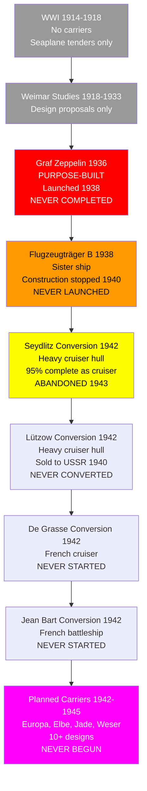

# German Navy Aircraft Carrier Research Tree (1918-1945)

## Era Overview

| Era | Years | Key Innovation | Classes | Ships |
|-----|-------|----------------|---------|-------|
| **WWI (Kaiserliche Marine)** | 1914-1918 | No carriers | 0 classes | 0 ships |
| **Weimar Proposals (1918-1933)** | 1918-1933 | Design studies only | 0 classes | 0 ships |
| **Graf Zeppelin Program (Kriegsmarine)** | 1936-1943 | Purpose-built carriers | 1 class | 2 ships (0 completed) |
| **Conversion Programs (Kriegsmarine)** | 1942-1945 | Cruiser conversions | 4 designs | 4 ships (0 completed) |
| **Planned Carriers (Kriegsmarine)** | 1942-1945 | Design studies | 10+ designs | 0 ships |

**Total:** ~15+ designs, **0 carriers operational** (2 launched, 6 started, 0 completed)

## Production Summary

| Type | Classes | Ships Planned | Ships Completed | Peak Era |
|------|---------|---------------|-----------------|----------|
| WWI Carriers | 0 | 0 | 0 | N/A |
| Weimar Proposals | 0 | 0 | 0 | 1918-1933 |
| Graf Zeppelin-class | 1 | 2 ships | **0** (1 launched) | 1936-1943 |
| Cruiser Conversions | 4 | 4 ships | **0** | 1942-1945 |
| Planned Carriers | 10+ | 10+ ships | **0** | 1942-1945 |
| **Grand Total** | **15+** | **16+** | **0** | **27 years** |

## Research Tree Diagram

## Major Milestones (All Incomplete)

### Incomplete/Failed Programs

| Program | Ship | Year | Status |
|---------|------|------|--------|
| **First carrier design** | Graf Zeppelin | 1936 | 85% complete, never commissioned |
| **First carrier launched** | Graf Zeppelin | 1938 | Launched, fitting out incomplete |
| **Largest carrier project** | Europa (Passenger liner conversion) | 1942 | Never started |
| **Closest to completion** | Seydlitz (Cruiser conversion) | 1942 | 95% complete as cruiser, conversion abandoned |
| **Most advanced design** | I-class design | 1943 | Design study only |

## Historical Context

### WWI (1914-1918) - No Carrier Development

**Why No Carriers:**
- Germany focused on battleships and U-boats
- Seaplane tenders used instead (Wolf, Stuttgart converted)
- Naval aviation focused on Zeppelins and floatplanes
- High Seas Fleet strategy did not require carriers
- British Grand Fleet blockade prevented carrier development necessity

**Seaplane Tenders:**
- SMS Stuttgart (1915 conversion) - launched seaplanes, not carrier
- SMS Wolf (1915 conversion) - auxiliary seaplane tender
- Various auxiliary seaplane ships
- No takeoff/landing capability, seaplanes lifted by crane

### Weimar Republic (1918-1933) - Design Studies Only

**Restrictions:**
- Treaty of Versailles forbade aircraft carriers
- Germany forbidden naval aviation
- Secret design work conducted abroad
- Paper studies only, no construction

**Proposed Designs:**
- Ersatz Yorck conversion (1918) - never pursued
- Various passenger liner conversion studies
- No serious programs due to treaty restrictions

### Kriegsmarine (1935-1945) - Ambitious Programs, Zero Success

**Context:**
- Treaty repudiation 1935 allowed carrier development
- Hitler and Raeder supported carrier program
- Göring's Luftwaffe controlled all aircraft (interservice rivalry)
- Resources diverted to U-boats and surface raiders
- No operational carrier experience or doctrine
- Programme Z (1939) planned 4 carriers by 1948

## Class Listing

### Kriegsmarine Graf Zeppelin-Class (1936-1943)

1. [[Graf-Zeppelin]] (1936-1943) - **NEVER COMPLETED (85% complete)**
   - **Laid Down**: 28 December 1936
   - **Launched**: 8 December 1938
   - **Status**: Construction stopped 1940, resumed 1942, abandoned 1943
   - **Displacement**: 33,550 tons full load (planned)
   - **Dimensions**: 861 ft × 103 ft × 28 ft (planned)
   - **Propulsion**: 200,000 shp, 33.8 knots (planned)
   - **Aircraft**: 42 aircraft (planned) - Bf 109T fighters, Ju 87C dive bombers
   - **Armament**: 16× 5.9-inch guns, 12× 4.1-inch AA guns, 22× 37mm AA guns
   - **Armor**: 3.9-inch belt, 1.6-inch deck
   - **Fate**: Scuttled 1945, raised by Soviets 1946, used as target, sunk 1947

2. [[Flugzeugträger-B]] (1938-1940) - **NEVER COMPLETED (20% complete)**
   - **Laid Down**: September 1938
   - **Status**: Construction stopped May 1940, never resumed
   - **Specifications**: Identical to Graf Zeppelin (planned)
   - **Completion**: ~20% complete when cancelled
   - **Fate**: Broken up on slipway 1940

### Kriegsmarine Cruiser Conversion Programs (1942-1945)

3. [[Seydlitz-Carrier-Conversion]] (1942-1943) - **ABANDONED (95% cruiser, 60% carrier)**
   - **Original**: Admiral Hipper-class heavy cruiser Seydlitz
   - **Status**: 95% complete as cruiser when conversion ordered 1942
   - **Conversion Work**: Flight deck installed, hangars added
   - **Completion**: ~60% complete as carrier when abandoned 1943
   - **Aircraft**: 18 aircraft (planned)
   - **Displacement**: 19,800 tons (planned as carrier)
   - **Fate**: Scuttled 1945, raised, scrapped 1958

4. [[Lützow-Carrier-Conversion]] (1942) - **NEVER STARTED**
   - **Original**: Admiral Hipper-class heavy cruiser Lützow
   - **Status**: Sold incomplete to USSR April 1940 (renamed Petropavlovsk)
   - **German Plan**: Proposed conversion after buying back (never happened)
   - **Soviet Service**: Completed as cruiser by Soviets 1944
   - **Fate**: Soviet service 1944-1960, scrapped

5. [[De-Grasse-Carrier-Conversion]] (1942) - **NEVER STARTED**
   - **Original**: French light cruiser De Grasse (incomplete, captured 1940)
   - **Status**: Proposed conversion 1942, never begun
   - **Reason**: Too small for effective carrier conversion
   - **Fate**: Returned to France 1945, completed as cruiser 1956

6. [[Jean-Bart-Carrier-Conversion]] (1942) - **NEVER STARTED**
   - **Original**: French battleship Jean Bart (incomplete, at Casablanca)
   - **Status**: Proposed conversion 1942, never captured
   - **Reason**: Ship in North Africa, never fell under German control
   - **Fate**: French control maintained, completed as battleship 1955

### Planned Carriers (1942-1945) - NEVER BEGUN

7. [[Europa-Class-Carrier-Conversion]] (1942) - **DESIGN STUDY ONLY**
   - **Original**: SS Europa (58,000-ton passenger liner)
   - **Planned Specs**: 50,000 tons, 50+ aircraft, 32 knots
   - **Status**: Design study 1942, never started
   - **Reason**: Ship needed for troop transport, conversion too costly
   - **Fate**: Survived war, became French liner Liberté

8. [[Potsdam-Class]] (1942) - **DESIGN STUDY ONLY**
   - **Planned**: Converted from passenger liners Potsdam, Gneisenau (liner)
   - **Specs**: 45,000 tons (planned), 40 aircraft
   - **Status**: Design study only, never started

9. [[Elbe-Class-Carrier]] (1942) - **DESIGN STUDY ONLY**
   - **Ships**: Elbe, Weser, Jade, planned names
   - **Specs**: 24,000 tons (planned), 30 aircraft, 35 knots
   - **Type**: Purpose-built fleet carriers
   - **Status**: Paper design only, cancelled 1942

10. [[I-Class-Carrier]] (1943) - **MOST ADVANCED DESIGN**
    - **Specs**: 32,000 tons (planned), 42 aircraft, 35 knots
    - **Features**: Improved Graf Zeppelin design
    - **Armament**: Reduced gun armament vs Graf Zeppelin
    - **Status**: Design study only, never ordered

11. [[II-Class-Carrier]] (1943) - **DESIGN STUDY ONLY**
    - **Specs**: 22,000 tons (planned), 30 aircraft, 33 knots
    - **Type**: Light fleet carrier
    - **Status**: Design study only

12. [[Auxiliary-Carrier-Designs]] (1943-1944) - **VARIOUS STUDIES**
    - Merchant ship conversions (MAC ship equivalents)
    - Escort carrier designs based on captured merchant ships
    - None progressed beyond initial studies

## Why Germany Never Operated Carriers

### Strategic Failures

**Interservice Rivalry:**
- Hermann Göring controlled ALL German aircraft (Luftwaffe)
- Refused to provide aircraft or pilots for Navy carriers
- Insisted carrier aircraft be under Luftwaffe control
- Navy-Luftwaffe cooperation never resolved
- Carrier without aircraft = useless

**Resource Allocation:**
- Hitler prioritized U-boats after 1939
- Carrier construction stopped May 1940
- Steel and labor diverted to U-boat program
- Surface fleet deprioritized after early losses
- Carriers seen as resource drain vs U-boats

**Operational Doctrine:**
- Germany had no carrier doctrine or experience
- No trained carrier pilots or crews
- No specialized carrier aircraft developed (Bf 109T, Ju 87C prototypes only)
- Fleet strategy focused on commerce raiding, not carrier warfare
- No need for carriers in Baltic or North Sea operations

**Technical Challenges:**
- Graf Zeppelin design flawed (too many heavy guns, too small flight deck)
- Catapult and arresting gear problems
- Flight deck armor questions unresolved
- No experience with carrier operations to refine design

### Specific Program Failures

**Graf Zeppelin (85% complete):**
- Construction stopped May 1940 (Fall of France)
- Briefly resumed 1942 (Hitler's order)
- Abandoned 1943 (Raeder resigned, Dönitz prioritized U-boats)
- Scuttled 1945 to prevent Soviet capture
- Never fitted with aircraft elevators, catapults, or arresting gear
- Would have required 2+ years to complete after 1943

**Seydlitz Conversion (60% carrier work complete):**
- Conversion started 1942
- Work stopped 1943 (resource priorities)
- Too small for effective carrier (18 aircraft only)
- Scuttled incomplete 1945

**All Other Programs:**
- None progressed beyond design studies
- Resources diverted to more urgent needs (U-boats, destroyers, E-boats)
- War situation increasingly desperate 1943-1945

## Comparison to Other Nations

| Feature | Germany | Britain | USA | Japan | Advantage |
|---------|---------|---------|-----|-------|-----------|
| **Carriers Operational (WWII)** | 0 | 50+ | 100+ | 25+ | Axis failure |
| **Carrier Aircraft** | 0 (Bf 109T/Ju 87C prototypes) | 1,000s | 10,000s | 1,000s | Germany 0 |
| **Carrier Doctrine** | None | Mature | Mature | Excellent | Germany failed |
| **Interservice Cooperation** | Failed | Good | Excellent | Good | Germany failed |
| **Resource Allocation** | U-boats priority | Balanced | Massive | Carriers priority | Germany wrong choice |

**Strategic Assessment:**
- Germany: Total failure in carrier development
- Britain/USA/Japan: Carriers decisive in WWII (Pacific, Atlantic, Mediterranean)
- Germany's lack of carriers:
  - Prevented effective fleet aviation
  - Left surface fleet vulnerable to British carrier strikes
  - Limited operational range of surface raiders
  - U-boats compensated partially, but insufficient
- Result: Germany's carrier failure one of many factors in naval defeat

## Graf Zeppelin - The Ship That Never Was

### Design (Planned Specifications)

| Characteristic | Value |
|----------------|-------|
| **Displacement** | 33,550 tons full load |
| **Dimensions** | 861 ft × 103 ft × 28 ft |
| **Propulsion** | 16× boilers, 4× turbines, 200,000 shp |
| **Speed** | 33.8 knots (planned) |
| **Range** | 8,000 nautical miles at 19 knots |
| **Armor** | Belt: 3.9 inches, Deck: 1.6 inches, Hangar: 1.6 inches |
| **Aircraft** | 42 aircraft (10× Bf 109T fighters, 12× Ju 87C dive bombers, 20× Fi 167 torpedo bombers - planned) |
| **Armament** | 16× 5.9-inch guns (8× twin turrets!), 12× 4.1-inch AA, 22× 37mm AA |
| **Catapults** | 2× (never installed) |
| **Elevators** | 2× (never installed) |
| **Crew** | 1,760 (planned) |

### Flaws in Design

**Over-Gunned:**
- 16× 5.9-inch guns in 8 twin turrets (!)
- More heavy guns than most cruisers
- Weight and complexity reduced aircraft capacity
- Fire arcs obstructed by island and flight deck

**Too Small:**
- 42 aircraft capacity (vs 70-90 on US/British fleet carriers)
- Short flight deck (861 ft vs 890+ ft US carriers)
- Small hangar space
- Limited operational flexibility

**Armament Priority Wrong:**
- Designed to fight surface ships (heavy guns)
- Aircraft capacity secondary consideration
- Reflected German lack of carrier doctrine
- British/US carriers prioritized aircraft over guns

**Technical Issues:**
- Catapult and arresting gear never tested
- Aircraft elevators never installed
- No operational trials to validate design
- Hangar layout problematic

### Aircraft Intended

**Bf 109T (Träger - Carrier):**
- Modified Bf 109E fighter
- 60 prototypes built, never deployed
- Folding wings, arresting hook, catapult capability
- Used as land-based fighters after carrier cancellation

**Ju 87C:**
- Modified Ju 87 Stuka dive bomber
- Folding wings, jettison able landing gear for ditching
- Prototypes only, cancelled when carrier program stopped

**Fi 167:**
- Carrier torpedo bomber
- Excellent performance, but carrier never completed
- 12 prototypes, used for coastal patrol instead

### Construction Timeline

- **28 Dec 1936**: Keel laid, Deutsche Werke shipyard, Kiel
- **8 Dec 1938**: Launched (85% hull complete)
- **May 1940**: Construction stopped (Fall of France, resources to U-boats)
- **1942**: Construction briefly resumed (Hitler's order)
- **Jan 1943**: Abandoned permanently (Dönitz prioritized U-boats)
- **25 Apr 1945**: Scuttled at Stettin to prevent Soviet capture
- **1946**: Raised by Soviets
- **1947**: Used as target ship, sunk

### What If Completed?

**Optimistic Scenario:**
- Completed 1941: Too late for Norway campaign
- Operational 1942: Vulnerable to British carriers/air strikes
- Luftwaffe cooperation: Never would have happened
- Aircraft: Bf 109T/Ju 87C inadequate vs British fighters
- Likely fate: Sunk like Bismarck, or idle like Tirpitz

**Realistic Assessment:**
- Would have tied up resources better spent on U-boats
- 42 aircraft insufficient for effective operations
- No doctrine or experience to employ effectively
- Interservice rivalry would have crippled operations
- Likely would have achieved nothing and been sunk

## Legacy

**Historical Significance:**
- Largest carrier never completed
- Symbol of German naval ambition vs reality
- Demonstrated importance of interservice cooperation
- Showed carriers require decades of experience to employ effectively
- Germany's carrier failure contributed to surface fleet ineffectiveness

**Technical Influence:**
- Soviet carrier designs influenced by captured Graf Zeppelin plans
- Post-war evaluation showed design flaws
- Confirmed carrier design philosophy (aircraft over guns)

**Strategic Lessons:**
- Carriers cannot be improvised mid-war
- Interservice cooperation essential for carrier operations
- Resource allocation critical (Germany chose U-boats, correctly given circumstances)
- Doctrine and experience matter more than hardware

---

**Tree:** Master Research Tree | **Classes:** 15+ | **Ships Planned:** 16+ | **Ships Completed:** 0

#aircraft-carrier #graf-zeppelin #flugzeugträger #kriegsmarine #carrier-conversion #seydlitz #never-completed #failed-program #german-navy #plan-z #luftwaffe #interservice-rivalry

## Summary: Germany's Carrier Failure

**Why Germany Never Had Carriers:**

1. **Interservice Rivalry**: Göring refused cooperation
2. **Resource Allocation**: U-boats prioritized (correct choice given circumstances)
3. **Lack of Experience**: No carrier doctrine or operations
4. **Design Flaws**: Graf Zeppelin over-gunned, under-aircraft-ed
5. **Strategic Situation**: War began before carriers ready
6. **Wrong Priorities**: Surface raiders not viable strategy vs British

**Result**: 0 carriers operational, billions spent, nothing achieved. Germany's carrier program one of WWII's greatest naval failures.
