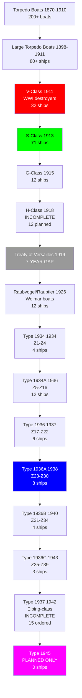
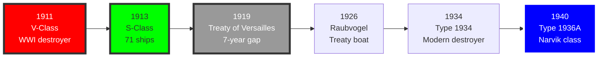

# German Navy Destroyer Research Tree (1870-1945)

## Era Overview

| Era | Years | Key Innovation | Classes | Ships |
|-----|-------|----------------|---------|-------|
| **Torpedo Boats (Kaiserliche Marine)** | 1870-1910 | Early torpedo warfare | 50+ classes | 200+ boats |
| **Large Torpedo Boats (Kaiserliche Marine)** | 1898-1911 | Destroyer equivalents | 15+ classes | 80+ ships |
| **WWI Destroyers (Kaiserliche Marine)** | 1911-1918 | Modern destroyers | 20+ classes | 110+ ships |
| **Interwar Gap (Treaty of Versailles)** | 1919-1927 | Limited construction | Few classes | 12 boats |
| **Mob-Destroyers (Kriegsmarine)** | 1926-1934 | Treaty-compliant | 2 classes | 12 ships |
| **Type 1934/36 (Kriegsmarine)** | 1934-1939 | 5-inch gun destroyers | 4 types | 22 ships |
| **Type 1936A/B (Kriegsmarine)** | 1938-1943 | Improved destroyers | 2 types | 15 ships |
| **Planned (Never Built)** | 1942-1945 | Type 1945 designs | 5+ designs | 0 ships |

**Total:** ~90+ major classes, ~429+ destroyers/torpedo boats built (450+ planned)

## Production Summary

| Type | Classes | Total Ships | Peak Era |
|------|---------|-------------|----------|
| Torpedo Boats (Kaiserliche Marine) | 50+ | 200+ boats | 1870-1910 |
| Large Torpedo Boats (Kaiserliche Marine) | 15+ | 80+ ships | 1898-1911 |
| WWI Destroyers (Kaiserliche Marine) | 20+ | 110+ ships | 1911-1918 |
| Weimar Torpedo Boats | 2 | 12 ships | 1926-1934 |
| Type 1934/36 (Kriegsmarine) | 4 | 22 ships | 1934-1939 |
| Type 1936A/B (Kriegsmarine) | 2 | 15 ships | 1938-1943 |
| **Grand Total (Built)** | **~93+** | **~439+** | **75 years** |
| **Grand Total (Planned)** | **~100+** | **~460+** | **75 years** |

## Research Tree Diagram

## Major Milestones

### Technological Firsts

| Achievement | Class/Ship | Year |
|-------------|------------|------|
| **First torpedo boat** | S1 (Lightning) | 1876 |
| **First large torpedo boat** | Division I | 1898 |
| **First oil-fired destroyer** | V25 | 1914 |
| **First treaty destroyer** | Raubvogel | 1926 |
| **First 5-inch gun destroyer** | Type 1934 | 1934 |
| **Largest destroyer built** | Type 1936A (Narvik) | 1940 |

## Timeline

## Class Listing by Era

### Kaiserliche Marine Torpedo Boats (1870-1910)

**Early Torpedo Boats (1870-1890s):**
- 200+ small torpedo boats built
- S1-S200+ numbering series
- 50-200 tons, 18-25 knots
- 2-4 torpedo tubes, minimal guns

**Large Torpedo Boats - Destroyer Equivalents (1898-1911):**

1. [[Division-I-TB]] (1898-1902) - 12 boats
   - G132-G143
   - 330 tons, 26 knots, 3× 1-pdr guns, 3× torpedo tubes

2. [[Division-II-TB]] (1902-1907) - 24 boats
   - G144-G167, V150-V161
   - 530 tons, 27 knots, 6× 1-pdr guns, 3× torpedo tubes

3. [[Division-III-TB]] (1907-1911) - 44 boats
   - G168-G197, V162-V185, S138-S147
   - 600-700 tons, 30 knots, 2× 3.5-inch guns, 3× torpedo tubes

### Kaiserliche Marine WWI Destroyers (1911-1918)

4. [[V-Class-1911]] (1911-1914) - **32 ships, first true destroyers**
   - V1-V32
   - 700-900 tons, 32-34 knots, 2-3× 3.5-inch guns, 4-6× torpedo tubes
   - Backbone of WWI destroyer flotillas

5. [[S-Class-1913]] (1913-1916) - **71 ships, most numerous WWI class**
   - S13-S24, S31-S113
   - 800-1,000 tons, 33-36 knots, 3× 3.5-inch guns, 6× torpedo tubes
   - Standard WWI destroyer design

6. [[G-Class-1915]] (1915-1916) - 12 ships
   - G7, G8, G37-G42, G85-G88
   - 1,000 tons, 34 knots, 3× 4.1-inch guns, 6× torpedo tubes
   - Larger, more powerful armament

7. [[H-Class-1918]] (1918) - **12 planned, NONE COMPLETED**
   - H145-H156 planned
   - 1,200 tons (planned), 34 knots, 4× 4.1-inch guns, 6× torpedo tubes
   - Cancelled incomplete due to armistice

### Interwar Period (1919-1926)

**Treaty of Versailles Restrictions:**
- Germany forbidden modern destroyers
- Limited to 12 torpedo boats (<800 tons)
- Existing destroyers scrapped or transferred
- 7-year gap in construction

### Weimar Republic Torpedo Boats (1926-1934)

8. [[Raubvogel-Class]] (1926-1929) - 6 boats
   - Möwe, Albatros, Greif, Kondor, Falke, Seeadler
   - 924 tons, 33 knots, 3× 4.1-inch guns, 6× torpedo tubes (21-inch)
   - Evaded treaty restrictions (officially <800 tons)

9. [[Raubtier-Class]] (1928-1929) - 6 boats
   - Wolf, Iltis, Jaguar, Leopard, Luchs, Tiger
   - 933 tons, 33 knots, 3× 4.1-inch guns, 6× torpedo tubes
   - Improved Raubvogel design

### Kriegsmarine Type 1934/36 Destroyers (1934-1939)

10. [[Type-1934]] (1934-1936) - **4 ships, Z1-Z4**
    - Z1 Leberecht Maass, Z2 Georg Thiele, Z3 Max Schultz, Z4 Richard Beitzen
    - 2,200 tons, 38 knots, 5× 5-inch guns, 8× 21-inch torpedo tubes
    - First modern Kriegsmarine destroyers

11. [[Type-1934A]] (1936-1938) - **12 ships, Z5-Z16**
    - Z5 Paul Jacobi through Z16 Friedrich Eckoldt
    - 2,400 tons, 38 knots, 5× 5-inch guns, 8× 21-inch torpedo tubes
    - Improved Type 1934 design

12. [[Type-1936]] (1937-1939) - **6 ships, Z17-Z22**
    - Z17 Diether von Roeder through Z22 Anton Schmitt
    - 2,400 tons, 38 knots, 5× 5.9-inch guns, 8× 21-inch torpedo tubes
    - Increased caliber to 5.9-inch

13. [[Type-1936A-Narvik]] (1938-1941) - **8 ships, Z23-Z30, Narvik-class**
    - Z23 through Z30
    - 2,600 tons, 38 knots, 4× 5.9-inch guns (twin turrets), 8× 21-inch torpedo tubes
    - Best German WWII destroyers

14. [[Type-1936B]] (1940-1942) - 4 ships, Z31-Z34
    - Z31, Z32, Z33, Z34
    - 2,600 tons, 38 knots, 4× 5.9-inch guns, 8× 21-inch torpedo tubes
    - Improved Narvik design

15. [[Type-1936C]] (1943-1944) - 3 ships, Z35-Z39
    - Z35, Z36, Z38 (Z37, Z39 incomplete)
    - 2,600 tons, 38 knots, 4× 5.9-inch guns, 8× 21-inch torpedo tubes
    - Final production type

### Kriegsmarine Type 1937 Fleet Destroyers (1942-1945)

16. [[Type-1937-Elbing]] (1942-1944) - **15 ordered, 9 launched, 4 completed**
    - T22, T23, T24, T25, T26, T27, T28, T29, T30, T31, T32, T33, T34, T35, T36
    - 1,750 tons, 33 knots, 4× 4.1-inch guns, 6× 21-inch torpedo tubes
    - Smaller "fleet torpedo boats"

### Planned But Never Built (1942-1945)

17. [[Type-1942]] - **12 ships planned, NONE LAID DOWN**
    - 3,600 tons (planned), 38 knots, 5× 5.9-inch guns
    - Design study only, cancelled 1942

18. [[Type-1944]] - **PLANNED, NEVER BEGUN**
    - 3,000 tons (planned), 40 knots, 4× 5.9-inch guns
    - Response to Allied destroyer developments

19. [[Type-1945]] - **PLANNED, NEVER BEGUN**
    - 3,200 tons (planned), 40 knots, 6× 5.5-inch guns (twin turrets)
    - Most advanced design, never started

## Key Technologies

### Main Battery Evolution
- **1870-1910:** 1-pdr, 37mm guns (torpedo boats)
- **1898-1911:** 1-2× 3.5-inch guns (large torpedo boats)
- **1911-1916:** 2-3× 3.5-4.1-inch guns (WWI destroyers)
- **1926-1934:** 3× 4.1-inch guns (Weimar boats)
- **1934-1939:** 5× 5-5.9-inch guns (Kriegsmarine destroyers)
- **1938-1945:** 4× 5.9-inch guns in twin turrets (Narvik onwards)

### Torpedo Evolution
- **1870-1910:** 14-17.7-inch torpedoes
- **1911-1918:** 19.7-inch torpedoes (WWI standard)
- **1926-1945:** 21-inch torpedoes (standard Kriegsmarine)

### Speed Evolution
- **1870-1898:** 18-26 knots (early torpedo boats)
- **1898-1911:** 26-30 knots (large torpedo boats)
- **1911-1918:** 32-36 knots (WWI destroyers)
- **1926-1934:** 33 knots (Weimar boats)
- **1934-1945:** 38-40 knots (Kriegsmarine destroyers)

### Propulsion Evolution
- **1870-1914:** Coal-fired boilers, reciprocating engines/turbines
- **1914-1918:** Oil-fired boilers, steam turbines (V25 first oil-fired 1914)
- **1926-1945:** High-pressure oil-fired boilers, steam turbines

## Notable Service

### Pre-WWI
- **Torpedo Boat Development:** Pioneered torpedo warfare tactics
- **Fleet Scouting:** Torpedo boats with High Seas Fleet
- **Baltic Operations:** Coastal defense and patrol

### World War I (1914-1918)
- **Battle of Jutland (1916):** 61 torpedo boats/destroyers engaged
  - S35, V27, V29, V4, V48 sunk
  - German torpedoes more effective than British
- **North Sea Operations:** Numerous skirmishes and patrol actions
- **Minelaying:** Extensive mine warfare operations
- **Heligoland Bight Actions (1914, 1917):** Several destroyer actions
- **Baltic Operations:** Against Russian Navy
- **Total WWI Losses:** ~60 torpedo boats/destroyers lost

### Interwar Period (1919-1933)
- **Treaty Restrictions:** Most WWI destroyers scrapped
- **Training Ships:** Raubvogel/Raubtier classes
- **Secret Rearmament:** Planning for modern destroyers

### World War II (1939-1945)
- **Invasion of Norway (1940):** Heavy losses (10 destroyers lost at Narvik)
  - First Battle of Narvik: Z21, Z22 sunk
  - Second Battle of Narvik: Z2, Z9, Z11, Z12, Z13, Z17, Z18, Z19 sunk/scuttled
- **Channel Dash (1942):** Z25, Z29 escorted Scharnhorst/Gneisenau
- **Arctic Convoys:** Destroyer operations against Arctic convoys
- **Battle of Barents Sea (1942):** Z16 Friedrich Eckoldt sunk
- **Bay of Biscay:** Destroyer operations vs Allied shipping
- **Baltic Evacuation (1945):** Evacuated German civilians from East Prussia
- **Total WWII Losses:** ~25 destroyers lost (over 50% casualty rate)

### Famous Ships

- **V25:** First oil-fired German destroyer (1914)
- **S90:** Famous WWI raider, captured British trawlers
- **Z1 Leberecht Maass:** First Type 1934, sunk friendly fire 1940
- **Z10 Hans Lody:** Survived entire war
- **Z23-Z30 (Narvik-class):** Most powerful German WWII destroyers
- **T22, T24 (Elbing-class):** Captured by Allies, evaluated post-war

## Narvik Disaster (April 1940)

**First Battle of Narvik (10 April 1940):**
- 10 German destroyers (Z9-Z13, Z17-Z22) in Narvik fjord
- 5 British destroyers attacked (HMS Hardy, Hunter, Havock, Hostile, Hotspur)
- Results: Z21 Wilhelm Heidkamp, Z22 Anton Schmitt sunk
- HMS Hardy, Hunter sunk
- Germans trapped in fjord (no fuel)

**Second Battle of Narvik (13 April 1940):**
- British battleship HMS Warspite + 9 destroyers attacked
- Remaining 8 German destroyers (Z2, Z9, Z11, Z12, Z13, Z17, Z18, Z19) scuttled/destroyed
- Total: 10 of 10 German destroyers at Narvik destroyed
- 2,300 German sailors killed/captured
- Worst German destroyer loss of WWII

## Cancelled Destroyer Programs

### Type 1942 Destroyers - CANCELLED
- **Ordered:** 12 ships planned
- **Specifications:** 3,600 tons, 38 knots, 5× 5.9-inch guns
- **Cancellation:** 1942 (resources diverted to U-boats)

### Type 1944 Destroyers - CANCELLED
- **Ordered:** Design study
- **Specifications:** 3,000 tons, 40 knots, 4× 5.9-inch guns
- **Cancellation:** 1944 (never begun)

### Type 1945 Destroyers - CANCELLED
- **Ordered:** Design study
- **Specifications:** 3,200 tons, 40 knots, 6× 5.5-inch guns (twin turrets)
- **Features:** Advanced fire control, radar, AA armament
- **Cancellation:** 1945 (never begun, war ended)

## Comparison to Royal Navy

| Feature | Germany | Britain | Advantage |
|---------|---------|---------|-----------|
| **WWI Destroyers** | 110+ ships | 300+ ships | Britain (quantity) |
| **WWII Destroyers** | 37 ships | 200+ ships | Britain (quantity) |
| **Gun Caliber** | 5.9-inch (heavy) | 4.7-inch (standard) | Germany (firepower) |
| **Torpedo Armament** | 8× 21-inch tubes | 8-10× 21-inch tubes | Similar |
| **Speed** | 38-40 knots | 36-37 knots | Germany (slightly faster) |
| **Survivability** | Good (sturdy construction) | Variable | Germany (quality) |
| **Narvik Losses** | 10 of 10 lost | 2 of 14 lost | Britain (tactical victory) |

**Strategic Assessment:**
- Germany: Larger, more powerful individual ships
- Britain: Greater numbers, worldwide deployment
- Result: British numerical superiority decisive, German quality insufficient

---

**Tree:** Master Research Tree | **Classes:** ~93+ | **Ships Built:** ~439+ | **Ships Planned:** ~460+

#destroyer #torpedo-boat #kaiserliche-marine #kriegsmarine #v-class #s-class #type-1936a #narvik-class #z-series #jutland #narvik-disaster #german-navy
