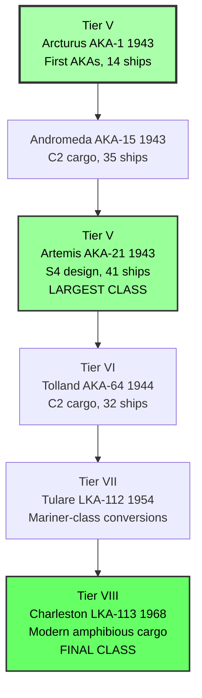
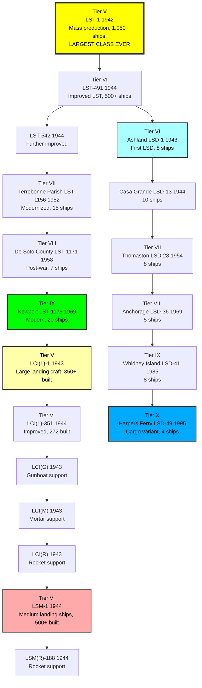
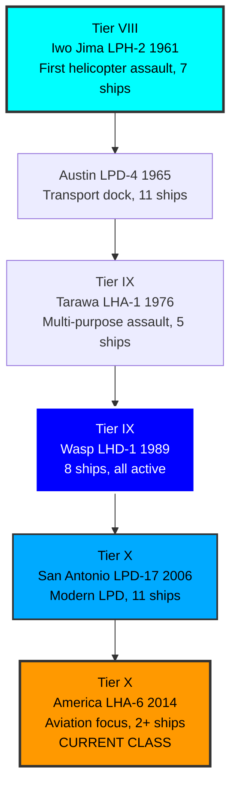

# US Navy Transport & Amphibious Ship Research Tree - GAMEPLAY STRUCTURE

## All 54 Classes in 4 Ship Types - Tier-Based Progression

This research tree organizes all 54 transport and amphibious classes into **4 ship types** with **tier-based chronological progression** for gameplay clarity.

---

## The 4 Ship Types

| Type | Classes | Ships | Gameplay Role |
|------|---------|-------|---------------|
| **TYPE 1: TRANSPORTS** | 23 | 400+ | Move troops & personnel to operations |
| **TYPE 2: CARGO SHIPS** | 6 | 108+ | Transport supplies & combat-loaded cargo |
| **TYPE 3: LANDING SHIPS** | 19 | 2,800+ | Beach assault & amphibious operations |
| **TYPE 4: ASSAULT SHIPS** | 6 | 40+ | Modern helicopter/vertical assault |
| **TOTAL** | **54** | **~3,500+** | **Complete amphibious force** |

---

## TYPE 1: TRANSPORTS (23 classes) - LONGEST BRANCH
**Function:** Move troops and personnel to amphibious operations

```mermaid
graph TD
    %% ========== MAIN LINE: COMPLETE PROGRESSION (1918-1945) ==========
    T1_1[Tier I<br/>Henderson AP-1 1918<br/>First transport, 8,100 tons] --> T1_2[Tier II<br/>Hunter Liggett 1923<br/>WWI conversions, 2 ships]
    T1_2 --> T1_3[Tier III<br/>Harris 1932<br/>Purpose-built, 13,500 tons]
    T1_3 --> T1_4[Tier IV<br/>Heywood 1940<br/>Pre-WWII, 6 ships]
    T1_4 --> T1_5A[Doyen APA-1 1940<br/>Early attack transport]
    T1_5A --> T1_5B[McCawley APA-4 1940<br/>Foreign conversions, 2 ships]
    T1_5B --> T1_5C[Harry Lee APA-10 1940<br/>Passenger conversion]
    T1_5C --> T1_5D[President Jackson APA-18 1940<br/>President Line, 3 ships]
    T1_5D --> T1_5E[John Penn APA-23 1941<br/>War loss]
    T1_5E --> T1_6A[Arthur Middleton APA-25 1942<br/>C3-P&C, 3 ships]
    T1_6A --> T1_6B[Frederick Funston APA-89 1942<br/>C3-S-A1, 2 ships]
    T1_6B --> T1_6C[Admiral Benson AP-120 1943<br/>C3 transport, 8 ships]
    T1_6C --> T1_7[Tier V<br/>Crescent City APA-21 1942<br/>C3 passenger, 4 ships]
    T1_7 --> T1_8A[Ormsby APA-49 1943<br/>C2-S-B1, 3 ships]
    T1_8A --> T1_8B[Sumter APA-52 1943<br/>C2-S-E1, 4 ships]
    T1_8B --> T1_8[Tier V<br/>Bayfield APA-33 1943<br/>C2 conversions, 62 ships]
    T1_8 --> T1_9[Windsor APA-55 1943-44<br/>C3-S-A1/A3/A2, 9 ships]
    T1_9 --> T1_10[Tier VI<br/>Haskell APA-117 1944<br/>Victory conversions, 117 ships!<br/>MOST NUMEROUS]
    T1_10 --> T1_11[Tier VI<br/>Gilliam APA-57 1945<br/>Victory conversions, 54 ships]

    %% ========== APD HIGH-SPEED TRANSPORT BRANCH ==========
    T1_4 --> APD1[APD-Wickes 1940<br/>DD conversions, ~32 ships]
    APD1 --> APD2[APD-Clemson 1943<br/>DD conversions, ~30 ships]
    APD2 --> APD3[Charles Lawrence APD-37 1943<br/>DE conversions, 43 ships]
    APD3 --> APD4[Crosley APD-87 1944-45<br/>DE conversions, 50 ships]

    %% ========== STYLING ==========
    style T1_1 fill:#f9f,color:#000,stroke:#333,stroke-width:3px
    style T1_4 fill:#fcc,color:#000,stroke:#333,stroke-width:3px
    style T1_8 fill:#f99,color:#000,stroke:#333,stroke-width:2px
    style T1_10 fill:#0f0,color:#000,stroke:#333,stroke-width:3px
    style APD4 fill:#fcf,color:#000,stroke:#333,stroke-width:2px
```

**Tier Breakdown:**
- **Tier I-III (1918-1940):** 4 classes - early/pre-war transports
- **Tier IV (1940-1942):** 9 classes - early war conversions
- **Tier V (1942-1943):** 4 classes - production ramp-up (Bayfield 62 ships)
- **Tier VI (1944-1945):** 2 classes - mass production (Haskell 117 ships!)
- **APD Branch:** 4 classes - high-speed special operations transports

---

## TYPE 2: CARGO SHIPS (6 classes) - LINEAR PROGRESSION
**Function:** Transport combat-loaded cargo, vehicles, and supplies

**Tier Breakdown:**
- **Tier V (1943):** 3 classes - first AKAs (Artemis 41 ships = largest)
- **Tier VI (1944):** 1 class - improved wartime design
- **Tier VII (1954):** 1 class - Korean War conversions
- **Tier VIII (1968):** 1 class - modern design (last cargo ship built)

---

## TYPE 3: LANDING SHIPS (19 classes) - EXTENDED PROGRESSION
**Function:** Beach assault operations and amphibious landing craft

**Tier Breakdown:**
- **LST Main Line:** 6 classes (Tier V-IX, 1942-1969) - tank landing ships
- **LSD Branch:** 6 classes (Tier VI-X, 1943-1995) - well deck ships
- **LCI Branch:** 5 classes (Tier V-VI, 1943-1944) - infantry craft (600+ built)
- **LSM Branch:** 2 classes (Tier VI, 1944) - medium ships (500+ built)

---

## TYPE 4: ASSAULT SHIPS (6 classes) - LINEAR PROGRESSION
**Function:** Helicopter-based vertical assault and modern amphibious warfare

**Tier Breakdown:**
- **Tier VIII (1961-1965):** 2 classes - helicopter assault begins (Iwo Jima LPH)
- **Tier IX (1976-1989):** 2 classes - multi-purpose assault (Tarawa, Wasp)
- **Tier X (2006-2014):** 2 classes - modern assault (San Antonio LPD, America LHA)

---

## Complete Tier Structure

| Tier | Era | Years | Classes | Notable Ships |
|------|-----|-------|---------|---------------|
| **I** | Experimental | 1918-1920 | 1 | Henderson (first transport) |
| **II** | Interwar | 1920-1930 | 1 | Hunter Liggett (WWI conversions) |
| **III** | Pre-War | 1932-1939 | 1 | Harris (purpose-built) |
| **IV** | Early WWII | 1940-1942 | 10 | Heywood, Doyen, early conversions |
| **V** | WWII Production | 1942-1943 | 11 | Bayfield, Arcturus, LST-1 (1,050 ships!) |
| **VI** | Late WWII | 1944-1945 | 11 | Haskell (117 ships), Tolland, Ashland |
| **VII** | Post-War | 1950s | 3 | Terrebonne Parish, Thomaston, Tulare |
| **VIII** | Cold War | 1960s | 5 | Iwo Jima (helicopters!), Charleston, Anchorage |
| **IX** | Modern | 1970s-1990s | 6 | Tarawa, Wasp, Newport, Whidbey Island |
| **X** | Contemporary | 2000s-2010s | 5 | San Antonio, America, Harpers Ferry |

---

## Branch Structure Comparison

| Ship Type | Classes | Main Line | Side Branches | Structure |
|-----------|---------|-----------|---------------|-----------|
| **TYPE 1: Transports** | 23 | 19 classes | 1 (APD: 4 classes) | Extended main + specialist branch |
| **TYPE 2: Cargo** | 6 | 6 classes | None | Fully linear |
| **TYPE 3: Landing** | 19 | 13 classes | 1 (LSD: 6 classes) | Extended main + dock branch |
| **TYPE 4: Assault** | 6 | 6 classes | None | Fully linear |

---

## Gameplay Progression Notes

### Early Game (Tiers I-IV)
- **Type 1 only:** Transports dominate early amphibious operations
- Limited options, focus on personnel movement
- Historical: pre-WWII limited amphibious doctrine

### Mid Game (Tiers V-VI)
- **All 4 types available:** Full amphibious capability
- Mass production era (LST-1: 1,050 ships, Haskell: 117 ships)
- Peak variety and production numbers
- Historical: WWII peak amphibious warfare

### Late Game (Tiers VII-X)
- **Types 3-4 dominant:** Modern assault ships replace transports
- Cargo ships phased out (last: Charleston 1968)
- Focus shifts to helicopters and well deck operations
- Historical: vertical assault doctrine

---

**Complete Tree:** All 54 Classes | 4 Ship Types | 10 Tiers | 107 Years

#gameplay #4types #tierstructure #chronological #complete
